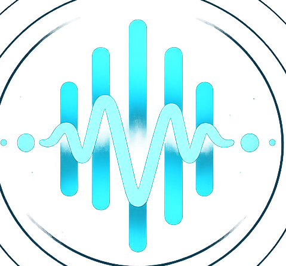
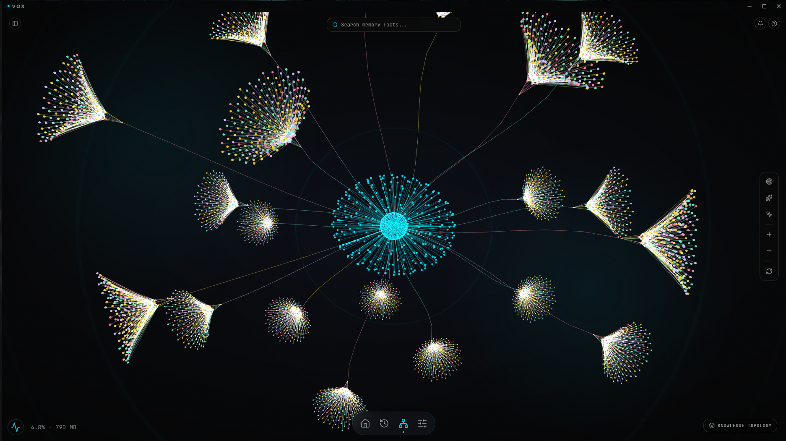
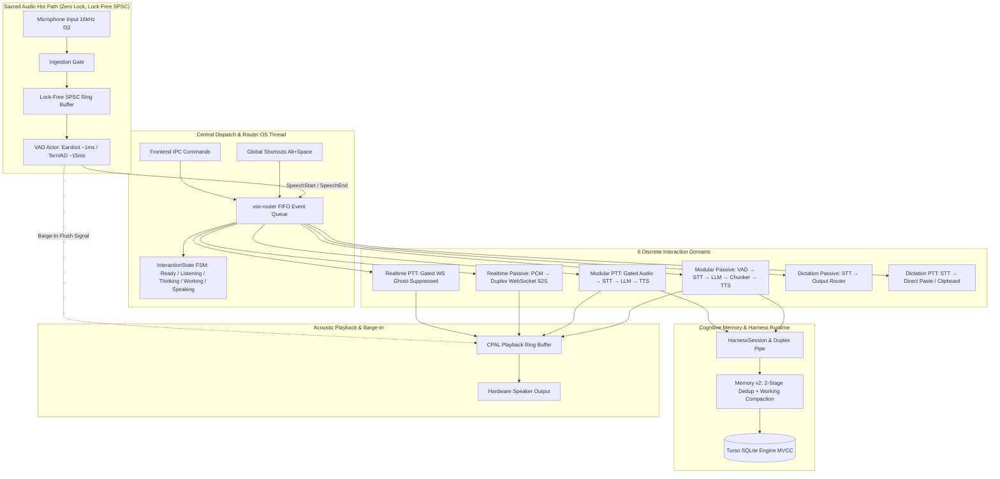

<div align="center">

  

# 🎙️ VOX
### The Ambient Voice Intelligence Layer for the Native Edge

<p align="center">
  <a href="#-the-vision">Vision</a> •
  <a href="#-product-tour">Product Tour</a> •
  <a href="#-key-capabilities">Capabilities</a> •
  <a href="#-technical-architecture">Architecture</a> •
  <a href="#-model-zoo">Model Zoo</a> •
  <a href="#-getting-started">Getting Started</a>
</p>

<p align="center">
  
  
  
  
  
  
</p>

</div>

---

## 🌌 The Vision

**Vox** is a real-time, local-first voice AI desktop application built from the ground up to disappear into your operating system. Rather than forcing you to break focus with a chat window, browser tab, or sluggish web wrapper, Vox operates as a persistent, low-latency ambient intelligence layer.

It listens seamlessly on an ephemeral HUD, responds with natural acoustic cadence, and clears out of your way the millisecond you stop speaking.

### Core Tenets
- **Real-Time Streaming Pipeline:** Streaming token-by-token synthesis, pre-roll playback cushions, and sub-millisecond clause chunking minimize perceived time-to-speech.
- **8GB RAM Baseline on CPU:** Highly optimized INT8 ONNX and GGUF inference pipelines run directly on CPU without requiring a dedicated GPU.
- **Strict Sovereignty & Privacy:** 100% local speech-to-text, reasoning, long-term memory, and text-to-speech. Zero audio telemetry leaves your machine unless you explicitly configure remote cloud providers.
- **Tactile Rhythm & Instant Barge-In:** Hardware audio drains and LLM generation cancellations trigger immediately the moment your voice interrupts speech playback.

---

## 🖼️ Product Tour

Vox marries high-performance native systems programming with an ethereal spatial aesthetic rendered in React 19 and Three.js.

<div align="center">
  <table border="0" cellpadding="8" cellspacing="0" width="100%">
    <tr>
      <td align="center" width="50%" valign="top">
        <a href="app/public/home.png"></a>
        <p><b>Living Resonance Orb & Telemetry HUD</b><br>
        <em>Dynamic 3D fluid sphere reacting to voice state with live hardware and inference telemetry.</em></p>
      </td>
      <td align="center" width="50%" valign="top">
        <a href="app/public/memory.png"></a>
        <p><b>Sentient Knowledge Topology</b><br>
        <em>Interactive 3D Fibonacci tree canopy with a Fresnel core mapping long-term cognitive memory.</em></p>
      </td>
    </tr>
    <tr>
      <td align="center" width="50%" valign="top">
        <a href="app/public/history.png"></a>
        <p><b>Chronological Orbit Session Archive</b><br>
        <em>Spatiotemporal timeline organizing conversations by day and month with turn-by-turn inspection.</em></p>
      </td>
      <td align="center" width="50%" valign="top">
        <a href="app/public/settings.png"></a>
        <p><b>Unified Control Center & Model Hub</b><br>
        <em>Dynamic model manager with hot-swappable local/cloud backends and cognitive memory controls.</em></p>
      </td>
    </tr>
  </table>
</div>

---

## ✨ Key Capabilities

### 1. Dual-Track Interaction Architecture
Vox runs two decoupled, concurrent interaction tracks under a unified hardware audio manager:
* **Assistant Track:** Conversational voice AI operating in either **Continuous Passive Listening** (ambient VAD gating) or **Push-To-Talk (PTT)** mode for high-intent queries.
* **Dictation Track:** System-wide instant transcription triggered via global hotkey (`Alt+Space`). Transcribes speech with 0ms LLM/TTS bypass directly into the active application via OS paste or clipboard.

### 2. Dual Pipeline Engines
* **Modular Pipeline (On-Device Local):**
  `CPAL Audio (16kHz f32)` → `Earshot / TenVAD` → `Nemotron-3.5 / Qwen3-ASR` → `Local Qwen3 0.8B / Llama 3.2 1B / Gemma3 4B` → `Supertonic / Chatterbox / Edge-TTS` → `CPAL Ring Buffer`.
* **Realtime S2S Engine (Cloud Duplex):**
  Native bi-directional WebSocket streaming connecting directly to **Gemini Live** or **Deepgram Voice Agent** for natural conversational duplex dialogue.

### 3. Sentient Cognitive Memory v2
* **2-Stage Deduplication Engine:** Combines fast Stage-1 Jaccard lexical filtering with Stage-2 semantic vector cosine similarity powered by an on-device `all-MiniLM-L6-v2` ONNX embedding pipeline.
* **Evolving Personal Profile:** Continuous synthesis of durable user preferences, facts, and habits isolated from short-term conversational context.
* **Rolling Working Memory Compaction:** Automated summarization when session tokens cross the 85% critical threshold, accompanied by natural transition speech fillers (`AudioIntent::InterimFiller`) so the assistant never feels frozen.

### 4. Dynamic Model Capability Catalog
* Built-in dynamic catalog supporting over 4,500 models parsed in ~5ms.
* Real-time endpoint capability probing measuring TTFT (Time-to-First-Token), TPS (Tokens-per-Second), and native tool-calling support.
* Dynamic context window floor enforced at 8,192 tokens across both backend and UI settings.

---

## 🏗️ Technical Architecture

Vox is built on a **domain-partitioned, single-writer event-driven pipeline in Rust**. A central non-blocking router thread (`vox-router`) acts as the sole serialization point for state transitions across all 6 interaction domains, eliminating race conditions while streaming UI tokens over decoupled Tauri IPC channels.



### Architectural Invariants
1. **Single-Writer Serialization Point:** All state-mutating commands route strictly through `mpsc::Sender<VoxEvent>`. The router OS thread is the sole writer for `InteractionState`, preventing multi-threaded transition races.
2. **Warm Pause vs. Engine Teardown:** `PauseSession` suspends microphone passthrough while keeping CPAL audio hardware streams running and warm (<10ms resumption latency). `EndSession` releases hardware back to the OS.
3. **Sacred Audio Hot Path:** Zero memory allocations, zero locks (`Mutex`/`RwLock`), and zero blocking I/O on the CPAL audio thread and VAD inference loop.
4. **Resilient 2D Error Handling:** Errors are categorized by operational impact (`Degraded`, `TurnAborted`, `SessionHalted`) and user actionability, preventing the assistant from ever getting permanently stuck in an error state.

---

## 🦁 Model Zoo

Vox manages model dependencies dynamically using cryptographic checksum validation. Missing weights are verified against the canonical manifest:

| Engine | Model | Format | Size | RAM (RSS) | Speed / Throughput | Tier |
| :--- | :--- | :--- | :--- | :--- | :--- | :--- |
| **VAD** | Earshot | Native Rust | 0 MB | ~0 MB | ~1ms / frame | Default (Zero-cost) |
| **VAD** | TenVAD | ONNX INT8 | 15 MB | ~50 MB | ~15ms / frame | Optional |
| **STT** | Nemotron-3.5 | ONNX INT8 | 756 MB | ~2.5 GB | 0.02–0.35x RTF | Core Default |
| **STT** | Qwen3-ASR 0.6B | ONNX INT8 | 986 MB | ~800 MB | 0.38–1.20x RTF | Optional |
| **STT** | Google Chirp 3 | Cloud API | 0 MB | 0 MB | Network dependent | Cloud Provider |
| **LLM** | Qwen3 0.8B | GGUF Q4_K_M | 600 MB | ~600 MB | 6–12 TPS (CPU) | Local Default |
| **LLM** | Llama 3.2 1B | GGUF Q6_K | 1.02 GB | ~970 MB | 3.5–5.5 TPS (CPU) | Optional |
| **LLM** | Gemma3 4B | GGUF Q4_K_M | 2.50 GB | ~2.5 GB | 8–10 TPS (CPU) | High-Capability Local |
| **LLM** | Cloud Providers | HTTP/SSE | 0 MB | 0 MB | OpenAiCompat / Nvidia NIM | Remote Tier |
| **Memory** | all-MiniLM-L6-v2 | ONNX INT8 | 23 MB | ~60 MB | ~5ms / embedding | Local Dedup Default |
| **TTS** | Supertonic 3 | ONNX INT8 | 144 MB | ~144 MB | 1.76x RTF | High-Quality Local |
| **TTS** | Edge TTS | WebSocket | 0 MB | 0 MB | 0.30x RTF | Cloud Default |
| **TTS** | Chatterbox | GGML Q4 | 340 MB | ~1.1 GB | Variable RTF | Voice Cloning Local |
| **Realtime** | Gemini 2.0 Flash | Duplex WS | 0 MB | 0 MB | Low-Latency Duplex S2S | Direct S2S Provider |
| **Realtime** | Deepgram Agent | Duplex WS | 0 MB | 0 MB | Low-Latency Duplex S2S | Direct S2S Provider |

---

## 🚀 Getting Started

### Prerequisites
* **Operating System:** Linux (Ubuntu 22.04+, Fedora 38+, Arch), macOS 13+, or Windows 11.
* **Rust:** Stable toolchain (`1.80+`).
* **Node.js:** Node `20+` and `pnpm`.
* **System Libraries (Linux only):**
  ```bash
  sudo apt install libasound2-dev libssl-dev pkg-config
  ```

### Developer Setup

1. **Clone the Repository with Submodules:**
   ```bash
   git clone --recurse-submodules https://github.com/addy-47/vox.git
   cd vox
   ```

2. **Install Frontend Dependencies:**
   ```bash
   cd app
   pnpm install
   ```

3. **Run in Sandboxed Development Mode:**
   ```bash
   # Launches Tauri dev server using an isolated local profile (.vox_sandbox)
   pnpm dev:sandbox
   ```

4. **Production Build:**
   ```bash
   pnpm tauri build
   ```

---

## 🧪 Verification & Test Suite

Vox maintains an exhaustive, production-faithful test suite designed to verify state-machine transitions, concurrency locks, and mutation kill resilience.

```bash
# Run full test suite across all 21 binaries with isolated thread allocation
cd app/src-tauri
RAYON_NUM_THREADS=$(nproc) OMP_NUM_THREADS=$(nproc) cargo nextest run --release --test-threads=1

# Execute Rust linting & formatting checks
cargo clippy --all-targets
cargo +nightly fmt --all

# Execute Frontend TypeScript and Bundle Verification
cd ../
pnpm build
```

---

## 🛡️ Privacy & Sovereign Architecture

- **Zero Cloud Leakage by Default:** Audio frames, transcripts, and embeddings stay strictly in memory and local SQLite storage.
- **Incognito Sessions:** One-click session blinding halts event ingestion into persistent storage.
- **Local SQLite Encryption:** Sessions, turns, and cognitive memory are stored using native Turso engine primitives.

---

<div align="center">
  <sub>Vox is open-source software built for immediate ambient intelligence on the native edge.</sub>
</div>