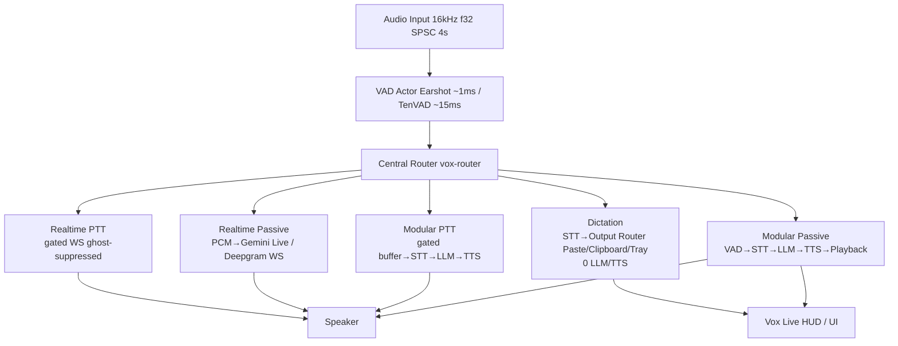

<div align="center">
  
  <h3>The Ambient Intelligence Layer for the Native Edge</h3>
  <p align="center">
    <a href="#-key-features">Key Features</a> •
    <a href="#-technical-architecture">Architecture</a> •
    <a href="#-product-tour">Product Tour</a> •
    <a href="#-model-zoo">Model Zoo</a> •
    <a href="#-getting-started">Getting Started</a>
  </p>
  <p align="center">
    
    
    
    
  </p>
</div>

---

## 🌌 The Vision

**Vox** is a real-time, local-first voice assistant designed to disappear into your desktop environment. Rather than forcing you to interact with a chat window, Vox operates as a persistent, ultra-low-latency ambient listener. It responds to voice activity instantly, streams output on the fly, and gets out of your way the second you stop speaking. 

Vox prioritizes conversational rhythm and tactile edge execution over cloud dependence, ensuring complete data privacy and full end-to-end voice interaction pipeline.

---

## ✨ Key Features

*   **Vox Live (Passive HUD)**: An ephemeral overlay that slides in automatically when speech is detected and auto-fades when you finish speaking.
*   **Push-To-Talk (PTT)**: Precise capture mechanism with real-time waveform visualization for higher-intent queries.
*   **Intelligent Barge-In**: Immediate flushing of audio buffers and LLM generation halts when you interrupt the model.
*   **Local Inference Zoo**: Leverages optimized ONNX and GGUF models running CPU-first inside a strictly enforced memory budget (~5.5GB).
*   **Multi-Platform Native Support**: Seamless native integration across Windows, macOS, and Linux, complete with a positioning HUD and click-through capability.

---

## 🏗️ Technical Architecture

Vox is built on a **domain-partitioned, event-driven pipeline in Rust**. A central non-blocking router (`services/pipeline/router.rs`) dispatches `VoxEvent`s to 5 dedicated handlers — no God loop — each with discrete lifecycle (`start_session`/`end_session`/`pause_session`/`ptt_*`).



*   **VAD**: Earshot (native Rust, ~1ms/frame) or TenVAD (ONNX ~15ms/frame) via `VadBackend` enum; decoupled actor emits `VoxEvent::SpeechStart/SpeechEnd`.
*   **STT**: Nemotron-3.5 (INT8 ONNX, ~2.5GB, 0.02–0.35× RTF, 8960-sample stateful windows) or Qwen3-ASR 0.6B; optional Google Chirp 3 cloud (`stt.cloud`). Partials throttled at 800ms.
*   **LLM**: Local Qwen3 0.8B (default) / Llama 3.2 1B / Gemma3 4B via llama.cpp, or remote via OpenAiCompat (OpenAI, Gemini, Anthropic, Nvidia `integrate.api.nvidia.com`, Groq) — capability probing measures TTFT/TPS + tool-calling.
*   **TTS**: Edge TTS (0 MB, WebSocket, 3.3× RTF) default; Supertonic 3 (99M, 31 languages), Chatterbox (340M Q4, voice cloning) local or remote. Clause chunker flushes sub-sentence by dynamic TPS.
*   **Realtime S2S**: Gemini Live / Deepgram Voice Agent via `RealtimeVoiceProvider` + `RealtimeSession` traits.
*   **Dictation**: System-wide hotkey `Alt+Space`, 0ms LLM/TTS fast path through `output_router` (Paste/Clipboard/Tray).


---

## 🖥️ Product Tour

### Ephemeral Interaction Layer
The passive HUD overlays transcriptions directly on your active workspace without disrupting focus. Enable click-through mode to pass events straight to background windows while you talk.

<div align="center">
  <table border="0">
    <tr>
      <td align="center" width="50%">
        
        <p><b>Passive HUD</b><br><em>Real-time overlay sliding in during active speech</em></p>
      </td>
      <td align="center" width="50%">
        
        <p><b>Push-To-Talk (PTT)</b><br><em>Manual trigger with visual waveform feedback</em></p>
      </td>
    </tr>
  </table>
</div>

### Control Center & Telemetry
Configure system behaviors, inspect live telemetry, select models, and view transcription history.

<div align="center">
  <table border="0">
    <tr>
      <td align="center" width="50%">
        
        <p><b>Command Center Dashboard</b><br><em>State change visualization during voice capture</em></p>
      </td>
      <td align="center" width="50%">
        
        <p><b>Model Manager</b><br><em>Dynamic hot-swapping for STT, LLM, and TTS configurations</em></p>
      </td>
    </tr>
    <tr>
      <td align="center" width="50%">
        
        <p><b>Performance Telemetry</b><br><em>Real-time resource logs (CPU, Memory, and Latency)</em></p>
      </td>
      <td align="center" width="50%">
        
        <p><b>Session History</b><br><em>Review recent interactions, transcripts, and model evaluations</em></p>
      </td>
    </tr>
  </table>
</div>

---

## 🦁 Model Zoo

Vox manages models locally using manifest validation. On first startup, the app validates your local models folder and downloads missing dependencies dynamically:

| Engine | Model | Format | File Size | Memory (RSS) | Latency | Required |
| :--- | :--- | :--- | :--- | :--- | :--- | :--- |
| **VAD** | Earshot | Native Rust | Zero | ~0 MB | ~1ms/frame | Default |
| **VAD** | Ten VAD | ONNX INT8 | ~15 MB | ~50 MB | ~15ms/frame | Optional (legacy) |
| **Translit** | Vox Translit RNN | ONNX | ~16 MB | ~16 MB | ~5ms | Lazy (first Devanagari) |
| **STT** | Nemotron-3.5 (Default) | ONNX INT8 | ~756 MB | ~2.5 GB | 0.02–0.35× RTF | Yes (Core) |
| **STT** | Qwen3-ASR (Legacy) | ONNX INT8 | ~986 MB | ~800 MB | 0.38–4.63× RTF | Optional |
| **STT** | Google Chirp 3 | Cloud | — | 0 MB | network | Optional |
| **LLM** | Qwen3 0.8B (Default) | GGUF Q4_K_M | ~600 MB | ~600 MB | 6–12 TPS | Default |
| **LLM** | Llama 3.2 1B Instruct | GGUF Q6_K | ~1.02 GB | ~970 MB | 2.5–4.4 TPS | Optional |
| **LLM** | Gemma3 4B | GGUF Q4_K_M | ~2.5 GB | ~2.5 GB | 9 TPS | Optional |
| **LLM** | Cloud (Nvidia/OpenAI/Gemini) | HTTP | — | 0 MB | network | Optional (Tier 2B default) |
| **TTS** | Edge TTS (Default) | WebSocket | — | 0 MB | 0.30× RTF | Default |
| **TTS** | Supertonic 3 | ONNX INT8 | ~144 MB | ~144 MB | 1.76× RTF | Optional |
| **TTS** | Chatterbox | GGML Q4 | ~340M | ~1.1 GB | variable | Optional (voice cloning) |


---

## 🚀 Getting Started

### Installation
You can install Vox directly on supported platforms using our bootstrap script:

```bash
curl -fsSL https://addy-47.github.io/vox/install.sh | bash
```

### Updates
To update your package manager repository and download the latest desktop client:

```bash
sudo apt update && sudo apt upgrade vox
```

---

<div align="center">
  
  <br>
  <sub>Designed for privacy and immediate ambient intelligence.</sub>
</div>\