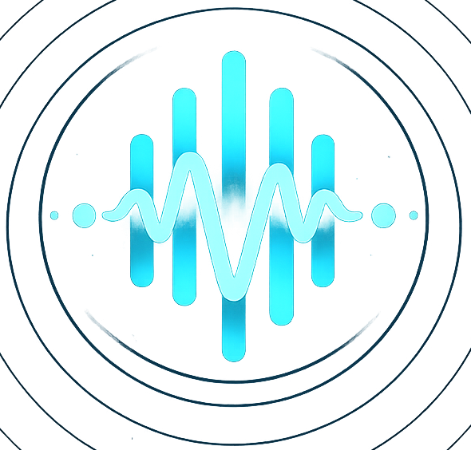
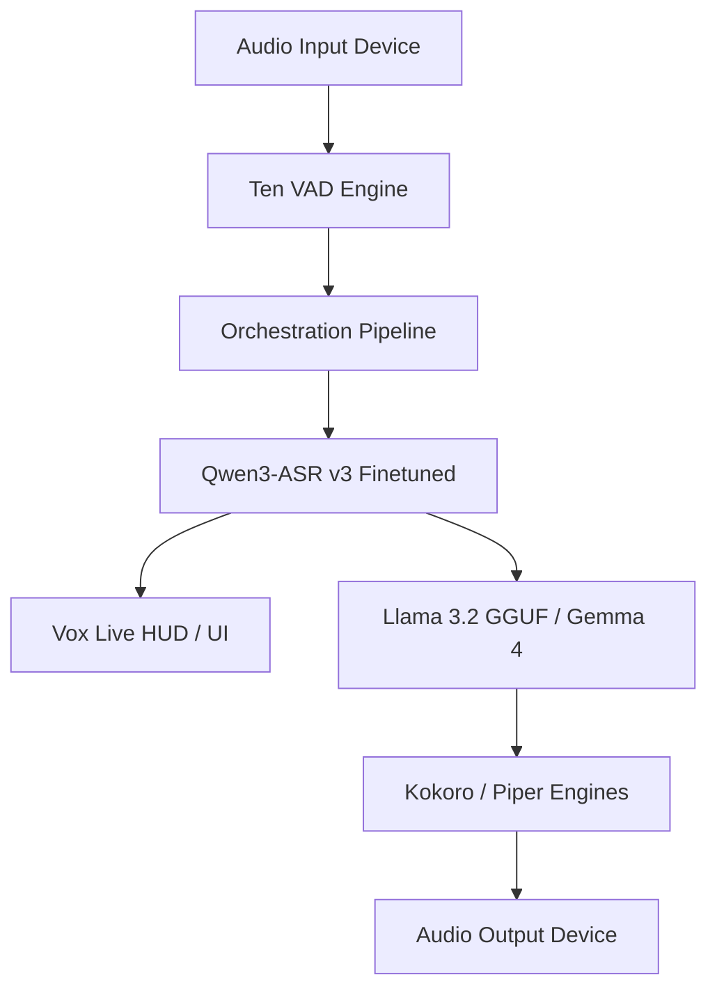
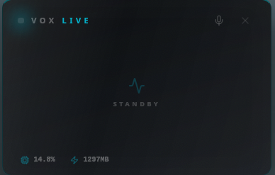
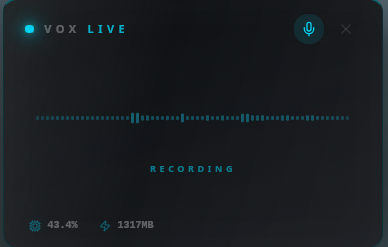
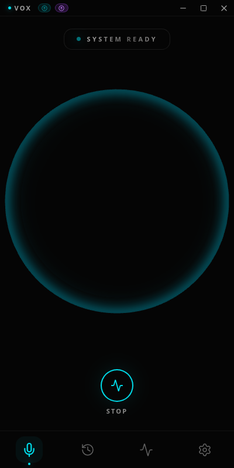
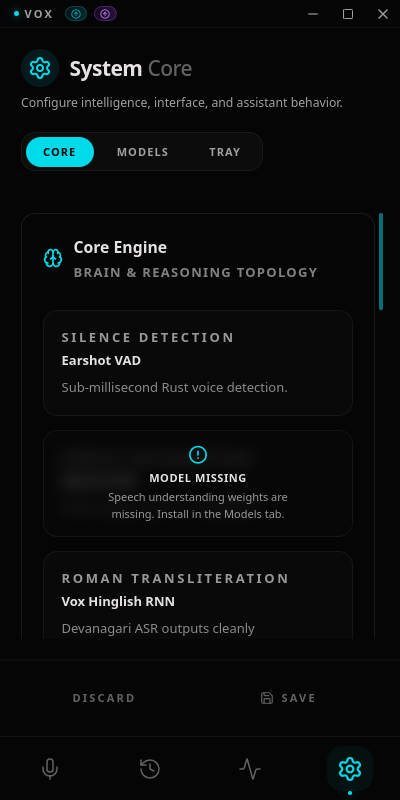
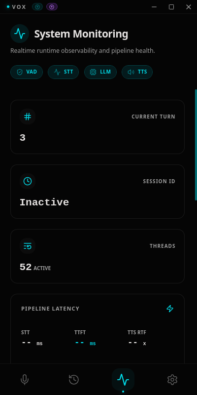
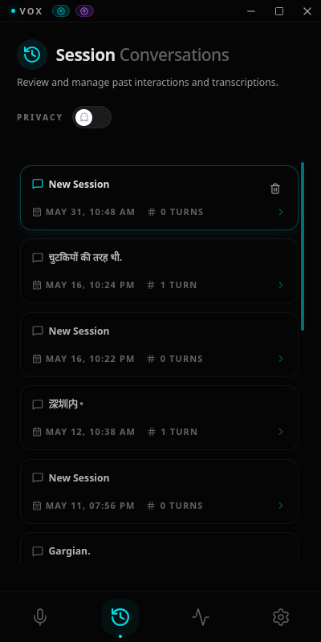

<div align="center">
  
  <h3>The Ambient Intelligence Layer for the Native Edge</h3>
  <p align="center">
    <a href="#-key-features">Key Features</a> •
    <a href="#-technical-architecture">Architecture</a> •
    <a href="#-product-tour">Product Tour</a> •
    <a href="#-model-zoo">Model Zoo</a> •
    <a href="#-getting-started">Getting Started</a>
  </p>
  <p align="center">
    
    
    
    
  </p>
</div>

---

## 🌌 The Vision

**Vox** is a real-time, local-first voice assistant designed to disappear into your desktop environment. Rather than forcing you to interact with a chat window, Vox operates as a persistent, ultra-low-latency ambient listener. It responds to voice activity instantly, streams output on the fly, and gets out of your way the second you stop speaking. 

Vox prioritizes conversational rhythm and tactile edge execution over cloud dependence, ensuring complete data privacy and sub-500ms response cycles.

---

## ✨ Key Features

*   **Vox Live (Passive HUD)**: An ephemeral overlay that slides in automatically when speech is detected and auto-fades when you finish speaking.
*   **Push-To-Talk (PTT)**: Precise capture mechanism with real-time waveform visualization for higher-intent queries.
*   **Intelligent Barge-In**: Immediate flushing of audio buffers and LLM generation halts when you interrupt the model.
*   **Local Inference Zoo**: Leverages optimized ONNX and GGUF models running CPU-first inside a strictly enforced memory budget (~5.5GB).
*   **Multi-Platform Native Support**: Seamless native integration across Windows, macOS, and Linux, complete with a positioning HUD and click-through capability.

---

## 🏗️ Technical Architecture

Vox is built on a non-blocking, multi-threaded pipeline using Rust. The audio loop parallelizes system mic captures, VAD detection, and online ASR streaming to keep input latency at a bare minimum.



*   **VAD Engine**: Powered by TEN VAD (FP32 ONNX) running at 100Hz with a sub-15ms execution time.
*   **Speech-To-Text**: Qwen3-ASR (INT8 quantized) running offline with local BPE tokenizers and frame-level feature extractor wrappers.
*   **TTS Generation**: Multi-voice Kokoro (English) and Piper (Hindi) synthesis engines streaming raw PCM directly into system audio outputs.

---

## 🖥️ Product Tour

### Ephemeral Interaction Layer
The passive HUD overlays transcriptions directly on your active workspace without disrupting focus. Enable click-through mode to pass events straight to background windows while you talk.

<div align="center">
  <table border="0">
    <tr>
      <td align="center" width="50%">
        
        <p><b>Passive HUD</b><br><em>Real-time overlay sliding in during active speech</em></p>
      </td>
      <td align="center" width="50%">
        
        <p><b>Push-To-Talk (PTT)</b><br><em>Manual trigger with visual waveform feedback</em></p>
      </td>
    </tr>
  </table>
</div>

### Control Center & Telemetry
Configure system behaviors, inspect live telemetry, select models, and view transcription history.

<div align="center">
  <table border="0">
    <tr>
      <td align="center" width="50%">
        
        <p><b>Command Center Dashboard</b><br><em>State change visualization during voice capture</em></p>
      </td>
      <td align="center" width="50%">
        
        <p><b>Model Manager</b><br><em>Dynamic hot-swapping for STT, LLM, and TTS configurations</em></p>
      </td>
    </tr>
    <tr>
      <td align="center" width="50%">
        
        <p><b>Performance Telemetry</b><br><em>Real-time resource logs (CPU, Memory, and Latency)</em></p>
      </td>
      <td align="center" width="50%">
        
        <p><b>Session History</b><br><em>Review recent interactions, transcripts, and model evaluations</em></p>
      </td>
    </tr>
  </table>
</div>

---

## 🦁 Model Zoo

Vox manages models locally using manifest validation. On first startup, the app validates your local models folder and downloads missing dependencies dynamically:

| Engine | Model | Format | File Size | Latency (RTF) | Required |
| :--- | :--- | :--- | :--- | :--- | :--- |
| **VAD** | Ten VAD | ONNX FP32 | ~330 KB | 0.015 | Yes (Core) |
| **Translit**| Vox Translit RNN | ONNX | ~16 MB | 0.005 | Yes (Core) |
| **STT** | Qwen3-ASR-0.6B (v3 Finetuned) | ONNX INT8 | ~980 MB | 0.080 | Yes (Core) |
| **LLM** | Llama 3.2 1B Instruct | GGUF Q6_K | ~1.02 GB | ~15 tok/sec | Optional |
| **LLM** | Gemma 4 2B Instruct | GGUF Q4_K_M | ~3.46 GB | ~9 tok/sec | Optional |
| **TTS (EN)**| Kokoro | ONNX + Bin | ~350 MB | 0.150 | Optional |
| **TTS (HI)**| Piper (Pratham / Priyamvada) | ONNX | ~63 MB | 0.180 | Optional |

---

## 🚀 Getting Started

### Installation
You can install Vox directly on supported platforms using our bootstrap script:

```bash
curl -fsSL https://addy-47.github.io/vox/install.sh | bash
```

### Updates
To update your package manager repository and download the latest desktop client:

```bash
sudo apt update && sudo apt upgrade vox
```

---

<div align="center">
  
  <br>
  <sub>Designed for privacy and immediate ambient intelligence.</sub>
</div>
