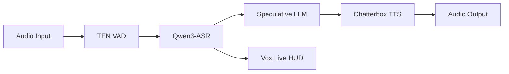
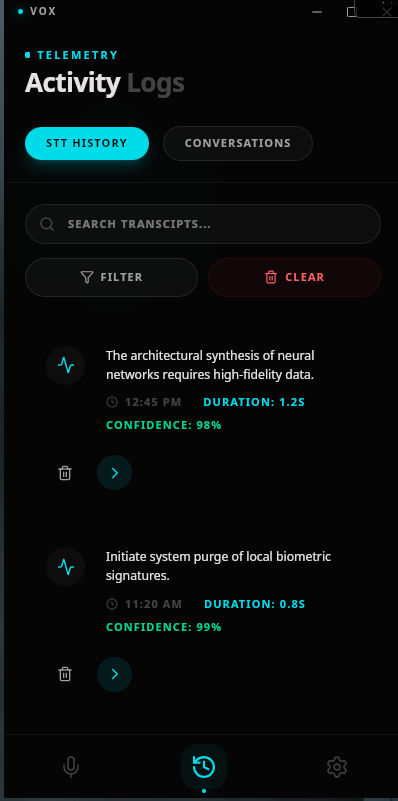

<div align="center">
  
  <h3>The Ambient Intelligence Layer for the Native Edge.</h3>
  <p align="center">
    <a href="#-vox-live-the-interaction-surface">Vox Live</a> •
    <a href="#-technical-architecture">Architecture</a> •
    <a href="#-the-command-center">Command Center</a> •
    <a href="#-model-zoo">Model Zoo</a> •
    <a href="#-getting-started">Setup</a>
  </p>
  <p align="center">
    
    
    
  </p>
</div>

---

## 🌌 The Vision

**Vox** is a real-time, local-first voice system designed to disappear. It isn't a chatbot or a dashboard; it's a persistent, low-latency intelligence layer that lives on your device. 

By prioritizing **Real-Time over Perfection**, Vox achieves a conversational flow that feels ambient and human. It responds while you're still speaking, handles interruptions naturally, and vanishes when the job is done.

---

## ⚡ Vox Live: The Interaction Surface

Vox Live is a system-level, ephemeral voice input layer that allows you to speak anywhere and instantly obtain usable text—without breaking your workflow.

### Ephemeral by Design
The transcription tray exists only during active speech. It appears instantly from the edge of your screen on `speech_start`, streams partial transcripts in real-time, and fades away automatically after a period of silence.

<div align="center">
  <table>
    <tr>
      <td width="50%" align="center">
        
        <p><strong>Passive HUD</strong><br><em>Auto-appearing transcription overlay</em></p>
      </td>
      <td width="50%" align="center">
        
        <p><strong>Push-To-Talk</strong><br><em>High-intent capture with visualization</em></p>
      </td>
    </tr>
  </table>
</div>

- **Zero Friction**: No manual triggers required. Speak, and the system reacts.
- **Context Preservation**: Stay in your IDE or browser while transcribing.
- **One-Click Utility**: Instant copy-to-clipboard for rapid workflows.

---

## 🏗️ Technical Architecture

Vox is built on a **Non-Blocking, Event-Driven Streaming Pipeline**. The system parallelizes audio ingestion, voice activity detection, and inference to ensure feedback is perceived as instantaneous.



### Deep Tech Breakdown
- **Barge-In Mechanics**: Immediate flushing of audio buffers and LLM halt upon new speech detection for natural interruptions.
- **Speculative Inference**: LLM context pre-filling begins while the STT is still streaming partial deltas.
- **Memory Physics**: Strictly engineered for a **5.5GB inference budget** to prevent OS swap thrashing on 8GB RAM devices.

---

## 🖥️ The Command Center

While the interaction is ephemeral, the Command Center provides full control over the system's brain, observability, and performance tuning.

<div align="center">
  <table>
    <tr>
      <td width="33%"></td>
      <td width="33%"></td>
      <td width="33%"></td>
    </tr>
    <tr>
      <td align="center"><strong>Active Monitoring</strong></td>
      <td align="center"><strong>Real-Time Logs</strong></td>
      <td align="center"><strong>Model Config</strong></td>
    </tr>
  </table>
</div>

---

## 🦁 Model Ecosystem (The Zoo)

| Role | Model | Quantization | Footprint | Latency (RTF) |
| :--- | :--- | :--- | :--- | :--- |
| **VAD** | TEN VAD | FP32 | 306 KB | ~0.015 |
| **STT** | Qwen3-ASR-0.6B | INT8 (ONNX) | 0.80 GB | ~0.080 |
| **LLM** | Gemma / Qwen2.5 | INT4 (GGUF) | 2.20 GB | 15 tok/s |
| **TTS** | Chatterbox-Turbo | INT8 (ONNX) | 0.50 GB | ~0.150 |

---

## 🚀 Getting Started

```bash
# Clone & Install
git clone https://github.com/your-repo/vox.git
cd vox
npm install

# Launch Development Environment
# Models are downloaded dynamically on first run.
npm run tauri dev
```

---

<div align="center">
  
  <br>
  <sub>Built for the future of ambient computing.</sub>
</div>
