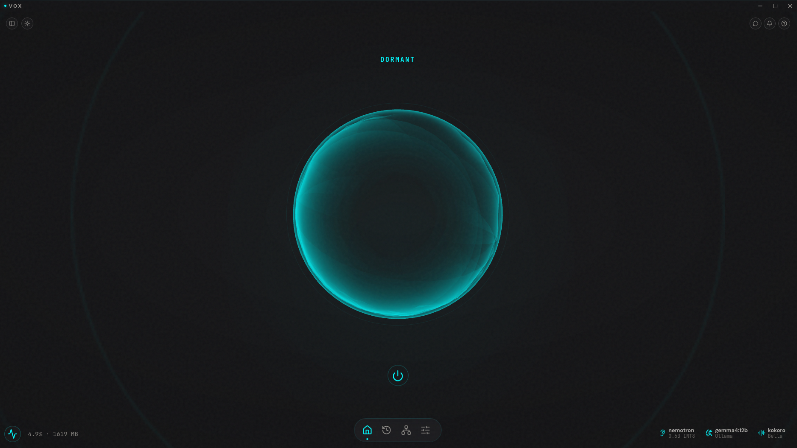
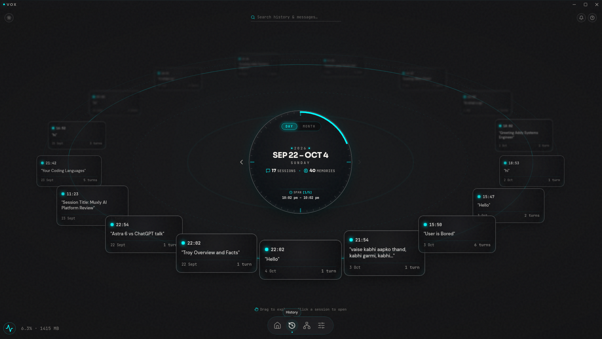
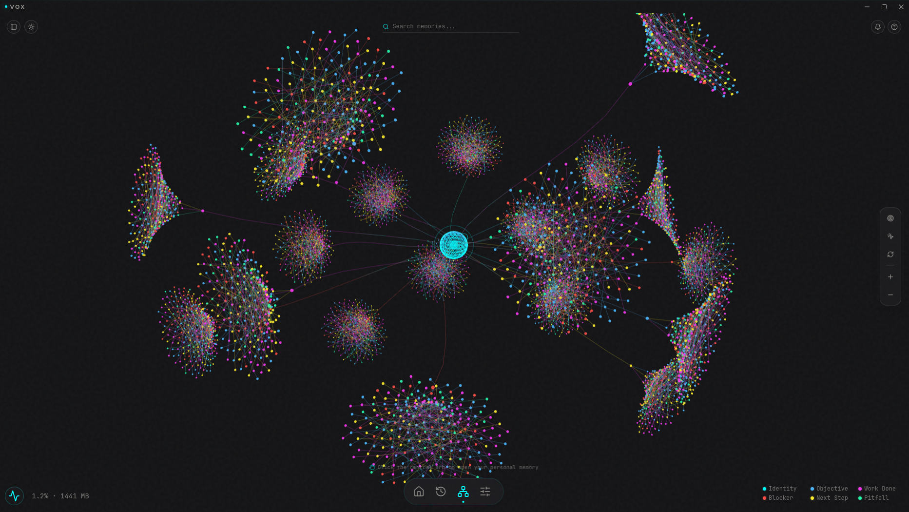
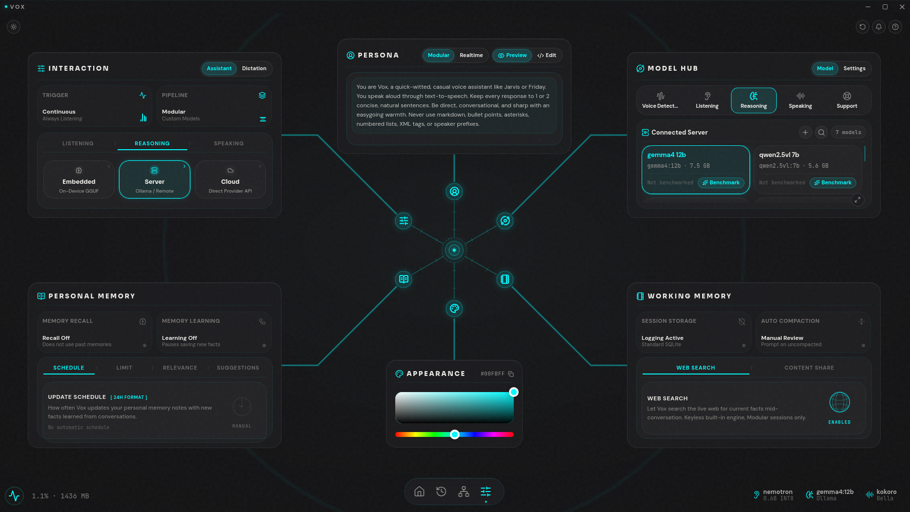
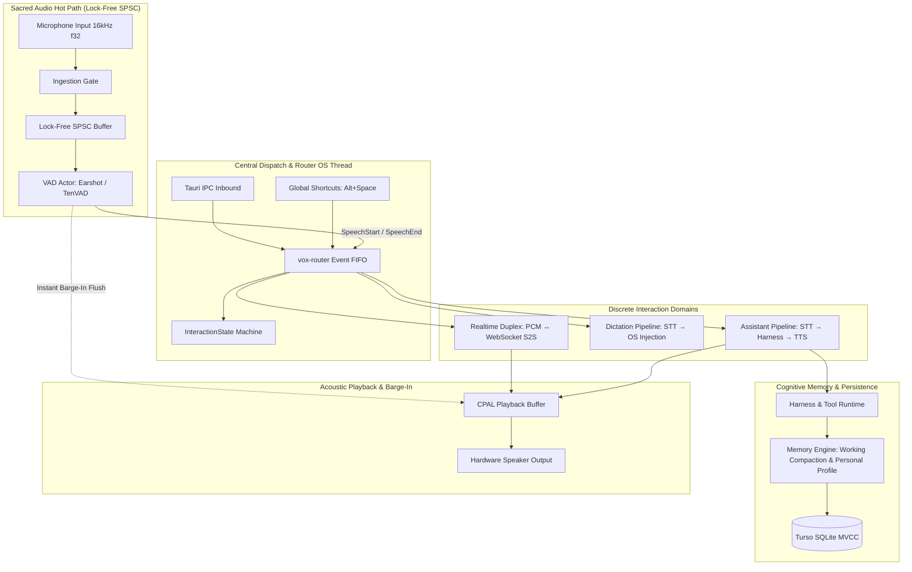

<div align="center">


# Vox

### Ambient Voice Intelligence for the Native Desktop

<p align="center">
  <b>A real-time, local-first voice assistant designed to disappear into your operating system.</b><br>
  Low-latency conversational voice, global instant dictation, persistent cognitive memory, and pluggable AI providers.
</p>

<p align="center">
  <a href="#what-is-vox">Overview</a> •
  <a href="#product-tour">Product Tour</a> •
  <a href="#key-capabilities">Capabilities</a> •
  <a href="#architecture">Architecture</a> •
  <a href="#design-principles">Design Principles</a> •
  <a href="#technology-stack">Tech Stack</a> •
  <a href="#getting-started">Getting Started</a> •
  <a href="#testing">Testing</a>
</p>

<p align="center">
  
  
  
  
  
</p>

</div>

---

## What is Vox?

Vox is built around a single premise: **voice interaction should feel like an organic part of your computer**, not another browser tab or chat application you have to constantly manage.

Operating as a persistent, low-latency ambient intelligence layer, Vox listens on an ephemeral HUD, responds with natural cadence, and steps out of your way the moment you finish speaking.

The system runs two primary interaction tracks:

* **Assistant Track** — Conversational voice AI operating via continuous ambient VAD or push-to-talk (PTT) with configurable local, remote, or realtime duplex providers.
* **Dictation Track** — Instant system-wide speech-to-text input triggered via global hotkey (`Alt+Space`), bypassing conversational LLM/TTS stages to inject text directly into the active OS window.

Audio work on latency-sensitive hot paths is strictly decoupled from background reasoning, memory synthesis, and database operations.

---

## Product Tour

Vox marries high-performance native systems programming with an ethereal spatial interface rendered in React 19 and Three.js.

<div align="center">

<table border="0" cellpadding="8" cellspacing="0" width="100%">
  <tr>
    <td align="center" width="50%" valign="top">
      <a href="app/public/home.png">
        
      </a>
      <br>
      <b>Living Resonance Orb & Telemetry HUD</b><br>
      <sub>Dynamic 3D fluid sphere reacting to voice state with live hardware, throughput, and inference telemetry.</sub>
    </td>
    <td align="center" width="50%" valign="top">
      <a href="app/public/history.png">
        
      </a>
      <br>
      <b>Chronological Orbit Session Archive</b><br>
      <sub>Spatiotemporal orbital timeline organizing conversations with search, session filtering, and turn inspection.</sub>
    </td>
  </tr>
  <tr>
    <td align="center" width="50%" valign="top">
      <a href="app/public/memory.png">
        
      </a>
      <br>
      <b>Sentient Knowledge Topology</b><br>
      <sub>Interactive 3D Fibonacci canopy mapping persistent user facts, habits, and durable preferences.</sub>
    </td>
    <td align="center" width="50%" valign="top">
      <a href="app/public/settings.png">
        
      </a>
      <br>
      <b>Unified Control Center & Model Hub</b><br>
      <sub>Capability discovery engine with live benchmark probing, hot-swappable providers, and persona tuning.</sub>
    </td>
  </tr>
</table>

</div>

---

## Key Capabilities

### 🎙️ Dual-Track Interaction Architecture
Vox decouples conversational dialogue from transcription under a unified audio manager:
* **Assistant Track:** Hands-free conversation powered by acoustic Voice Activity Detection (VAD) or Push-To-Talk for high-intent queries.
* **Dictation Track:** System-wide transcription with zero LLM/TTS overhead, injecting speech directly into target desktop applications via native OS input paste or clipboard.

### 🧠 Persistent Cognitive Memory
* **Personal Memory:** Long-term durable memory synthesized from user interactions. Includes a staging review surface with Google Docs-style diffs to approve, edit, or reject learned preferences.
* **Working Memory & Compaction:** Session-level context is dynamically tracked. When token usage nears model limits, background compaction summarizes earlier turns while playing acoustic fillers so the assistant never feels stalled.

### ⚡ Sub-Millisecond Audio Hot Path & Instant Barge-In
* **Lock-Free SPSC Queues:** Hardware audio streams run over lock-free single-producer single-consumer ring buffers with zero dynamic allocations in the audio thread.
* **Instant Barge-In:** When user speech is detected during speech playback, active audio drains flush instantly and LLM generation cancels in <10ms.

### 🔌 Pluggable AI Provider Architecture
* **Local On-Device Models:** Runs on CPU/GPU via ONNX Runtime and GGUF backends (optimized for 8GB RAM baselines).
* **Remote & Cloud Providers:** Connects to OpenAI-compatible endpoints, Ollama servers, and cloud providers (Nvidia NIM, OpenRouter).
* **Realtime S2S Duplex:** Native WebSocket streaming to duplex voice engines (Gemini Live, Deepgram Voice Agent) for sub-second turn latency.

### 📊 Empirical Capability Discovery & Probing
* Built-in model catalog parses thousands of models in milliseconds.
* Automated capability probe measures real-world Time-to-First-Token (TTFT), Tokens-per-Second (TPS), and verifies production tool-calling support against actual endpoints.

---

## Architecture

Vox separates latency-critical audio processing from state transitions, background inference, and UI rendering:


```mermaid
graph TD
    subgraph Audio_Hot_Path["Sacred Audio Hot Path (Lock-Free SPSC)"]
        Mic[Microphone Input 16kHz f32] --> Ingest[Ingestion Gate]
        Ingest --> RingBuffer[Lock-Free SPSC Buffer]
        RingBuffer --> VAD[VAD Actor: Earshot / TenVAD]
    end

    subgraph Central_Core["Central Dispatch & Router OS Thread"]
        VAD -->|SpeechStart / SpeechEnd| Router[vox-router Event FIFO]
        Hotkeys[Global Shortcuts: Alt+Space] --> Router
        IPCCommands[Tauri IPC Inbound] --> Router
        Router --> FSM[InteractionState Machine]
    end

    subgraph Interaction_Domains["Discrete Interaction Domains"]
        Router --> AP[Assistant Pipeline: STT → Harness → TTS]
        Router --> DP[Dictation Pipeline: STT → OS Injection]
        Router --> RP[Realtime Duplex: PCM ↔ WebSocket S2S]
    end

    subgraph Cognitive_Layer["Cognitive Memory & Persistence"]
        AP --> Harness[Harness & Tool Runtime]
        Harness --> Memory[Memory Engine: Working Compaction & Personal Profile]
        Memory --> DB[(Turso SQLite MVCC)]
    end

    subgraph Acoustic_Output["Acoustic Playback & Barge-In"]
        AP & RP --> Playback[CPAL Playback Buffer]
        Playback --> Speaker[Hardware Speaker Output]
        VAD -.->|Instant Barge-In Flush| Playback
    end
```

### Architectural Guarantees
1. **Single-Writer Serialization:** All state transitions flow through `mpsc::Sender<VoxEvent>`. The `vox-router` thread is the sole writer for `InteractionState`, preventing race conditions.
2. **Warm Pause vs. Teardown:** Pausing suspends microphone capture while keeping CPAL audio streams warm (<10ms resumption latency).
3. **No Allocation on Audio Hot Path:** Zero locks (`Mutex`/`RwLock`), zero blocking I/O, and zero dynamic memory allocations in the audio ingestion callback.
4. **Resilient Error Categorization:** Errors are partitioned by operational impact (`Degraded`, `TurnAborted`, `SessionHalted`) and user actionability, keeping the application responsive.

> 📖 **Deep-Dive Specifications:** Comprehensive subsystem contracts live in [`docs/specs/`](docs/specs/) (storage, events, dictation, LLM harness, database, memory).

---

## Design Principles

| Principle | Description |
| :--- | :--- |
| **Local-First** | Audio processing, personal memory, and data storage stay on the local device by default. Cloud backends are opt-in. |
| **Provider Independence** | Inference backends sit behind stable provider interfaces. Swapping an LLM or STT engine never breaks interaction contracts. |
| **Acoustic Tactility** | State transitions, barge-in cancellation, and pre-roll playback cushions are tuned to match human conversational rhythm. |
| **Explicit State Separation** | Assistant and Dictation operate as isolated interaction tracks with defined ownership rules, avoiding modal confusion. |
| **Progressive Disclosure** | Compact viewport controls handle quick interaction, while expandable drawers provide inspection when needed. |

---

## Technology Stack

| Layer | Technologies | Role & Implementation |
| :--- | :--- | :--- |
| **Core Runtime** | Rust (2021 edition) | Central event router, lock-free audio pipelines, state machines, and hardware monitoring |
| **Desktop Shell** | Tauri v2 | Native window management, multi-platform system tray, global shortcut hooks, and async IPC |
| **Audio I/O** | CPAL, Rubato | 16kHz f32 capture, multi-channel ring buffer, sample-rate conversion, and acoustic playback |
| **Frontend & UI** | React 19, TypeScript, Tailwind CSS | Spatial UI surfaces, responsive drawers, and design system tokens |
| **Visuals & Motion** | Three.js, Framer Motion, Lenis | Living resonance orb canvas, 3D memory topology, and hardware-accelerated transitions |
| **Persistence** | Turso SQLite (`libsql`) | Multi-version concurrency control (MVCC), schema migrations, and vector embeddings |
| **Local Inference** | ONNX Runtime, GGUF | On-device voice activity detection, speech recognition, local reasoning, and embeddings |

---

## Getting Started

### Prerequisites

* **Operating System:** Linux (Ubuntu 22.04+, Fedora 38+, Arch), macOS 13+, or Windows 11
* **Rust:** Stable toolchain (`1.80+`)
* **Node.js:** Node `20+` and `pnpm` (`9+`)
* **Linux Libraries:**
  ```bash
  sudo apt install libasound2-dev libssl-dev pkg-config
  ```

### Developer Setup

1. **Clone the repository with submodules:**
   ```bash
   git clone --recurse-submodules https://github.com/addy-47/vox.git
   cd vox
   ```

2. **Install frontend dependencies:**
   ```bash
   cd app
   pnpm install
   ```

3. **Run in sandboxed development mode:**
   ```bash
   # Launches Tauri dev server using an isolated local profile (.vox_sandbox)
   pnpm dev:sandbox
   ```

4. **Build production bundle:**
   ```bash
   pnpm tauri build
   ```

---

## Testing

Vox maintains integration and production-path test suites verifying state-machine transitions, concurrency locks, and IPC contracts:

```bash
# Run isolated Rust test suite
cd app/src-tauri
RAYON_NUM_THREADS=$(nproc) OMP_NUM_THREADS=$(nproc) cargo nextest run --release --test-threads=1

# Run Rust linting and formatting
cargo clippy --all-targets --release
cargo +nightly fmt --all

# Run frontend TypeScript type-check and bundle verification
cd ..
pnpm build
```

---

## Privacy & Security

* **Zero Audio Telemetry by Default:** Captured audio buffers and generated transcripts remain on your local machine unless a remote cloud provider is explicitly configured.
* **Incognito Private Mode:** Temporary private sessions blind event persistence, dropping session turns and memory facts from database writes.
* **Local Database Storage:** Conversations, settings, and memory topologies reside in local SQLite storage (`~/.vox/vox.db`).

---

<div align="center">

<sub>Vox — A voice-first AI desktop application built for ambient intelligence on the native edge.</sub>

</div>
