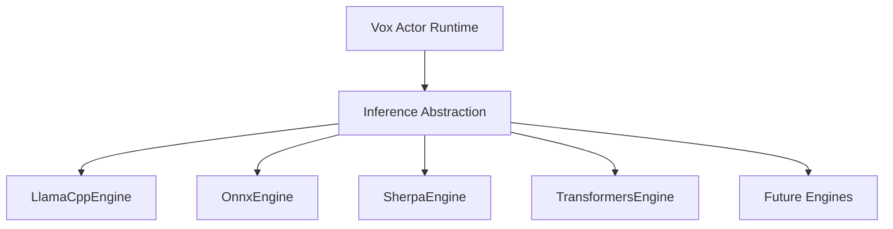

# Vox Technology Decision Framework

This document captures the major architectural decisions behind Vox and, more importantly, **why those decisions were made**.

The goal is not to defend every decision forever; the goal is to remember the constraints that existed when the decision was made.

---

# 1. Core Principles & The Audio-First Reality

Vox is:

* A **Realtime Audio Runtime**
* A **Native Desktop Application**
* A **Local Inference System**

The primary engineering challenge is **not AI model quality**, but the continuous pipeline:

```text
Audio → VAD → STT → LLM → TTS → Audio Output
```

### Constraint

Everything must run on an **8GB laptop** without feeling slow.

Most engineering effort goes into:

* Latency reduction
* Memory pressure management
* Thread coordination
* Startup sequencing

---

# 2. Language & Runtime Decisions

## Decision #1: Why Rust?

Rust was chosen because Vox is fundamentally a **realtime systems application**, not just a model wrapper.

### Reasons

* **Native Performance**

  * No interpreter
  * No VM
  * No managed runtime

* **Predictable Latency**

  * No Garbage Collector
  * Consistency matters more than peak benchmark numbers

* **Safe Concurrency**

  * Compile-time guarantees for:

    * Actor services
    * Audio workers
    * Inference threads

* **C++ Interoperability**

  * Acts as a thin orchestration layer for:

    * `llama.cpp`
    * ONNX runtimes
    * Sherpa-ONNX

### Memorable Rule

> Rust was chosen for runtime behavior, not inference performance.

---

## Decision #2: Why Not Python?

Python is the best place to **build and train models**, but not necessarily the best place to **run Vox**.

### Reasons

* **Interpreter Overhead**

  * Object metadata and interpreter state add latency before the model even loads.

* **GIL Constraints**

  * Complicates concurrent subsystem design:

    * Audio
    * VAD
    * STT
    * LLM
    * TTS

* **Predictability**

  * Python excels at driving C++ libraries.
  * Vox values predictable latency more than peak throughput.

### Memorable Rule

> Python is the best place to build models. Rust is the best place to run Vox.

---

## Decision #3: Why Not Go?

Go is an excellent backend language, but Vox is not a backend service.

### Reasons

* **Garbage Collection**

  * Even excellent GC implementations introduce latency pauses.
  * Realtime systems require deterministic behavior.

* **Memory Control**

  * Go intentionally trades low-level control for simplicity.
  * Vox requires deterministic allocation and lifecycle management.

* **CGO Reality**

  * Once integrating:

    * `llama.cpp`
    * Sherpa-ONNX
    * ONNX Runtime

  CGO becomes unavoidable and reduces Go's deployment advantages.

### Memorable Rule

> If Vox were a cloud service, choose Go. Because Vox is a realtime desktop runtime, choose Rust.

---

# 3. Inference & Model Support

## Decision #4: Why C++ Inference Engines?

Inference is primarily a linear algebra problem.

Modern C++ engines have spent years optimizing:

* SIMD
* AVX2 / AVX-512
* Quantization
* Cache locality
* Thread scheduling

### Architecture

```text
Rust (Orchestrator)
        ↓
Inference Trait
        ↓
C++ Engine
(llama.cpp / ONNX / Sherpa)
```

### Memorable Rule

> Vox should orchestrate inference, not reimplement it.

---

## Decision #5: What Determines Model Support?

A common misconception is that the programming language determines model support.

In reality:

> Model support is a function of the inference runtime.

Examples:

| Runtime      | Model Support Source   |
| ------------ | ---------------------- |
| llama.cpp    | GGUF ecosystem         |
| ONNX Runtime | ONNX ecosystem         |
| Sherpa-ONNX  | Speech models          |
| Transformers | Hugging Face ecosystem |

### Memorable Rule

> Model support comes from the runtime, not the language.

---

## Decision #6: Why Sherpa-ONNX?

Sherpa handles the difficult speech pipeline:

* Audio preprocessing
* Feature extraction
* Log-Mel generation
* Decoding
* Streaming recognition

### Trade-Off

Sherpa allows Vox to focus on:

**Voice System Engineering**

instead of

**Speech Research Engineering**

It sacrifices flexibility in exchange for operational simplicity.

### Memorable Rule

> Sherpa trades flexibility for operational simplicity.

---

## Decision #7: Why Not Use Transformers Everywhere?

The Transformers ecosystem acts as a universal model runtime.

However, it introduces:

* PyTorch
* Processor objects
* Large dependency chains
* Significant memory overhead

### Constraint

For an 8GB RAM, CPU-first system:

* Sherpa is usually lighter for STT
* llama.cpp is usually lighter for LLMs

### Memorable Rule

> Transformers maximizes model choice; Sherpa maximizes operational efficiency.

---

# 4. Memory & Architecture

## Decision #8: Memory Footprint Reality

Rust eliminates interpreter overhead.

It does **not** eliminate model memory requirements.

### Reality

Most RAM consumption comes from:

* STT model weights
* LLM model weights
* TTS model weights

The orchestration layer is comparatively small.

### Memorable Rule

> Models dominate memory. Languages influence overhead.

---

## Decision #9: Roadmap for Future Models

Inference engines should not dictate architecture.

By abstracting inference behind an engine interface, Vox can adopt new runtimes without architectural rewrites.

### Architecture



### Memorable Rule

> Add engines. Do not rewrite Vox.

---

# 5. Final Guiding Principles

When evaluating any future technology for Vox, ask five questions:

1. Does it reduce latency?
2. Does it reduce memory pressure?
3. Does it improve runtime stability?
4. Does it improve installability?
5. Does it preserve the 8GB baseline?

### Decision Rule

If the answer is **"No"** to these questions, do not adopt it.

---

# Summary

Vox is not optimized around model experimentation.

It is optimized around delivering a smooth, local, realtime voice experience on constrained hardware.

The architecture therefore prioritizes:

* Predictable latency
* Low memory overhead
* Operational simplicity
* Native desktop deployment
* Long-term extensibility through engine abstraction

> Build a stable runtime first. Models can change later.
