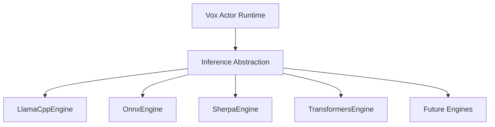

# Vox Technology Decision Framework

This document captures the major architectural decisions behind Vox and, more importantly, **why those decisions were made**.

The goal is not to defend every decision forever; the goal is to remember the constraints that existed when each decision was made.

---

## 1. Core Principles & The Audio-First Reality

Vox is:
- A **Realtime Audio Runtime**
- A **Native Desktop Application**
- A **Local Inference System**

The primary engineering challenge is **not AI model quality**, but the continuous pipeline:

```
Audio → VAD → STT → LLM → TTS → Audio Output
```

**Constraint**: Everything must run on an **8GB laptop** without feeling slow.

Most engineering effort goes into latency reduction, memory pressure management, thread coordination, and startup sequencing.

---

## 2. Language & Runtime Decisions

### Decision #1: Why Rust?

Rust was chosen because Vox is fundamentally a **realtime systems application**, not just a model wrapper.

**Reasons:**
- **Native Performance** — No interpreter, no VM, no managed runtime
- **Predictable Latency** — No garbage collector. Consistency matters more than peak benchmark numbers
- **Safe Concurrency** — Compile-time guarantees for actor services, audio workers, inference threads
- **C++ Interoperability** — Thin orchestration layer for `llama.cpp`, ONNX runtimes, Sherpa-ONNX

**Memorable Rule:** > Rust was chosen for runtime behavior, not inference performance.

---

### Decision #2: Why Not Python?

Python is the best place to **build and train models**, but not the best place to **run Vox**.

**Reasons:**
- **Interpreter Overhead** — Object metadata and interpreter state add latency before the model even loads
- **GIL Constraints** — Complicates concurrent subsystem design (Audio, VAD, STT, LLM, TTS)
- **Predictability** — Python excels at driving C++ libraries. Vox values predictable latency more than peak throughput

**Memorable Rule:** > Python is the best place to build models. Rust is the best place to run Vox.

---

### Decision #3: Why Not Go?

Go is an excellent backend language, but Vox is not a backend service.

**Reasons:**
- **Garbage Collection** — Even excellent GC implementations introduce latency pauses. Realtime systems require deterministic behavior
- **Memory Control** — Go intentionally trades low-level control for simplicity. Vox requires deterministic allocation and lifecycle management
- **CGO Reality** — Once integrating `llama.cpp`, Sherpa-ONNX, and ONNX Runtime, CGO becomes unavoidable and erodes Go's deployment advantages

**Memorable Rule:** > If Vox were a cloud service, choose Go. Because Vox is a realtime desktop runtime, choose Rust.

---

## 3. Inference & Model Support

### Decision #4: Why C++ Inference Engines?

Inference is primarily a linear algebra problem. Modern C++ engines have spent years optimizing SIMD, AVX2 / AVX-512, quantization, cache locality, and thread scheduling.

**Architecture:**
```
Rust (Orchestrator) → Inference Trait → C++ Engine (llama.cpp / ONNX / Sherpa)
```

**Memorable Rule:** > Vox should orchestrate inference, not reimplement it.

---

### Decision #5: What Determines Model Support?

Model support is a function of the inference runtime, not the programming language.

| Runtime | Model Support Source |
|---------|---------------------|
| llama.cpp | GGUF ecosystem |
| ONNX Runtime | ONNX ecosystem |
| Sherpa-ONNX | Speech models |
| Transformers | Hugging Face ecosystem |

**Memorable Rule:** > Model support comes from the runtime, not the language.

---

### Decision #6: Why Sherpa-ONNX?

Sherpa handles the difficult speech pipeline: audio preprocessing, feature extraction, Log-Mel generation, decoding, and streaming recognition.

**Trade-off:** Sherpa allows Vox to focus on **Voice System Engineering** instead of **Speech Research Engineering**. It sacrifices flexibility for operational simplicity.

**Memorable Rule:** > Sherpa trades flexibility for operational simplicity.

---

### Decision #7: Why Not Use Transformers Everywhere?

The Transformers ecosystem acts as a universal model runtime, but introduces PyTorch, processor objects, large dependency chains, and significant memory overhead.

**Constraint (8GB RAM, CPU-first system):**
- Sherpa is usually lighter for STT
- llama.cpp is usually lighter for LLMs

**Memorable Rule:** > Transformers maximizes model choice; Sherpa maximizes operational efficiency.

---

## 4. Memory & Architecture

### Decision #8: Memory Footprint Reality

Rust eliminates interpreter overhead. It does **not** eliminate model memory requirements.

**Reality:** Most RAM consumption comes from STT, LLM, and TTS model weights. The orchestration layer is comparatively small.

**Memorable Rule:** > Models dominate memory. Languages influence overhead.

---

### Decision #9: Roadmap for Future Models

Inference engines should not dictate architecture. By abstracting inference behind an engine interface, Vox can adopt new runtimes without architectural rewrites.



**Memorable Rule:** > Add engines. Do not rewrite Vox.

---

## 5. Database & Persistence

### Decision #10: Why Turso Over SQLite / libSQL?

Vox uses the **`turso` crate** (Turso Database, v0.7.1) — a clean-room Rust rewrite of SQLite — as its embedded persistence engine. This decision was driven by Vox's realtime, event-driven architecture, not by database feature checklists.

**Why not raw SQLite (via `rusqlite`)?**

The standard `rusqlite` crate wraps SQLite's C library. For Vox this means:
- **Blocking I/O** — Every `rusqlite` call blocks the calling thread. In an async‑first Rust app with tokio, this either requires `spawn_blocking` (extra thread pool, context switches) or blocks the async executor (latency spikes in the audio pipeline)
- **No native vector types** — Embeddings (BGE-M3, 1024-dim) must be stored as opaque blobs and decoded into Rust memory for every similarity scan. This means `O(n)` full-table scans in application memory
- **Single-writer lock** — SQLite serializes all writes. During peak memory pipeline processing, the persistence worker becomes a bottleneck
- **C compiler dependency** — `rusqlite` requires a C compiler toolchain, complicating cross-compilation and CI

**Why not the `libsql` crate?**

The `libsql` crate wraps the libSQL C fork of SQLite. It adds vector search support and cloud sync, but inherits SQLite's blocking I/O and C dependency:
- **Blocking C calls** — `libsql` still wraps C code; async is simulated via `spawn_blocking`
- **C compiler required** — Same cross-compilation and toolchain burden as `rusqlite`
- **Maintenance track** — libSQL is in maintenance mode; all new development (async I/O, MVCC, pure Rust, Postgres frontend) happens in the `turso` crate

**Why the `turso` crate wins for Vox:**

| Requirement | `turso` crate | `rusqlite` | `libsql` crate |
|-------------|---------------|------------|----------------|
| Async I/O (zero `spawn_blocking`) | ✅ Native tokio | ❌ Blocking C calls | ❌ Blocking C calls |
| Vector search in SQL | ✅ `vector_distance_cos()` | ❌ Manual decode | ✅ Same support |
| MVCC concurrent writes | ✅ `BEGIN CONCURRENT` | ❌ Single-writer lock | ❌ Not supported |
| Pure Rust (no C compiler) | ✅ | ❌ Requires C toolchain | ❌ Requires C toolchain |
| Future direction | 🚀 All new development | 🛡️ Mature / stable | 🛡️ Maintenance mode |

**How this helps Vox specifically:**

1. **Eliminates Rust-side O(n) vector decode loops** — `vector_distance_cos()` runs inside SQL, pushing cosine similarity computation into the engine. Candidate pre-filtering happens before any data leaves the database, removing the application-level `O(n)` scan of 384‑dim float arrays
2. **Async I/O keeps the audio pipeline responsive** — Database queries use `conn.query(...).await` directly on the tokio runtime. No `spawn_blocking` thread pool, no executor stalls during wave file writes or compaction
3. **Single binary, zero external dependencies** — `turso` compiles with `cargo` alone. No `libsqlite3`, no C toolchain, no system libraries. CI, cross-compilation, and end‑user installation are all simpler
4. **Future path to concurrent writes** — When Vox's persistence worker becomes a throughput bottleneck, `BEGIN CONCURRENT` unlocks MVCC multi‑writer mode without an architectural change. The crate is already in place; this is a configuration change

**Benchmark Evidence (10,000 × 384-dim vectors, release mode):**

A direct comparison of SQL `vector_distance_cos()` vs Rust `cosine_similarity()` was run against synthetic data matching the production schema:

| Metric | SQL Pushdown | Rust Loop | Winner |
|--------|-------------|-----------|--------|
| Raw compute (10K vecs) | 38.09ms | 34.55ms | Rust ~1.1x faster* |
| Per-vector compute | 3.81µs | 3.46µs | Rust ~1.1x |
| Load+decode (one-time) | **0ms** | **50.68ms** (14.6 MB) | SQL — eliminates entirely |
| Top-5 result equivalence | — | — | **Identical** (max diff 6.9e-8) |
| App heap allocation | **~0 bytes** | ~14.6 MB temporary | SQL |
| Scalability with vector index | O(log n) | O(n) | SQL (future) |

*Rust's compiler auto-vectorizes the dot-product loop with SIMD, giving it a ~10% edge in raw compute. The real win for SQL pushdown is eliminating the 14.6 MB load+decode transfer — in the old per-query approach, this cost is paid **3x per fact** (seeds + intra + inter), adding ~150ms of data movement before any similarity computation. The SQL approach pays this cost zero times.

**Interpretation for Vox's memory pipeline:**
- Each fact ingestion runs 3 vector similarity queries (semantic seeds, intra-collection NLI candidates, inter-collection LLM candidates)
- Old approach (Rust decode + loop per query): ~3 × (50ms load+decode + 35ms compute) = **~255ms per fact**
- SQL pushdown: ~3 × 38ms = **~114ms per fact** — with zero application memory pressure
- Primary benefit is **eliminating the data transfer bottleneck**, not raw compute speed
- Future vector index (DiskANN) will make SQL O(log n) vs Rust's O(n), widening the gap at scale

**Current adoption status:** Vox uses `vector_distance_cos()` SQL pushdown in all three candidate search paths (semantic seeds, intra-collection NLI, inter-collection LLM). The remaining high-ROI features (`BEGIN CONCURRENT`, vector index, cloud sync) are documented gaps, not selection regrets.

**Memorable Rule:** > The `turso` crate is the right engine. The gaps are in utilization, not selection.

---

## 6. Final Guiding Principles

When evaluating any future technology for Vox, ask five questions:

1. Does it reduce latency?
2. Does it reduce memory pressure?
3. Does it improve runtime stability?
4. Does it improve installability?
5. Does it preserve the 8GB baseline?

If the answer is **"No"** to these questions, do not adopt it.

---

## Summary

Vox is not optimized around model experimentation. It is optimized around delivering a smooth, local, realtime voice experience on constrained hardware.

The architecture therefore prioritizes predictable latency, low memory overhead, operational simplicity, native desktop deployment, and long-term extensibility through engine abstraction.

> Build a stable runtime first. Models can change later.

---

**Last Updated:** 2026-07-25
