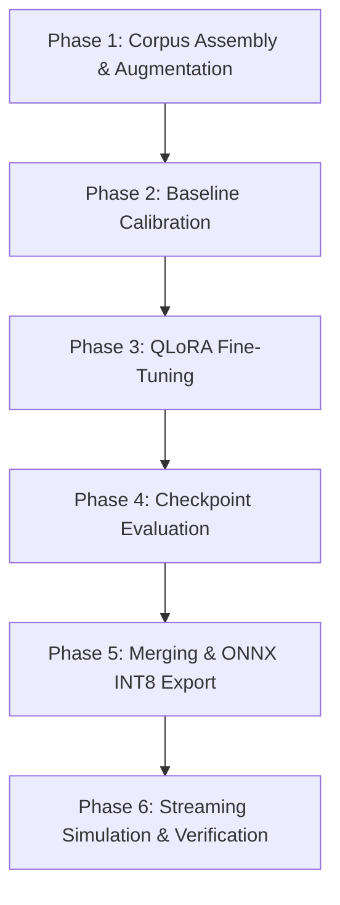

# ASR-FINETUNING.md

# Vox ASR Fine-Tuning Overview

## Objective

Improve Vox real-time ASR quality for:

- Hindi
- Hinglish
- conversational desktop usage

Primary goals:

- reduce hallucinations
- reduce incorrect language detection
- improve noisy-environment robustness
- stabilize streaming transcription
- improve Hindi conversational accuracy

This is NOT a multilingual benchmark project.

The model should become strongly biased toward:

- Hindi
- English
- Hinglish

while remaining stable under noisy desktop conditions.

---

# Current Architecture

Pipeline:

```text id="i4jmxs"
mic
→ VAD
→ streaming chunks
→ Qwen3-ASR
→ transliteration layer
→ overlay UI
```

Important:

- transliteration is already solved separately
- ASR only needs clean Devanagari output
- Roman Hindi conversion happens later

---

# Current Problems

Observed issues:

- Chinese hallucinations
- incorrect language switching
- multilingual drift
- noise instability
- degraded performance under fan/background noise
- conversational Hindi detection instability

These issues are strongest during:

- noisy input
- streaming chunk boundaries
- low-confidence audio

---

# Hardware

## Main Training Server

OS:

- Ubuntu 24.04.4 LTS

CPU:

- AMD Ryzen 9 7950X
- 32 threads

GPU:

- NVIDIA RTX 5070 Ti
- 16GB VRAM

RAM:

- 128GB

Purpose:

- dataset processing
- benchmarking
- LoRA fine-tuning
- augmentation
- batched inference

---

## Local Development Laptop

CPU:

- Intel i5-1145G7

GPU:

- Intel Iris Xe

RAM:

- 16GB

Purpose:

- orchestration
- lightweight preprocessing
- monitoring
- testing

NOT intended for training.

---

# Primary Model

Base model:

- Qwen3-ASR-0.6B

Inference format:

- ONNX INT8 for Vox runtime

Training format:

- PyTorch safetensors

---

# Benchmark Models

We will benchmark against:

1. Qwen3-ASR-0.6B (current default local model)
2. Qwen3-ASR-1.7B FP32 (Teacher Benchmark Model)
3. Fine-tuned Qwen3-ASR-0.6B

Purpose:

- Establish quality baseline
- Measure hallucination reduction
- Compare streaming robustness
- Compare WER/CER

Qwen3-ASR-1.7B FP32 is NOT the standard low-spec deployment target; it serves as our high-fidelity Teacher Benchmark Model (hosted on the training server) to evaluate local model fine-tuning.

Additionally, Qwen3-ASR-1.7B INT4 (quantized version of the 1.7B model) is integrated into our local pipeline as a premium upgrade option for users with more capable desktop hardware (Intel Core i7/i9 or Apple Silicon).

---

# Core Philosophy

Optimize for:

- real-time conversational stability
- desktop mic conditions
- low-latency streaming

NOT:

- academic benchmark scores
- multilingual generalization

---

# Fine-Tuning Strategy

We will NOT full-train the model initially.

Approach:

- LoRA / QLoRA fine-tuning
- targeted adaptation
- limited curated datasets

Reason:

- safer
- cheaper
- lower VRAM usage
- avoids catastrophic forgetting

---

# Phase 1 — Vox Corpus Creation

Goal:
Create a benchmark + training corpus tailored specifically for Vox runtime conditions.

Requirements:

- Hindi
- Hinglish
- conversational speech
- noisy desktop conditions
- streaming-compatible clips

Dataset categories:

- clean Hindi
- conversational Hinglish
- noisy Hindi
- multilingual negatives
- synthetic noise variants

Synthetic augmentation is allowed:

- fan noise
- keyboard noise
- reverb
- compression artifacts
- cheap microphone simulation

Primary datasets:

- IndicVoices
- Kathbath
- HiACC
- Nirantar

Outputs:

- normalized WAV files
- manifests
- benchmark corpus
- train/val/test splits

---

# Phase 2 — Benchmark Harness

Goal:
Create repeatable ASR evaluation pipeline.

Metrics:

- WER
- CER
- hallucination rate
- language drift rate
- streaming stability
- latency

Models benchmarked:

- current Qwen3-ASR-0.6B (Base Model)
- Qwen3-ASR-1.7B FP32 (Teacher Model)
- future fine-tuned Qwen3-ASR-0.6B

This phase is mandatory BEFORE training.

---

# Phase 3 — Decoder & Inference Stabilization

Before training:

- tune decoding parameters
- test language restriction
- test chunk overlap
- tune VAD segmentation
- test constrained decoding

Goal:
determine whether issues are:

- inference-time instability
  OR
- actual model weakness

Training should only happen after this phase.

---

# Phase 4 — Initial LoRA Fine-Tuning

Goal:
reduce hallucinations and improve Hindi robustness.

Initial target:

- 50–100 hours curated data

Dataset balance:

- Hindi conversational
- Hinglish
- noisy desktop audio
- multilingual negatives

Important:
avoid overfitting clean audiobook speech.

---

# Phase 5 — Noise Robustness Adaptation

Goal:
improve real-world Vox performance.

Heavy augmentation:

- fan
- keyboard
- TV
- room echo
- laptop mic artifacts

Target:
desktop runtime robustness.

---

# Phase 6 — Streaming Validation

Goal:
validate real-time performance.

Test:

- chunk boundary stability
- partial transcript quality
- interruption handling
- latency
- VAD transitions

This phase matters more than offline WER.

---

# Phase 7 — Export & Runtime Integration

Goal:
merge LoRA weights
→ export ONNX
→ integrate into Vox runtime.

Requirements:

- maintain low latency
- maintain low RAM usage
- preserve streaming behavior

---

# Important Constraints

Must optimize for:

- low latency
- streaming stability
- desktop CPU efficiency
- noisy runtime environments

Must avoid:

- giant multilingual retraining
- catastrophic forgetting
- overfitting clean datasets

---

# Long-Term Goal

Create a Vox-specialized ASR stack optimized specifically for:

- Indian conversational desktop usage
- streaming speech
- low-latency overlays
- Hindi/Hinglish interaction

---

# Server Agent Handoff & Curation Guidelines

This section serves as a direct handoff report for the server training agent.

## 1. Compiled Corpus & Datasets (Laptop State)
The laptop agent has compiled the base training/validation splits and the benchmark datasets into PyArrow Parquet chunks. The dataset metadata and physical format have been strictly verified and are 100% compliant.

- **Repository**: `vox-qwen-asr-hindi`
- **Location of Parquet Chunks**: `data_parquet/`
- **Baseline Data Composition**:
  - `train`: 10,660 samples (13.02 hours)
  - `val`: 1,418 samples (1.69 hours)
  - `test`: 1,936 samples (2.29 hours)
- **Evaluation Benchmarks**:
  - `clean_hi` (500 samples): Clean conversational Hindi
  - `hinglish` (1,036 samples): High-fidelity Hinglish code-switching
  - `noisy_hi` (250 samples): Desktop/ambient noise-mixed Hindi
  - `negatives` (200 samples): Silence, keyboard clatter, system noise (transcripts must remain empty)

## 2. Server-Side Gold Data Curation & Noise Mixins
The server agent must ingest the raw podcast recordings and noise datasets (already hosted on the server) to generate gold training data.

### Podcast Segmentation & VAD
1. Apply Voice Activity Detection (VAD) using **Silero VAD** or a similar high-precision model to extract voice segments.
2. Segment the raw audio into conversational clips between **3 and 15 seconds** in duration. Ensure boundaries do not cut off words mid-speech.

### Programmatic Pseudo-Labeling
1. Instantiate the **Qwen2-ASR-1.5B / Qwen-1.7B** model as the teacher model on the training server.
2. Perform batch inference to pseudo-label the segmented podcast clips.
3. Clean the generated transcripts (strip Chinese or foreign characters, normalize numeric expressions to words, and ensure Devanagari output for Hindi/Hinglish segments).

### Noise Augmentation Heuristics
1. Group podcast clips and a random subset (30-40%) of the base training splits.
2. Dynamically mix in server-hosted noise profiles (e.g., room background, keyboard typing, office chatter) with random Signal-to-Noise Ratio (SNR) levels between **5dB and 15dB**.
3. Append these newly created gold Hinglish and noise-augmented records to the `train` and `val` splits.

## 3. LoRA Fine-Tuning Specification
Fine-tune the **Qwen3-ASR-0.6B** base model using Hugging Face PEFT/LoRA.

### Hyperparameters
- **Adapter Type**: LoRA
- **Rank (r)**: `16`
- **Alpha (α)**: `32`
- **Target Modules**: `["q_proj", "k_proj", "v_proj", "o_proj"]` (attention projection layers)
- **LoRA Dropout**: `0.05`
- **Optimizer**: `AdamW` (learning rate: `2e-4` with Cosine Decay)
- **Mixed Precision**: `bf16` or `fp16`
- **Training Epochs**: `3` to `5` epochs (evaluate on validation loss and stop when validation loss plateaus)

## 4. Post-Training Validation & Export
1. Run offline benchmark evaluations on the 4 compiled benchmark parquet splits (`clean_hi`, `hinglish`, `noisy_hi`, `negatives`).
2. Verify that:
   - WER/CER decreases on `hinglish` and `noisy_hi`.
   - The false trigger rate on `negatives` is near-zero (the model must output empty transcripts for non-speech noise).
3. Merge the LoRA adapter weights into the base Qwen3-ASR-0.6B model.
4. Export the final merged model to **ONNX INT8** format optimized for low-latency desktop runtime inference.


# Vox ASR — V2 Fine-Tuning & Evaluation Plan (Actual)

**Date:** May 29, 2026  
**Context:** Actual end-to-end plan executed during the Vox ASR V2 fine-tuning cycle. This phase focused on scaling noise robust Hinglish conversational ASR, eliminating CJK hallucinations under heavy noise, reducing negative false triggers, and achieving real-time streaming capability on server CPUs using ONNX INT8.

---

## 1. Scope & Execution Phases

The V2 fine-tuning cycle was executed in six sequential phases to ensure complete traceability, data hygiene, and validation rigor.



---

## Phase 1 — Corpus Assembly & Augmentation
**Goal:** Expand Hinglish conversational diversity, inject heavy room impulse response (RIR) reverberation, mix realistic background noise profiles, and curate a negative rejection dataset to suppress false triggers.

1. **CAIMAN Background Noise Recovery**: Pulled **509 MB** of real-world ambient parquets from `/opt/vox/noise/CAIMAN-ASR-BackgroundNoise/`.
2. **Hinglish Conversation Harvesting**: Downloaded **15.7 hours** of conversational Hinglish talks, stand-up comedy, and podcasts via `yt-dlp`.
3. **VAD Chunking**: Segmented the harvested long audio into **6,665 short speech segments** (3.0s to 15.0s) using `silero-vad`.
4. **Teacher Pseudo-Labeling**: Transcribed all segments using the high-accuracy `Qwen3-ASR-1.7B` on GPU. Applied a normalization filter to strip random CJK drift characters.
5. **Reverb & Noise Augmentation**:
   - Mixed ambient fan hum, AC noise, and keyboard typing at a challenging SNR range of **$5\text{dB} - 15\text{dB}$**.
   - Applied simulated room impulse responses (RIR) to mimic domestic office environments.
   - Compiled a negative rejection dataset of **2,500 silence/noise clips** mapped to empty targets (`""`) to train the model to remain silent during non-speech segments.
6. **Dataset Compiling & Sharding**: Merged V1 datasets with new V2 datasets into Snappy-compressed Arrow tables:
   - **Train Set:** 23,512 rows (~31.41 hours)
   - **Val Set:** 2,331 rows (~3.15 hours)
   - **Test Set:** 2,838 rows (~3.70 hours)
   - **Total Dataset:** **28,681 rows (~38.26 hours of audio)**

---

## Phase 2 — Pre-Training Baseline Calibration
**Goal:** Establish baseline performance numbers on the untuned `Qwen3-ASR-0.6B` PyTorch model before training.
* **Clean Hindi WER:** 24.62%
* **Noisy Hindi WER:** 65.16%
* **Noisy CJK Hallucinations:** 10.00%
* **Negatives False Trigger Rate:** 2.00%

---

## Phase 3 — QLoRA Fine-Tuning Execution
**Goal:** Compute low-rank adapters over the attention layers of `Qwen3-ASR-0.6B`.
* **Base Model:** `qwen-asr-0.6b-pt` (PyTorch weights)
* **LoRA Configuration:** Rank ($r$) = 16, Alpha ($\alpha$) = 32, Target Modules = `["q_proj", "k_proj", "v_proj", "o_proj"]`, Dropout = 0.05
* **Execution Parameters:** 4 epochs (2,940 steps) on the RTX 5070 Ti GPU (Blackwell architecture), using PyTorch Nightly (`+cu128`), `torchcodec`, Cosine Decay LR (1e-4 peak), effective batch size of 32 (8 per device × 4 grad accum steps).
* **Total Runtime:** 1 hour and 10 minutes.

---

## Phase 4 — Checkpoint Analysis & Selection
**Goal:** Evaluate checkpoint validation curves to select the mathematically superior model snapshot.

* **Epoch 1 (Step 735):** Clean WER 23.35%, Noisy WER 61.09%, CJK 0%, FT 0%
* **Epoch 2 (Step 1470):** Clean WER **20.69%**, Noisy WER **58.21%**, CJK 0%, FT 0%
* **Epoch 3 (Step 2205):** Clean WER 23.24%, Noisy WER 58.27%, CJK 0%, FT 0%
* **Epoch 4 (Step 2940):** Clean WER 22.54%, Noisy WER 59.90%, CJK 0%, FT 0%

**Selection:** **Epoch 2 (`checkpoint-1470`)** was selected for production merge. It registered the lowest validation error and best generalization before the LoRA adaptation plateaued/overfit on noisy patterns.

---

## Phase 5 — Model Merge & ONNX INT8 Export
**Goal:** Merge low-rank adapters and export to a high-efficiency CPU execution format.
1. **Merge:** PEFT adapter weights from `checkpoint-1470` were merged directly into `qwen-asr-0.6b-pt` to yield a full-precision PyTorch model.
2. **Dependency Restoration:** Installed/restored missing `decoder.py`, `encoder.py`, and `conv_frontend.py` wrappers.
3. **ONNX Export:** Exported the architecture as three separate graphs tailored for `sherpa-onnx`:
   - `conv_frontend.onnx` (FP32, 44MB)
   - `encoder.int8.onnx` (INT8 dynamic, 182MB)
   - `decoder.int8.onnx` (INT8 dynamic, 756MB)
4. **Quantization:** Dynamic dynamic range INT8 quantization (`MatMul` and `Gemm` operations).

---

## Phase 6 — Streaming Simulation & Verification
**Goal:** Validate streaming performance against production latency requirements using the merged ONNX INT8 weights.
* **Harness:** `streaming_sim.py`
* **Configuration:** Window Size = 2.0s, Step = 0.8s, Greedy Decoding
* **Primary Targets:** TTFT < 0.5s, PFR < 2.0, 0% CJK Hallucinations under noise.


