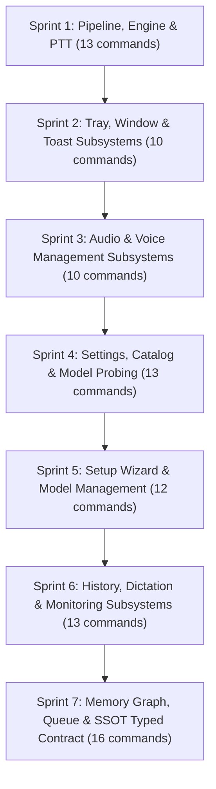

# IPC Command Architecture Overhaul — Sprint Roadmap & Decision Ledger

> **Context:** Complete Frontend $\leftrightarrow$ Backend IPC Command (`invoke`) consolidation and hardening across 87 Tauri command definitions (86 registered in `lib.rs`, 1 unregistered).  
> **Methodology:** `/create-sprints` enumeration + `/grill-me` iterative decision frontier across all 12 domains.  
> **Invariants:** Zero skipped commands, strict `AGENTS.md:4.1#5` service boundary compliance, zero runtime hot-path audio regressions, typed command contracts.

---

## 1. Complete Scope & Sprint Architecture

Deterministic census: **87 backend command definitions**, **86 `generate_handler!` registrations**, **76 frontend invoke sites (75 distinct strings)** across 12 domains.

### Sprint Breakdown Table

| Sprint | Domain Grouping | Raw Commands Count | Raw Handlers in Scope | Status |
| :--- | :--- | :---: | :--- | :--- |
| **Sprint 1** | Pipeline, Engine & PTT | 13 | `check_engine_status`, `launch_engine`, `stop_engine`, `start_session`, `end_session`, `pause_session`, `resume_session`, `test_clip`, `test_clip_cancel`, `get_realtime_session_cache`, `ptt_start`, `ptt_stop`, `ptt_cancel` | ✅ **Decided & Locked** |
| **Sprint 2** | Tray, Window & Toast | 10 | `hide_tray_window`, `toggle_tray_visibility`, `sync_hud_visibility`, `set_hud_ignore_cursor`, `update_interaction_mode`, `show_main_window`, `show_toast_window`, `hide_toast_window`, `destroy_toast_window_cmd`, `get_last_toast` | ✅ **Decided & Locked** |
| **Sprint 3** | Audio & Voice Management | 10 | `list_input_devices`, `list_output_devices`, `list_voices`, `fetch_edge_tts_voices`, `add_voice_from_file`, `add_voice_from_recording`, `start_backend_recording`, `stop_backend_recording`, `delete_voice`, `rename_voice` *(unregistered)* | ✅ **Decided & Locked** |
| **Sprint 4** | Settings, Catalog & Probing | 13 | `request_boot_state`, `request_model_catalog`, `get_settings`, `check_llm_provider_health`, `check_stt_provider_health`, `check_tts_provider_health`, `list_llm_models`, `get_cached_capabilities`, `probe_model_capabilities`, `validate_llm_token_cap`, `setup_remote_server`, `update_setting`, `reset_settings` | ✅ **Decided & Locked** |
| **Sprint 5** | Setup Wizard & Lifecycle | 12 | `fetch_manifest`, `check_for_updates`, `check_for_model_updates`, `get_onboarding_status`, `get_runtime_report`, `start_model_setup`, `cancel_model_setup`, `complete_setup_wizard`, `reveal_wizard`, `check_model_exists`, `download_optional_model`, `delete_model` | ✅ **Decided & Locked** |
| **Sprint 6** | History, Dictation & Monitoring | 13 | `get_transcript_history`, `commit_session_to_history`, `get_sessions`, `get_turns`, `delete_session`, `get_dictation_settings`, `get_last_dictation_transcript`, `copy_last_dictation_transcript`, `get_runtime_snapshot`, `get_runtime_history`, `clear_runtime_history`, `get_profiler_snapshot`, `record_memory_profile_event` | 🟡 **Active Frontier** |
| **Sprint 7** | Memory Graph, Queue & SSOT Typed Contract | 16 | `get_graph_version`, `get_memory_graph_topology`, `get_memory_fact_detail`, `get_memory_stats`, `edit_fact_content`, `reassign_fact_collection`, `soft_delete_fact`, `user_edit_memory`, `user_delete_memory`, `get_unresolved_conflicts`, `resolve_memory_conflict`, `get_memory_relations`, `get_memory_queue_status`, `toggle_pipeline_processing`, `retry_failed_queue`, `retry_failed_queue_items` | ⚪ Queued |

---

## 2. Sprint 1 Ledger: Pipeline, Engine & PTT

### Finalized Decisions (13 Commands $\to$ 11 Retained, 2 Pruned)
1. **`check_engine_status`**: ❌ **Pruned from IPC Handlers**. Subsystem availability is derived directly from `get_runtime_snapshot`.
2. **`launch_engine`**: ✅ **Retained**. Required for manual boot / model engine initialization.
3. **`stop_engine`**: ✅ **Retained**. Required for orderly shutdown and VRAM/RAM release.
4. **`start_session`**: ✅ **Retained (SSOT)**. Moves assistant state `Idle -> Ready` with DB identity preloading.
5. **`end_session`**: ✅ **Retained (SSOT)**. Domain cleanup, persists `SessionEnded`, returns pipeline to `Idle`.
6. **`pause_session`**: ✅ **Retained (SSOT)**. Pauses pipeline processing and disconnects audio passthrough.
7. **`resume_session`**: ✅ **Retained (SSOT)**. Resumes active session from `Paused` back to `Ready`.
8. **`test_clip`**: ✅ **Retained**. Test fixture injecting 16kHz mono audio into STT actor.
9. **`test_clip_cancel`**: ✅ **Retained**. Cancels ongoing test clip and renews turn token.
10. **`get_realtime_session_cache`**: ❌ **Pruned from IPC Handlers**. Zero frontend production consumers; backend internally manages session TTL and token caching.
11. **`ptt_start`**: ✅ **Retained (Hot Path)**. Initiates PTT turn under strict `!Idle && !Paused` guards.
12. **`ptt_stop`**: ✅ **Retained (Hot Path)**. Finalizes speech window validation and enters `Listening`/STT.
13. **`ptt_cancel`**: ✅ **Retained (Hot Path)**. Immediately cancels active PTT turn.

---

## 3. Sprint 2 Ledger: Tray, Window & Toast

### Finalized Decisions (10 Commands $\to$ 5 Clean SSOT Handlers)
1. **`show_main_window`**: ✅ **Retained**. Focuses the main Vox desktop application window.
2. **`hide_tray_window`**: ✅ **Retained**. Invoked by `TrayApp.tsx` on dismiss, clicking `X`, or turn cancellation.
3. **`set_window_click_through`**: 🔄 **Consolidated & Renamed** from `set_hud_ignore_cursor`. Signature: `{ window: "tray" | "toast", enabled: bool }`. Instructs OS window manager (GTK/Win32) on mouse click pass-through.
4. **`manage_toast_window`**: 🔄 **Consolidated** from `show_toast_window`, `hide_toast_window`, `destroy_toast_window_cmd`. Signature: `{ action: "show" | "hide" | "destroy" }`.
5. **`get_last_toast`**: ✅ **Retained**. Retrieves buffered toast payload on late webview mount.
6. **`toggle_tray_visibility`**: ❌ **Pruned from IPC / Demoted to Private Rust Function**. Executed directly by native OS tray context menu (`lib.rs`).
7. **`sync_hud_visibility`**: ❌ **Pruned**. Redundant with `hide_tray_window`.
8. **`update_interaction_mode`**: ❌ **Pruned**. Handled via generic `update_setting("interaction.mode", ...)`.
9. **Boundary Fix**: Encapsulate all toast IPC calls in `services/toastService.ts` to eliminate `ToastApp.tsx` raw `invoke` violations.

---

## 4. Sprint 3 Ledger: Audio & Voice Management Subsystems

### Finalized Decisions (10 Commands $\to$ 8 Standardized Handlers)
1. **`list_audio_devices`**: 🔄 **Consolidated** from `list_input_devices` and `list_output_devices`. Signature: `{ kind: "input" | "output" } -> Vec<AudioDevice>` (shares 5-second CPAL enumeration cache).
2. **`list_voices`**: 🔄 **Consolidated** with `fetch_edge_tts_voices`. Signature: `{ provider?: "custom" | "edge" | "kokoro" | "supertonic" } -> Vec<VoiceEntryDto>`.
3. **`add_voice_from_file`**: ✅ **Retained**. Clones voice embedding from audio file path.
4. **`add_voice_from_recording`**: ✅ **Retained**. Clones voice embedding from mic recording buffer.
5. **`start_backend_recording`**: ✅ **Retained**. Starts temporary audio capture buffer for custom voice sampling.
6. **`stop_backend_recording`**: ✅ **Retained**. Stops recording and returns captured PCM audio samples.
7. **`delete_voice`**: ✅ **Retained**. Deletes custom voice entry from SQLite DB and disk.
8. **`rename_voice`**: 🔄 **Registered & Wired**. Exposes `{ id: string, name: string }` in `lib.rs` and `pipelineService.ts`.

---

## 5. Sprint 4 Ledger: Settings, Catalog & Model Probing

### Finalized Decisions (13 Commands $\to$ 9 SSOT Handlers)
1. **`get_settings`**: 🔄 **Standardized SSOT** (replaces `request_boot_state`). Returns `{ settings, models_dir_exists, settings_path }`.
2. **`get_model_catalog`**: 🔄 **Renamed** from `request_model_catalog`. Returns categorized models, groups, voices, and preset colors.
3. **`check_provider_health`**: 🔄 **Consolidated** from `check_llm_provider_health`, `check_stt_provider_health`, `check_tts_provider_health`. Signature: `{ kind: "llm" | "stt" | "tts", provider?: ProviderConfig } -> bool`.
4. **`list_llm_models`**: ✅ **Retained**. Lists available local GGUFs or queries remote Ollama/OpenAI models.
5. **`probe_model_capabilities`**: 🔄 **Consolidated** with `get_cached_capabilities`. Signature: `{ provider?: ProviderConfig, model_id?: string, refresh?: bool } -> ModelCapabilities`.
6. **`validate_llm_token_cap`**: ✅ **Retained & Encapsulated**. Moved into `services/settingsService.ts` to fix `LlmSettingsView.tsx` direct invoke boundary violation.
7. **`setup_remote_server`**: ✅ **Retained**. Deploys Chatterbox/Ollama on remote GPU server via SSH streaming.
8. **`update_setting`**: ✅ **Retained**. Generic hot-apply setting mutation.
9. **`reset_settings`**: ✅ **Retained**. Resets configuration to factory defaults.

---

## 6. Sprint 5 Ledger: Setup Wizard & Model Lifecycle

### Finalized Decisions (12 Commands $\to$ 8 Clean Handlers)
1. **`check_updates`**: 🔄 **Consolidated** from `check_for_updates` and `check_for_model_updates`. Signature: `{ scope: "app" | "models" | "all" }`.
2. **`download_models`**: 🔄 **Consolidated** from `start_model_setup` and `download_optional_model`. Signature: `{ model_ids: Vec<String> }`.
3. **`cancel_model_download`**: 🔄 **Renamed** from `cancel_model_setup`. Cancels active model downloads.
4. **`delete_model`**: ✅ **Retained**. Deletes downloaded model files and verified hash markers.
5. **`check_model_exists`**: ✅ **Retained**. Checks presence and SHA verification markers.
6. **`get_onboarding_status`**: ✅ **Retained**. Checks `setup_completed` status.
7. **`get_runtime_report`**: ✅ **Retained**. Comprehensive hardware inspection + installed model verification.
8. **`complete_setup_wizard`**: ✅ **Retained & Deduped**. Consolidated duplicate frontend export into `services/modelService.ts`.
9. **`reveal_wizard`**: ✅ **Retained**. Brings setup wizard window to focus.
10. **`fetch_manifest`**: ❌ **Pruned from IPC Handlers**. Demoted to internal Rust fallback; `get_model_catalog` is the public SSOT.

---

## 7. Sprint 6: History, Dictation & Monitoring Subsystems

### Commands in Scope (13)
1. `get_transcript_history` (`ipc/history.rs:7`)
2. `commit_session_to_history` (`ipc/history.rs:18`)
3. `get_sessions` (`ipc/history.rs:70`)
4. `get_turns` (`ipc/history.rs:103`)
5. `delete_session` (`ipc/history.rs:138`)
6. `get_dictation_settings` (`ipc/pipeline/dictation.rs:8`)
7. `get_last_dictation_transcript` (`ipc/pipeline/dictation.rs:17`)
8. `copy_last_dictation_transcript` (`ipc/pipeline/dictation.rs:26`)
9. `get_runtime_snapshot` (`ipc/monitoring.rs:8`)
10. `get_runtime_history` (`ipc/monitoring.rs:14`)
11. `clear_runtime_history` (`ipc/monitoring.rs:20`)
12. `get_profiler_snapshot` (`ipc/monitoring.rs:26`)
13. `record_memory_profile_event` (`ipc/monitoring.rs:41`)
