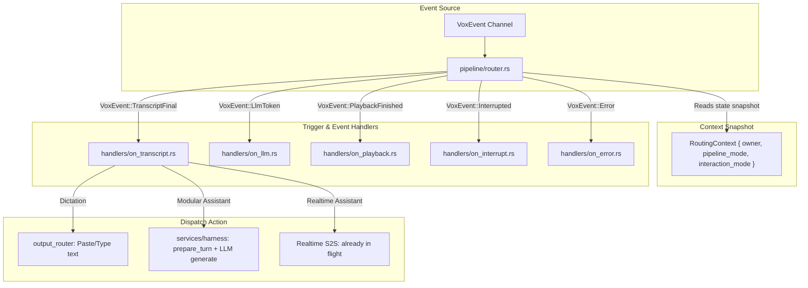

# High-Level Architecture (HLD) & Deep Redundancy Audit: `pipeline/`

## Step 0 — Scale and Intent
- **Calibration**: Production desktop voice application (sub-200ms latency, CPU-first, 8GB RAM).
- **Target**: Eliminate massive copy-paste redundancy across 5 pipeline handlers (`modular/ptt.rs`, `modular/passive.rs`, `realtime/ptt.rs`, `realtime/passive.rs`, `dictation.rs`) and establish a clean **Trigger/Event-Driven Pipeline Architecture**.

---

## 1. Redundancy & Debt Audit of Current `pipeline/`

An audit of all 2,118 lines across `pipeline/` reveals that **over 70% of the code is identical boilerplate** duplicated across 5 files:

| Duplicate Pattern | `modular/ptt.rs` | `modular/passive.rs` | `realtime/ptt.rs` | `realtime/passive.rs` | `dictation.rs` | Redundancy Assessment |
| :--- | :---: | :---: | :---: | :---: | :---: | :--- |
| **`TurnAccumulator`** | Lines 14–55 | Lines 14–55 | Lines 13–46 | Lines 13–46 | Partial | **100% duplicate** token & transcript accumulator |
| **`on_playback_started`** | Lines 537–542 | Lines 487–492 | Lines 437–442 | Lines 424–429 | N/A | **100% duplicate** (`Thinking -> Speaking`) |
| **`on_playback_finished`** | Lines 545–550 | Lines 495–500 | Lines 445–450 | Lines 432–437 | N/A | **100% duplicate** (`Speaking -> Ready`) |
| **`on_llm_token` IPC emit** | Lines 443–453 | Lines 393–403 | Lines 388–399 | Lines 375–386 | N/A | **100% duplicate** `emit_ipc_to(WINDOW_MAIN, LlmToken)` |
| **`on_llm_finished` persist** | Lines 504–534 | Lines 454–484 | Lines 403–434 | Lines 390–421 | N/A | **100% duplicate** `push_assistant_turn` & `PersistenceEvent::TurnCompleted` |
| **`on_interrupt` barge-in** | Lines 105–153 | Lines 141–189 | Lines 138–197 | Lines 219–278 | N/A | **90% duplicate** playback cancel, token renew, partial turn persistence |
| **`on_error` & Toast dispatch** | Lines 553–585 | Lines 503–535 | Lines 453–474 | Lines 440–462 | Lines 246–278 | **95% duplicate** `IpcEvent::VoiceError` & `show_toast` |
| **Transliteration & IPC** | Lines 272–292 | Lines 222–242 | Lines 353–380 | Lines 300–319 | Lines 168–188 | **100% duplicate** `transliterate_if_hi` & `TranscriptPartial` |

### Why Did This Happen?
Initially, it seemed each mode (`PTT`, `Passive`, `Realtime`, `Modular`, `Dictation`) needed completely distinct lifecycle handling. In reality, **a pipeline event is a pipeline event** — whether speech comes from Realtime WebSocket or Whisper STT, `on_transcript_final` always transliterates, updates state, and prepares the next stage.

---

## 2. Core Question: How Does Routing Work in an Event/Trigger Pipeline?

If we flatten `pipeline/` into **trigger/event-first files** (e.g. `on_speech_start.rs`, `on_transcript.rs`, `on_llm.rs`, `on_playback.rs`), **how does routing work without domain silos?**

### The Answer: The Unified Event State Machine Pattern



### The Mechanism:
1. `pipeline/router.rs` receives the `VoxEvent`.
2. It takes a single snapshot of `RoutingContext::from_app_state(&state)`.
3. It passes `(&app, &state, &ctx, payload)` directly to the matching **event handler function**.
4. The event handler contains the common pipeline logic (state transitions, IPC emits, error toasts, SQLite persistence) and branches **only on the one decision that differs** (e.g. `match ctx.owner { Dictation => output_router, Assistant => harness }`).

---

## 3. Target Proposed Structure

```
pipeline/
├── mod.rs               # RoutingContext, transition(), target_window(), state helpers
├── router.rs            # spawn_router() event pump loop
├── session.rs           # start_session(), pause_session(), resume_session(), end_session()
├── ptt.rs               # PTT Hotkey actions: ptt_start(), ptt_stop(), ptt_cancel()
│
└── handlers/            # [FIRST-CLASS EVENT HANDLERS]
    ├── mod.rs           # Re-exports all event handler functions
    ├── speech.rs        # on_speech_start, on_speech_end
    ├── transcript.rs    # on_transcript_partial, on_transcript_final (translit, IPC, routing)
    ├── llm.rs           # on_llm_token (TTS chunking), on_llm_finished (DB persist)
    ├── playback.rs      # on_playback_started, on_playback_finished
    ├── interrupt.rs     # on_interrupt (barge-in cancellation + partial turn flush)
    └── error.rs         # on_error, on_cancelled, toast dispatch
```

---

## 4. Key Advantages

1. **Eliminates 1,200+ Lines of Redundant Code**: All duplicate accumulators, IPC emitters, SQLite queries, and state transition matchers collapse into single shared handlers.
2. **Zero Inconsistencies**: Bug fixes to barge-in or error handling immediately apply across all modes (PTT, Passive, Realtime, Dictation).
3. **Crystal Clear Flow**: Trace any action directly: `VoxEvent::TranscriptFinal` $\to$ `handlers/transcript.rs: handle_transcript_final(...)`.

---

## 5. Discussion & Open Questions for User Alignment

1. **Session Lifecycle**: Does moving `start_session / end_session` into a dedicated `pipeline/session.rs` (which branches internally on `ctx.pipeline_mode` to initialize workers or WebSocket) make sense?
2. **Push-To-Talk Hotkey Actions**: Does consolidating `ptt_start`, `ptt_stop`, `ptt_cancel` into a single `pipeline/ptt.rs` cleanly unify Dictation PTT, Modular PTT, and Realtime PTT?

Let's discuss and align on this HLD architecture before proceeding!
