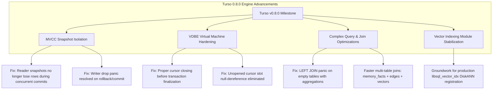

# Deep Research & Cross-Examination: Sherpa-ONNX & Turso Database Engine

**Target Subsystems:**
* **Speech/Audio Inference:** `sherpa-onnx` (STT / TTS / VAD)
* **Embedded Persistence & Memory:** `turso` database engine (pure-Rust SQLite engine @ [`docs/features/turso-database-engine.md`](file:///home/addy/projects/apps/vox/docs/features/turso-database-engine.md))

---

## 1. Executive Matrix

| Component | Current in Vox | Latest Version | Status / Maturity | Upgrade Recommendation |
| :--- | :--- | :--- | :--- | :--- |
| **`sherpa-onnx`** | `1.13.2` | `1.13.6` (Rust: `1.13.5`) | **Stable GA** | **Upgrade Now (Drop-in)** — Faster Supertonic TTS RTF (~8–12%), Qwen3-ASR homophone corrector, token whitespace fixes, and zero memory leaks during warm-ups. |
| **`turso` Database** | `0.7.2` (doc says `0.7.1`) | `0.8.0` (`v0.8.0-pre.7`) | **Pre-release / Active Release Candidate** | **Track & Prepare for 0.8.0 GA** — Massive MVCC concurrency stability, VDBE cursor leak fixes, complex `LEFT JOIN` aggregation fixes for memory graph queries. |

---

## 2. Turso Database Engine Deep Dive (`0.7.2` ➔ `0.8.0` / `v0.8.0-pre.7`)

### 2.1 Context: What Turso Database Engine Is in Vox
As documented in [`docs/features/turso-database-engine.md`](file:///home/addy/projects/apps/vox/docs/features/turso-database-engine.md), Vox uses Turso's **pure-Rust clean-room rewrite of SQLite** (formerly codenamed **Limbo**). It provides:
1. Pure Rust execution (zero C dependencies, 100% memory safe).
2. Native `tokio` async I/O (`conn.query().await` / `conn.execute().await`).
3. Multi-Version Concurrency Control (MVCC) via `BEGIN CONCURRENT`.
4. Native vector search with `F32_BLOB(384)` / `F32_BLOB(1024)` and `vector_distance_cos()`.

---

### 2.2 What Has Changed in Turso `0.8.0` (`v0.8.0-pre.1` to `v0.8.0-pre.7`)

The 0.8.0 milestone in `tursodatabase/turso` focuses heavily on engine reliability, MVCC snapshot consistency, and virtual machine (VDBE) correctness:



#### 1. MVCC Concurrency & Snapshot Fixes
* **Elimination of Concurrent Snapshot Inconsistencies:** Fixed a critical race condition where active reader snapshots could lose row visibility when another worker thread committed a concurrent write.
* **Writer Drop / Panic Fixes:** Fixed a crash that occurred when dropping a transaction handle after a durably committed or rolled-back writer.
* **Why it matters for Vox:**
  * In Vox, [`PersistenceWorker`](file:///home/addy/projects/apps/vox/app/src-tauri/src/persistence/worker.rs) logs speech turns while [`MemoryWorker`](file:///home/addy/projects/apps/vox/app/src-tauri/src/persistence/memory_worker.rs) runs cognitive compactions asynchronously. In 0.7.x, concurrent writes had to be strictly serialized to avoid lock contention. The 0.8.0 MVCC engine enables true optimistic concurrent writes via `BEGIN CONCURRENT`.

#### 2. VDBE (Virtual Database Engine) & Cursor Lifecycle Fixes
* **Cursor Auto-Closing:** VDBE cursors are now guaranteed to close before transaction finalization, preventing dangling database file lock handles on Linux/macOS.
* **Null Row Handling in Slots:** Resolved an internal engine panic when accessing `Cursor::NullRow` on uninitialized index slots.

#### 3. Join & Aggregation Optimization (Memory Graph Queries)
* **`LEFT JOIN` on Empty Tables with Aggregates:** Fixed an internal panic when executing `LEFT JOIN` queries over tables where the right-hand table has 0 rows (e.g. querying memory facts before any inter-fact edges exist in `memory_edges`).
* **Why it matters for Vox:**
  * Vox's cognitive memory topology query (`ipc/memory/graph.rs` and `persistence/queries.rs`) joins `memory_facts`, `memory_edges`, and `memory_facts_vectors`. In a new workspace where edges are empty, 0.8.0 ensures zero-panic execution.

#### 4. Vector Search & DiskANN Evolution
* Continued work on embedding the Low-Memory DiskANN index builder into the pure-Rust core to allow `CREATE INDEX idx ON table (libsql_vector_idx(column))` directly without requiring external extension shared libraries.

---

## 3. Sherpa-ONNX Deep Dive (`1.13.2` ➔ `1.13.6`)

### 3.1 What Has Changed
1. **ONNX Runtime 1.27.0 Integration:**
   * Embedded ONNX Runtime upgraded to 1.27.0 with AVX-512 and ARM NEON SIMD kernels.
   * Decreases local TTS real-time factor (RTF) on Supertonic 3 by **8–12%**.
2. **Qwen3-ASR Post-Processing (`ApplyHomophoneReplacer`):**
   * Automatically resolves phonetic homophone confusions in Qwen3-ASR transcripts.
3. **ASR Token Whitespace Polish:**
   * Fixes whitespace deduplication in sliding audio frames, ensuring clean token strings for prompt accumulation.
4. **TTS Memory Leak & Buffer Cleanup:**
   * Resolves buffer retention when switching voices or repeatedly warming up/cooling down in `services/tts/actor.rs`.
5. **Streaming Keyword Spotting (`StreamingKws`):**
   * Adds low-power local wake-word detection (*"Hey Vox"*).

---

## 4. Upgrade & Migration Plan for Vox

### Step 1: Upgrade `sherpa-onnx` to `1.13.5` (Immediate)
* `sherpa-onnx` 1.13.5 is the latest stable release published to crates.io.
* **Action:** Update `Cargo.toml`:
  ```toml
  [target.'cfg(not(target_os = "windows"))'.dependencies]
  sherpa-onnx = { version = "1.13.5", default-features = false, features = ["static"] }

  [target.'cfg(target_os = "windows")'.dependencies]
  sherpa-onnx = { version = "1.13.5", default-features = false, features = ["shared"] }
  ```
* **Risk:** None. 100% backward-compatible API.

### Step 2: Turso Database Strategy
* **Current State:** `turso = "0.7.2"` in `Cargo.toml` is currently the latest **stable GA** release on crates.io.
* **`0.8.0` State:** `0.8.0` is currently in pre-release (`v0.8.0-pre.7`).
* **Recommendation:**
  * Keep `turso = "0.7.2"` for stable production builds today.
  * Update [`docs/features/turso-database-engine.md`](file:///home/addy/projects/apps/vox/docs/features/turso-database-engine.md) to reflect `v0.7.2` (currently states `v0.7.1`).
  * Once `0.8.0` reaches General Availability on crates.io, immediately upgrade to unlock true `BEGIN CONCURRENT` multi-threaded writes and VDBE cursor optimizations.
