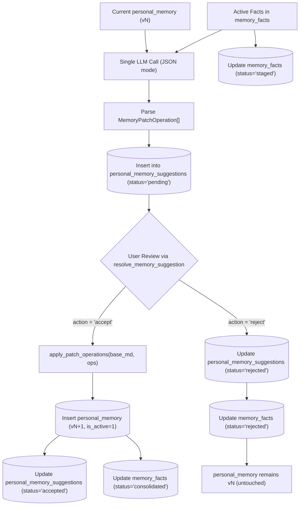

Yes, the structured-consolidation idea is feasible and is likely the correct long-term design. But it should be implemented as a **validated patch protocol**, not as “Markdown with line numbers” that the model can freely rewrite.

## What failed in the full run

The pipeline itself was mechanically healthy:

- 5,200 turns persisted.
- 14 sessions created.
- 33 compactions completed.
- Zero incomplete compactions.
- Zero failed queue items.
- 1,625 facts persisted.
- Ingestion accounting passed for every case.

The 11 failed cases came from two separate problems:

### 1. Compaction-count classification: 6 cases

- Case 04: expected 1, actual 0.
- Cases 10–14: expected 3, actual 4 or 5.
- Actual total: 33 compactions versus 28 expected.

This is not a broken compactor. The expected counts were calibrated to a different model’s compaction output size. Ling’s generated context has a different size, so later sessions cross the threshold earlier or later.

**Fix:** separate these assertions:

1. **Trigger correctness:** every actual compaction occurs at a critical turn, with a contiguous ledger and valid watermark.
2. **Count baseline:** expected counts are model-specific calibration data, not universal correctness.

For a new model, the correct check is:

```text
actual_count == model_calibrated_count
```

not:

```text
actual_count == count from another model
```

The existing count matrix should be retained as a regression baseline for the original model, not treated as a model-independent specification.

### 2. Personal-memory continuity: 8 cases

Failed cases:

- 03
- 05
- 06
- 07
- 08
- 11
- 13
- 14

The model consolidated successfully, but rewrote or dropped prior memory anchors. The current prompt says “preserve existing memory,” but that is only a behavioral instruction; the model can still regenerate the whole document and violate it.

This is exactly where structured consolidation helps.


# Implementation Plan: Structured Delta Personal Memory Consolidation

> **Role & Perspective:** System Architect $\to$ Backend Engineer  
> **Status:** Ready for Execution  
> **Target Specs:** [memory-spec.md](file:///home/addy/projects/apps/vox/docs/specs/memory-spec.md), [db-spec.md](file:///home/addy/projects/apps/vox/docs/specs/db-spec.md), [ipc-spec.md](file:///home/addy/projects/apps/vox/docs/specs/ipc-spec.md)  
> **Checklist:** [structured-consolidation-checklist.md](file:///home/addy/projects/apps/vox/docs/plans/phase12/structured-consolidation-checklist.md)

---

## 1. Goal Description & Target End-State

The existing Personal Memory consolidation and comment regeneration pipelines instruct the LLM to rewrite the entire Markdown dossier from scratch. In multi-case evals, this caused anchor erosion in 8 of 14 runs (stochastic loss of previously learned user traits).

**The Target End-State:**
* The LLM operates strictly as a **change proposer**, returning a structured JSON payload containing atomic patch operations (`replace`, `insert`, `delete`).
* Proposed patches are staged in a dedicated Turso database table: `personal_memory_suggestions`.
* Document lines not explicitly targeted by an operation are mathematically immutable.
* A single polymorphic IPC command `resolve_memory_suggestion(id, action)` allows the user (or auto-apply policy) to accept or reject suggestions individually or in bulk.
* When accepted, a deterministic patch engine applies the delta to the base markdown and bumps `personal_memory` version. When rejected, facts are marked `'rejected'` so they are never re-suggested.



---

## 2. Architecture & Design Resolutions

Every design decision has been vetted against pipeline invariants:

1. **No Synthetic Line Numbers:** The LLM targets content via `section` heading and exact `target_text`. This avoids line-arithmetic hallucinations and index drift under insertions.
2. **Simplified Atomic Operators:** We dropped the redundant `insert_after` operator. The protocol supports only three operations: `replace`, `insert`, and `delete`.
3. **Zero `reason` Noise:** We explicitly eliminated the `reason` field from prompt, schema, and database. The diff (`target_text` $\to$ `proposed_text`) is self-evident.
4. **Modal Exclusivity:** The Staging Card in the frontend owns review mode. While suggestions are pending, direct document edits and imports are disabled, preventing base-version race conditions by design.
5. **Unified Comments & Facts Engine:** Comment-driven regeneration uses the exact same structured delta schema and lands in `personal_memory_suggestions` for user verification.
6. **Polymorphic IPC Surface:** `resolve_memory_suggestion(id: Option<String>, action: String)` handles single cards (`id = Some(id)`) as well as `Accept All` / `Discard All` (`id = None`).

---

## 3. Execution Batches (Ordered by Real Dependency)


---

### Batch 1: Database Migration & Persistence Layer (Turso) [MODIFIED]

* **Blast Radius:** `schema.rs`, `personal_memory.rs`, `facts.rs`.
* **Structural Dependency:** None (foundational).
* **Build Health:** Must compile green with tests passing.

#### 1.1 `schema.rs` Changes [MODIFIED]
Bump `SCHEMA_VERSION = 7`. Add `personal_memory_suggestions` table DDL and index to `V2_TABLE_STATEMENTS`:

```rust
"CREATE TABLE IF NOT EXISTS personal_memory_suggestions (
    id TEXT PRIMARY KEY,
    base_memory_version INTEGER NOT NULL REFERENCES personal_memory(version) ON DELETE CASCADE,
    project_id TEXT REFERENCES projects(id) ON DELETE CASCADE,
    op TEXT NOT NULL,
    section TEXT NOT NULL,
    target_text TEXT,
    proposed_text TEXT NOT NULL,
    source_fact_ids TEXT NOT NULL,
    status TEXT NOT NULL DEFAULT 'pending',
    created_at INTEGER NOT NULL,
    resolved_at INTEGER
);",
"CREATE INDEX IF NOT EXISTS idx_suggestions_pending ON personal_memory_suggestions(base_memory_version, status);",
"CREATE INDEX IF NOT EXISTS idx_suggestions_created ON personal_memory_suggestions(created_at DESC);"
```

In `run_migrations`, add migration block for `current_version < 7` to execute `CREATE TABLE IF NOT EXISTS personal_memory_suggestions` and its indices on existing databases.

#### 1.2 `persistence/personal_memory.rs` Changes [MODIFIED]
Add the strongly-typed DTO and persistence queries (using `i64` for `base_memory_version` and atomic resolution transaction):

```rust
#[derive(Debug, Clone, Serialize, Deserialize)]
pub struct PersonalMemorySuggestionRecord {
    pub id: String,
    pub base_memory_version: i64,
    pub project_id: Option<String>,
    pub op: String,
    pub section: String,
    pub target_text: Option<String>,
    pub proposed_text: String,
    pub source_fact_ids: Vec<String>,
    pub status: String,
    pub created_at: i64,
    pub resolved_at: Option<i64>,
}

pub type MemorySuggestionRecord = PersonalMemorySuggestionRecord;

pub async fn insert_personal_memory_suggestions(
    conn: &Connection,
    suggestions: &[PersonalMemorySuggestionRecord],
) -> Result<()>;

pub async fn fetch_pending_suggestions(
    conn: &Connection,
    base_version: i64,
    project_id: Option<&str>,
) -> Result<Vec<PersonalMemorySuggestionRecord>>;

pub async fn resolve_suggestions_transaction(
    conn: &Connection,
    project_id: Option<&str>,
    target_id: Option<&str>,
    action: &str,
    new_content: Option<&str>,
) -> Result<PersonalMemoryRecord>;
```

#### 1.3 `persistence/facts.rs` Changes [MODIFIED]
Add helper functions to transition fact status across both `memory_facts` and `memory_facts_vectors`:
* `mark_facts_staged(conn: &Connection, fact_ids: &[String]) -> Result<()>`: Updates facts from `'active'` to `'staged'`.
* `mark_facts_rejected(conn: &Connection, fact_ids: &[String]) -> Result<()>`: Updates facts from `'staged'` to `'rejected'`.

---

### Batch 2: Structured Delta Patch Engine & Prompts [MODIFIED]

* **Blast Radius:** `services/memory/personal.rs`, `services/memory/mod.rs`.
* **Structural Dependency:** Batch 1.
* **Build Health:** Must compile green with comprehensive unit tests.

#### 2.1 Structs & Model Output Payload
```rust
#[derive(Debug, Clone, Serialize, Deserialize, PartialEq, Eq)]
pub struct MemoryPatchOperation {
    pub op: String, // "replace" | "insert" | "delete"
    pub section: String,
    #[serde(default)]
    pub target_text: Option<String>,
    #[serde(default)]
    pub proposed_text: String,
    #[serde(default)]
    pub source_fact_ids: Vec<String>,
}

#[derive(Debug, Clone, Serialize, Deserialize)]
pub struct PersonalConsolidationOutput {
    pub operations: Vec<MemoryPatchOperation>,
}
```

#### 2.2 Deterministic Markdown Patch Application Engine [MODIFIED]
Implement a pure, robustly unit-tested function:
```rust
pub fn apply_patch_operations(
    base_markdown: &str,
    operations: &[MemoryPatchOperation],
) -> Result<String>
```

**Implementation Invariants for `apply_patch_operations`:**
1. **Section Discovery:** Scans markdown for headings matching `section` (normalizes `## Header` vs `Header`).
2. **`insert` Logic:**
   - If `section` exists: appends `proposed_text` formatted as a bullet (`- `) under that section before the next heading.
   - If `section` does not exist: appends the section heading and the bullet at the bottom of the document.
3. **`replace` Logic:**
   - Locates exact `target_text` inside `section`.
   - If exact match fails, falls back to whitespace-trimmed / punctuation-trimmed matching.
   - Replaces `target_text` with `proposed_text`. If no match found, logs warning and skips op without failing whole batch.
4. **`delete` Logic:**
   - Locates exact `target_text` inside `section` and removes the entire line/bullet.
5. **Preservation Guarantee:** Any lines or sections outside the targeted operations remain byte-for-byte identical.

#### 2.3 System Prompts Refactor
Refactor `PERSONAL_CONSOLIDATION_SYSTEM_PROMPT` and `COMMENT_REGENERATION_SYSTEM_PROMPT`:
* The prompt defines the exact role: emit a raw JSON object with `{"operations": [...]}`.
* Explicitly forbids line numbers or wrapping in markdown code fences.
* Requires valid `source_fact_ids` matching the input candidates.

#### 2.4 Service Pipeline Updates [MODIFIED]
Refactor `consolidate_personal_memory` & `regenerate_with_comments`:
1. Gating & quiescence checks remain intact.
2. Formats `<current_personal_memory>` and `<new_personal_facts>` with their `id`s.
3. Executes LLM pass with `OutputConstraint::JsonObject`, `ReasoningMode::Disabled`, and markdown fence stripping.
4. Deserializes `PersonalConsolidationOutput`.
5. Inserts records into `personal_memory_suggestions`.
6. For facts: calls `mark_facts_staged(conn, &fact_ids)`.
7. Returns current record with staged suggestions pending review.

---

### Batch 3: IPC Layer & Command Exposure [MODIFIED]

* **Blast Radius:** `ipc/memory.rs`, `lib.rs`.
* **Structural Dependency:** Batch 1 & 2.
* **Build Health:** Must compile green.

#### 3.1 `ipc/memory.rs` Commands
```rust
#[tauri::command]
pub async fn get_memory_suggestions(
    project_id: Option<String>,
    state: State<'_, Arc<AppState>>,
) -> Result<Vec<PersonalMemorySuggestionRecord>, VoxIpcError>;

#[tauri::command]
pub async fn resolve_memory_suggestion(
    app: AppHandle,
    id: Option<String>,
    action: String,
    project_id: Option<String>,
    state: State<'_, Arc<AppState>>,
) -> Result<PersonalMemoryRecord, VoxIpcError>;
```

**Resolution Execution Flow (`resolve_memory_suggestion`):**
1. Fetch active `personal_memory` (version $V$).
2. Fetch target suggestion(s) where `status = 'pending'` and `base_memory_version = V`.
3. If `action == "accept"`:
   - Compute patched markdown: `apply_patch_operations(&current.content, &patch_ops)`.
   - Call `resolve_suggestions_transaction(&conn, project_id, id.as_deref(), "accept", Some(&new_content))`.
   - Emit `IpcEvent::PersonalMemoryUpdated(record.clone())`.
   - Return updated `PersonalMemoryRecord`.
4. If `action == "reject"`:
   - Call `resolve_suggestions_transaction(&conn, project_id, id.as_deref(), "reject", None)`.
   - Emit `IpcEvent::PersonalMemoryUpdated(record.clone())`.
   - Return current `PersonalMemoryRecord`.

#### 3.2 `lib.rs` Wiring
Register `get_memory_suggestions` and `resolve_memory_suggestion` in `tauri::generate_handler!`.

---

### Batch 4: Backend Unit & Integration Tests (Test Engineer Owns Live Evals) [MODIFIED]

* **Blast Radius:** `app/src-tauri/tests/personal_memory_test.rs`, pure unit tests in `personal.rs`.
* **Structural Dependency:** Batch 1, 2, 3.
* **Build Health:** Must compile green and local test suite pass.

1. **Unit Tests in `personal.rs`**:
   - Comprehensive test suite for `apply_patch_operations` (`insert`, `replace`, `delete`, section creation, fallback trimming, empty/multiple ops).
2. **Integration Tests in `tests/personal_memory_test.rs`**:
   - Integration test exercising `insert_personal_memory_suggestions`, `fetch_pending_suggestions`, and atomic `resolve_suggestions_transaction` for accept and reject.
3. **Role Boundary Note on Remote Evals**:
   - Standalone consolidation eval (`memory_consolidation_eval.rs`) and multi-phase pipeline eval runs on the GPU server are owned and executed by the Test Engineer in subsequent phases.

---

## 4. Risks & Mitigations

| Risk | Impact | Mitigation |
|---|---|---|
| Model outputs slightly inexact `target_text` (e.g. trailing period) | `replace` or `delete` fails to find match | Normalize whitespace and punctuation trimming fallback in `apply_patch_operations`. If match still fails, log error and skip only that single op rather than failing the transaction. |
| Model invents non-existent `source_fact_ids` | Staging references ghost facts | Filter `source_fact_ids` against candidate set before inserting into DB. |
| Ingestion runs concurrently with suggestion review | Staged facts get overwritten | `QueueStatus` and `memory_facts.status = 'staged'` isolates facts from duplicate Stage 1/2 processing. |

---

## 5. Architectural Approval Gate

This plan conforms to:
* Zero Backward Compatibility (ZBC): Replaces legacy full-rewrite interfaces directly.
* Native Turso Invariant: Pure transactional SQLite operations in `persistence/`.
* Fixed Pipeline Hierarchy: Memory consolidation runs in background, isolated from real-time audio.
