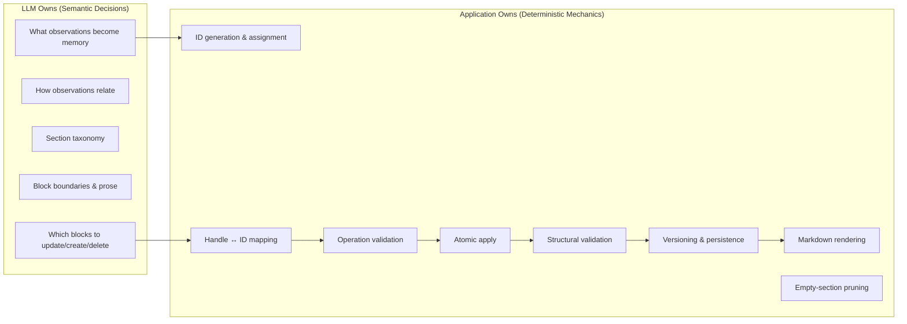

# Approach 4 — Semantic Structured Personal Memory (Finalized Architecture)

> **Type:** LLD — Low-Level Design inside an agreed HLD boundary (Personal Memory subsystem).
> **Scale:** Production. Single-user desktop app, 9B local model, ~1s consolidation budget.
> **Supersedes:** Approaches 1–3 documented in [`consolidation-structured--logic-plan.md`](file:///home/addy/projects/apps/vox/docs/plans/phase12/consolidation-structured--logic-plan.md).

---

## 0. Why This Exists — Three Failures and One Root Cause

Every prior approach shared a single structural defect: **the canonical representation was a Markdown document**, and the LLM was asked to address positions inside that document.

| Approach | Addressing | Failure mode | Reference |
|---|---|---|---|
| 1. Full-document regeneration | None (rewrite all) | Dropped prior anchors on rewrite | Part 1 §2 |
| 2. Prose-targeted delta | `section` + `target_text` string match | Nameless `##` headings, append-only bullet dump, silent skips | Part 2 §2.4–§2.9 |
| 3. Content-element index | `[N]` 1-based element index | Off-by-one destroys headings; heading-loss gate stalls the pipeline (1→17 blocked ops) | Part 3 §3.8 D1, Part 4 §4.5 |

The root cause is not prompt quality. It is that **Markdown is the source of truth** and every mutation must go through positional addressing inside a formatted text document. A 9B model cannot reliably count elements, match strings, or perform index arithmetic — and no amount of prompt engineering, kind-labelling, or mechanical gates has made it reliable.

Approach 4 changes the canonical representation. **Personal Memory becomes a structured semantic object. Markdown is a derived rendering.**

---

## 1. Terminology Alignment (Codebase-Wide Sweep Required)

The current codebase conflates several distinct concepts under the same names. This terminology change is not cosmetic — it is the root cause of the confused logic that produced malformed documents across all three approaches.

| Old term (retire) | New term | Meaning |
|---|---|---|
| "fact" / "personal fact" | **observation** | A raw extracted claim from compaction. Input to memory, not memory itself. |
| "personal memory document" / "markdown document" | **Personal Memory** (the semantic object) | The structured JSON model of what is known about the person. |
| "personal memory content" (the `content` TEXT column) | **rendered memory** / **memory document** | The Markdown string derived from the semantic object for display and system-prompt injection. |
| "consolidation" / "fact integration" | **memory consolidation** | The process of updating the semantic model with new observations. |
| "patch" / "edit" / "delta" / `MemoryPatchOperation` | **semantic operation** | A structural mutation on the semantic model (`create_block`, `update_block`, `delete_block`, `create_section`). |
| "suggestion" | **pending revision** | A proposed semantic operation awaiting user review. |
| "content element" / `ContentElement` / `ElementKind` | *(retired)* | No longer exists. The document model is sections and blocks, not parsed Markdown lines. |
| `target_index` / `base_memory_version` re-anchoring | *(retired)* | No positional addressing. INVARIANT 5.3-B is eliminated entirely. |

> [!IMPORTANT]
> This is a **full codebase sweep**: types, DB columns, persistence functions, IPC commands, frontend service layer, UI copy, log messages, and specs. Every file that says "fact" when it means "observation" or "document" when it means "semantic model" must be updated, because the confusion between these concepts is what produced the broken logic in the first place.

---

## 2. Conceptual Pipeline

```
Conversation → compaction → observations → ingestion/dedup → memory consolidation → Personal Memory JSON → Markdown renderer
```

**Observations** are evidence extracted from conversations (the current `memory_facts WHERE type = 'personal'`). They are inputs to memory formation, not the memory itself.

**Personal Memory** is a structured semantic model — a JSON object of sections and prose blocks. It is the canonical, persisted source of truth.

**Markdown** is a rendering of that model. It is generated on demand for display in the UI and injection into the system prompt. It contains no semantic intelligence and no IDs.

---

## 3. Canonical Data Model

### 3.1 The Semantic Object

```json
{
  "sections": [
    {
      "id": "sec_a1b2c3",
      "title": "Vox Development",
      "blocks": [
        {
          "id": "blk_x7y8z9",
          "text": "Addy is building Vox, a voice-first AI assistant written in Rust with a Tauri frontend."
        },
        {
          "id": "blk_k4m5n6",
          "text": "He is redesigning its memory system so that observations are treated as evidence from which coherent, prose-based memories are constructed."
        }
      ]
    },
    {
      "id": "sec_d4e5f6",
      "title": "Reading & Interests",
      "blocks": [
        {
          "id": "blk_p1q2r3",
          "text": "Reads hard sci-fi on weekends — currently enjoying 'Children of Memory' and has finished 'The Three-Body Problem'."
        }
      ]
    }
  ]
}
```

### 3.2 Design Rules

1. **A block is a semantic unit chosen by the LLM.** It is 1–3 sentences expressing one coherent idea. Not a bullet. Not a line. Not a fact. The LLM decides block boundaries based on meaning, not punctuation.

2. **IDs are persistent and represent semantic identity, not position.** If `blk_x7y8z9` is rewritten, it keeps its ID. If one block needs to become two independent ideas, the LLM proposes `delete_block` + `create_block` × 2.

3. **The LLM never sees or assigns persistent IDs.** It receives short per-request handles (`b1`, `b2`, …` for blocks; `s1`, `s2`, …` for sections). The engine maps these to persistent IDs after validation. This eliminates mis-copied random strings — a critical concern for a 9B model.

4. **The application assigns all persistent IDs.** Format: `sec_{timestamp_hex}_{4-char-uuid}` and `blk_{timestamp_hex}_{4-char-uuid}`. Collision-free, human-readable in logs.

5. **Section and block ordering is determined by array position** in the JSON. No explicit `order` or `after_block_id` fields. The LLM's `create_block` appends to the end of the target section. Ordering is a user concern, not an LLM decision — and removing it from the LLM's output space eliminates the inter-operation dependency that `temp_id` + `after_block_id` would create.

---

## 4. Database Schema Changes

### 4.1 `personal_memory` — Column Change

The `content` column changes meaning. It stores the **canonical JSON** (the semantic object), not Markdown.

| Column | Type | Change | Description |
|---|---|---|---|
| `content` | TEXT | **Semantic change** | Canonical Personal Memory JSON (`{ "sections": [...] }`). Was: raw Markdown. |

> [!NOTE]
> The column type stays `TEXT` (JSON stored as text in SQLite). No schema migration needed for the column itself — only the content format changes. A one-time migration script converts existing Markdown documents to the new JSON format via a cold-generation pass.

### 4.2 `personal_memory_suggestions` — Replaced

The current table stores index-addressed patch operations (`op`, `target_index`, `content`). This is replaced with semantic operations.

| Column | Type | Constraints | Description |
|---|---|---|---|
| `id` | TEXT | PRIMARY KEY | Suggestion ID: `rev_{timestamp}_{uuid}` |
| `base_memory_version` | INTEGER | NOT NULL REFERENCES `personal_memory(version)` | Target document version |
| `project_id` | TEXT | NULLABLE | Associated project scope |
| `op` | TEXT | NOT NULL | `'create_block'`, `'update_block'`, `'delete_block'`, `'create_section'` |
| `target_id` | TEXT | NOT NULL | Persistent `sec_*` or `blk_*` ID this operation targets. For `create_block`: the section to append to. For `create_section`: empty string (new entity). |
| `content` | TEXT | NOT NULL | JSON payload: `{ "text": "..." }` for block ops, `{ "title": "...", "blocks": [...] }` for `create_section` |
| `status` | TEXT | NOT NULL DEFAULT 'pending' | `'pending'`, `'accepted'`, `'rejected'` |
| `created_at` | INTEGER | NOT NULL | Millisecond epoch |
| `resolved_at` | INTEGER | NULLABLE | Millisecond epoch |

> [!IMPORTANT]
> **INVARIANT 5.3-B is eliminated.** There is no `target_index` to re-anchor. Operations address semantic IDs, not positions. Accepting one operation never shifts the target of another. Each operation is independently applicable.

### 4.3 `memory_facts` / `memory_ingestion_queue` — Terminology Only

- Rename column/field references from "fact" to "observation" in types, persistence functions, and log messages.
- The `type` column values (`'personal'`, `'objective'`, etc.) and the `status` lifecycle are unchanged.
- The `'consolidated'` status is renamed to `'integrated'` to match the new terminology (observation integrated into the semantic model).

---

## 5. LLM Wire Format — Per-Request Handles

The LLM receives the current semantic memory with **short per-request handles** instead of persistent IDs:

```
<current_memory>
[s1] Vox Development
  [b1] Addy is building Vox, a voice-first AI assistant written in Rust with a Tauri frontend.
  [b2] He is redesigning its memory system so that observations are treated as evidence from which coherent, prose-based memories are constructed.

[s2] Reading & Interests
  [b3] Reads hard sci-fi on weekends — currently enjoying 'Children of Memory' and has finished 'The Three-Body Problem'.
</current_memory>
```

The engine maintains the bidirectional mapping: `b1 ↔ blk_x7y8z9`, `s1 ↔ sec_a1b2c3`, etc. A handle that doesn't exist in the map is a validation error, cleanly rejected.

---

## 6. Semantic Operations — Flat Grouped Schema

Following Claude's feedback: a flat schema grouped by verb, not a discriminated union. Homogeneous arrays are more robust under strict grammar-constrained decoding.

### 6.1 LLM Output Schema

```json
{
  "type": "object",
  "properties": {
    "new_sections": {
      "type": "array",
      "items": {
        "type": "object",
        "properties": {
          "title": { "type": "string" },
          "blocks": {
            "type": "array",
            "items": { "type": "string" }
          }
        },
        "required": ["title", "blocks"],
        "additionalProperties": false
      }
    },
    "creates": {
      "type": "array",
      "items": {
        "type": "object",
        "properties": {
          "section": { "type": "string" },
          "text": { "type": "string" }
        },
        "required": ["section", "text"],
        "additionalProperties": false
      }
    },
    "updates": {
      "type": "array",
      "items": {
        "type": "object",
        "properties": {
          "block": { "type": "string" },
          "text": { "type": "string" }
        },
        "required": ["block", "text"],
        "additionalProperties": false
      }
    },
    "deletes": {
      "type": "array",
      "items": {
        "type": "object",
        "properties": {
          "block": { "type": "string" }
        },
        "required": ["block"],
        "additionalProperties": false
      }
    }
  },
  "required": ["new_sections", "creates", "updates", "deletes"],
  "additionalProperties": false
}
```

### 6.2 Operation Semantics

| Verb | Target | Meaning |
|---|---|---|
| `new_sections[i]` | — | Create a new section with title and initial blocks. Application assigns `sec_*` and `blk_*` IDs. |
| `creates[i]` | `section: "s1"` (per-request handle) | Append a new block to the end of section `s1`. Application assigns `blk_*` ID. |
| `updates[i]` | `block: "b2"` (per-request handle) | Replace the text of block `b2`. ID is preserved. |
| `deletes[i]` | `block: "b3"` (per-request handle) | Remove block `b3`. |

### 6.3 What Is Not In The Operation Set (and why)

| Deferred op | Reason |
|---|---|
| `delete_section` | Destructive one-shot. Sections disappear automatically when all their blocks are deleted — the engine prunes empty sections after applying all operations. |
| `update_section` (rename) | Rare in incremental updates. Regeneration replaces the whole structure anyway. Defer until evals show it's needed. |
| `move_block` | Rare in incremental. Ordering within a section is low-value for a 9B model. Regeneration handles large-scale reorganization. Defer. |

### 6.4 Eliminated Failure Modes

| Old failure | Why it can't happen |
|---|---|
| Nameless `## ` headings (§2.4) | Sections have a `title` field validated for non-empty. No Markdown parsing involved. |
| Append-only bullet dump (§2.5) | `updates` rewrites existing blocks. The LLM decides structure, not the engine. |
| Silent operation skip from prose mismatch (§2.9) | No string matching. Operations target IDs. |
| Off-by-one heading destruction (§3.8 D1) | No index arithmetic. Blocks and sections are addressed by handle, resolved to ID. |
| Heading-loss gate stall (§4.5) | No heading-loss gate needed. `delete_section` doesn't exist. Empty sections are auto-pruned. |
| INVARIANT 5.3-B re-anchor cascade | No positional indices. Operations are independent. Each suggestion is independently resolvable. |
| `done_reason=length` from reasoning (§3.4) | Output is a flat grouped JSON, not a copy of the document. Smaller output budget suffices. |

---

## 7. Cold Generation

**Trigger:** No Personal Memory exists (version 0 / empty content).

**Input:** Active personal observations.

**Task:** The LLM synthesizes the complete semantic model — not Markdown, not bullets. It determines sections, groups related observations into coherent prose blocks, deduplicates, and removes redundancy.

**Output:** The same grouped JSON schema (§6.1), but with only `new_sections` populated (no `creates`, `updates`, `deletes` since there's nothing to modify).

> [!IMPORTANT]
> **JSON schema output for ALL passes.** The previous implementation used `OutputConstraint::Text` (raw Markdown) for cold generation and regeneration. In Approach 4, **every pass** — cold generation, incremental consolidation, comment-directed edits, and regeneration — uses `OutputConstraint::JsonSchema` with the flat grouped schema. The LLM never emits raw Markdown. Markdown is always a derived rendering from the semantic JSON.

**Post-processing:**
1. Validate: every section has a non-empty title; no duplicate titles (case-insensitive); at least one section; every block has non-empty text.
2. Assign persistent IDs to all sections and blocks.
3. Persist as version 1 with `is_active = 1`.
4. Mark all candidate observations `'integrated'`.

---

## 8. Incremental Consolidation

**Trigger:** Active Personal Memory exists + new active personal observations available.

**Input to LLM:**
1. Current semantic memory in handle format (§5).
2. New observations as a bullet list.

**Task:** The LLM determines how the new information changes the existing memory and emits the grouped operation schema.

**Post-processing:**
1. **Handle resolution:** Map per-request handles (`s1`, `b2`) to persistent IDs. Reject any unresolvable handle.
2. **Structural validation:** Referenced section IDs exist for `creates`; referenced block IDs exist for `updates` and `deletes`; section titles in `new_sections` are non-empty and unique against existing titles.
3. **Stage as pending revisions** if `suggestion_policy == "manual_review"`.
4. **Auto-apply** non-destructive operations if `suggestion_policy == "auto_apply"` (deletes held for confirmation — existing policy, unchanged).
5. Mark all candidate observations `'integrated'`.

> [!TIP]
> Each operation is independently resolvable. The user can accept `creates[0]` and reject `updates[1]` without any re-anchoring. This is the architectural guarantee that eliminates the Sprint 2 stall.

---

## 9. Suggestion/Revision Lifecycle

### 9.1 Staging

Each element in the LLM's grouped output becomes one `personal_memory_suggestions` row (renamed to `personal_memory_revisions` in the sweep). The `target_id` is the persistent semantic ID; `content` is the operation payload as JSON.

### 9.2 Acceptance

1. Load the current semantic JSON from `personal_memory.content`.
2. Deserialize the operation from the suggestion row.
3. Apply:
   - `create_block`: append block to target section, assign new `blk_*` ID.
   - `update_block`: find block by ID, replace text.
   - `delete_block`: find block by ID, remove. If section becomes empty, prune section.
   - `create_section`: append section with blocks, assign `sec_*` and `blk_*` IDs.
4. Validate the result (same checks as §7 post-processing step 1).
5. Serialize back to JSON and persist as `version + 1`.
6. Mark suggestion `'accepted'`.

No re-anchoring of other pending suggestions is needed because operations target IDs, not positions.

### 9.3 Rejection

Mark suggestion `'rejected'`. No document change.

### 9.4 Bulk Resolution

Apply all accepted operations in a single pass, then validate once and persist once. If any individual operation targets an ID that no longer exists (because another accepted operation in the same batch deleted it), that operation is auto-rejected with a reason — same per-operation granularity as the current `ApplyReport`, without the positional complexity.

---

## 10. Comment-Directed Editing

Same pipeline as incremental consolidation, different input:
- Current semantic memory in handle format.
- User directive comments (free text).

The LLM produces the same grouped operation schema. Operations are staged as pending revisions. **No separate editing mechanism exists.** Comment editing and automatic consolidation share the same mutation layer.

---

## 11. Regeneration

Full reorganization of the existing Personal Memory:
1. Current semantic memory is rendered to the LLM in handle format (same as incremental).
2. LLM returns a complete new structure via the same JSON schema — only `new_sections` populated.
3. **All IDs are fresh.** Application assigns new `sec_*` and `blk_*` IDs to every entity. No fuzzy matching, no ID preservation attempt. Simpler, no false matches, and since regeneration creates a new version, pending revisions targeting old IDs are bulk-rejected as stale.
4. Saved as a new immutable version (`max_version + 1`, `is_active = 1`).

> [!NOTE]
> Regeneration is the only path that replaces the entire structure. It subsumes what `move_block`, `update_section`, and `delete_section` would do. This is why those operations are deferred.

---

## 12. Markdown Rendering

A pure function. Zero semantic intelligence.

```rust
fn render_personal_memory(memory: &PersonalMemory) -> String {
    let mut out = String::new();
    for (i, section) in memory.sections.iter().enumerate() {
        if i > 0 { out.push('\n'); }
        out.push_str(&format!("## {}\n", section.title));
        for block in &section.blocks {
            out.push_str(&format!("{}\n", block.text));
        }
    }
    out
}
```

This replaces:
- `parse_content_elements`
- `format_indexed_document`
- `render_content_elements`
- `validate_document_structure` (validation moves to the semantic model layer)
- `validate_no_heading_loss` (structurally impossible now)

---

## 13. Responsibility Split



---

## 14. What Changes in the Codebase

### 14.1 Files Replaced (new module structure)

| Old file | New file | Responsibility |
|---|---|---|
| [`document.rs`](file:///home/addy/projects/apps/vox/app/src-tauri/src/services/memory/personal/document.rs) | `model.rs` | `PersonalMemory`, `MemorySection`, `MemoryBlock` structs; `validate_structure`; `render_to_markdown` |
| [`patch.rs`](file:///home/addy/projects/apps/vox/app/src-tauri/src/services/memory/personal/patch.rs) | `operations.rs` | `SemanticOp` enum; `apply_operations`; `ApplyReport`; handle ↔ ID resolution |
| [`prompts.rs`](file:///home/addy/projects/apps/vox/app/src-tauri/src/services/memory/personal/prompts.rs) | `prompts.rs` | Rewritten prompts for semantic model; new JSON schema |
| [`consolidate.rs`](file:///home/addy/projects/apps/vox/app/src-tauri/src/services/memory/personal/consolidate.rs) | `consolidate.rs` | Same control flow, different data types |
| [`suggestions.rs`](file:///home/addy/projects/apps/vox/app/src-tauri/src/services/memory/personal/suggestions.rs) | `revisions.rs` | Same lifecycle, no re-anchoring, semantic operation payloads |
| [`generation.rs`](file:///home/addy/projects/apps/vox/app/src-tauri/src/services/memory/personal/generation.rs) | `generation.rs` | Unchanged plumbing, different output constraint |
| [`tests.rs`](file:///home/addy/projects/apps/vox/app/src-tauri/src/services/memory/personal/tests.rs) | `tests.rs` | Rewritten for semantic model |

### 14.2 Persistence Layer Changes

| File | Change |
|---|---|
| [`personal_memory.rs`](file:///home/addy/projects/apps/vox/app/src-tauri/src/persistence/personal_memory.rs) | `PersonalMemorySuggestionRecord` → `PersonalMemoryRevisionRecord`; column mapping to new schema; insert/fetch/resolve functions adapted for `target_id` + `content` JSON payload |
| [`facts.rs`](file:///home/addy/projects/apps/vox/app/src-tauri/src/persistence/facts.rs) | Rename types/functions: "fact" → "observation"; `mark_facts_consolidated` → `mark_observations_integrated` |
| [`schema.rs`](file:///home/addy/projects/apps/vox/app/src-tauri/src/persistence/schema.rs) | DDL for revised `personal_memory_suggestions` → `personal_memory_revisions` table |

### 14.3 IPC Layer Changes

| Command | Change |
|---|---|
| `get_personal_memory` | Returns rendered Markdown (unchanged for frontend), plus `version` and metadata. Backend reads JSON and renders. |
| `get_memory_suggestions` → `get_memory_revisions` | Returns revision records with semantic op type + human-readable preview text |
| `resolve_memory_suggestions` → `resolve_memory_revisions` | Same accept/reject mechanics, no re-anchoring |
| `consolidate_personal_memory` | Same trigger surface, different internal data flow |

### 14.4 Frontend Changes

| Component | Change |
|---|---|
| [`Memory.tsx`](file:///home/addy/projects/apps/vox/app/src/pages/Memory.tsx) | Displays rendered Markdown (unchanged) |
| [`SuggestionCard.tsx`](file:///home/addy/projects/apps/vox/app/src/shared/components/memory/SuggestionCard.tsx) | Shows operation type (`Create`, `Update`, `Delete`) + preview text instead of `insert_after`/`replace`/`delete` + index |
| [`memoryService.ts`](file:///home/addy/projects/apps/vox/app/src/services/memoryService.ts) | Rename IPC commands; adapt types |
| [`PersonalMemoryStagingCard.tsx`](file:///home/addy/projects/apps/vox/app/src/shared/components/memory/PersonalMemoryStagingCard.tsx) | Adapt to new revision record shape |

### 14.5 Eval Harness Changes

The entire `evals/common/structure.rs` module — element-index assertions, heading-count checks, re-anchor verification — is replaced with semantic model assertions:
- Section title uniqueness/non-empty
- Block text non-empty
- ID persistence across versions
- Observation coverage classification (unchanged concept, different addressing)

---

## 15. What Does NOT Change

- **Stage 0–2 of the pipeline** (turns, compaction, ingestion, dedup) are untouched. Observations still flow through the same `memory_ingestion_queue` → `memory_facts` path.
- **Episodic memory retrieval** (`search_memory` tool) is unaffected — it queries non-personal fact types.
- **Compaction** is completely independent of Personal Memory.
- **The suggestion/revision lifecycle** (manual_review vs auto_apply, cadence, conflict policy) keeps the same product semantics.
- **Version history and version carousel** stay the same. Each version stores the full JSON snapshot.
- **System prompt injection** still injects rendered Markdown into the system prompt.

---

## 16. LLM Generation Settings

All four passes (cold generation, incremental consolidation, comment-directed edits, regeneration) share these settings. **The previous split** — where cold gen and regeneration used `OutputConstraint::Text` and only incremental used `OutputConstraint::JsonSchema` — **is eliminated.** Every pass emits the flat grouped JSON schema.

| Parameter | Value | Rationale |
|---|---|---|
| Reasoning | **Disabled** | Measured: reasoning ON consumes entire output budget with zero content tokens on `qwen3.5:9b` (§3.4). The flat grouped schema is even smaller than index-addressed edits, making this even safer. |
| Temperature | **0.2** | Low-hallucination, reproducible. Separate from compaction temperature. |
| Output ceiling | **4096 tokens** | Generous headroom. The grouped flat schema is more compact than the index-addressed schema. |
| JSON schema | **Strict** (`OutputConstraint::JsonSchema`) for **all 4 passes** | Flat grouped arrays are more robust under grammar-constrained decoding. Cold gen and regeneration produce `new_sections`-only output; the schema's `creates`/`updates`/`deletes` arrays are simply empty. |

---

## 17. Migration Strategy

1. **Schema migration:** Add `personal_memory_revisions` table. Keep old `personal_memory_suggestions` table during transition.
2. **Data migration:** For each existing `personal_memory` row with Markdown content, run a one-time cold-generation pass (or a deterministic Markdown→JSON converter for simple documents) to produce the canonical JSON.
3. **Pending suggestions:** Any pending suggestions in the old format are bulk-rejected (with a notification), since they cannot be translated to the new addressing scheme.
4. **Observation terminology:** Rename types, functions, and log messages in a mechanical sweep.
5. **Frontend:** Deploy behind a feature flag if needed, since the rendered output is Markdown in both cases — the frontend doesn't need to know the canonical format changed unless it's displaying revision details.

---

## 18. Resolved Design Decisions

1. **Block granularity:** Prompt guidance ("each block should express one distinct idea in 1–3 sentences"), not mechanical enforcement. The LLM decides granularity; the prompt steers it. If evals show drift, tighten the prompt before adding a character limit. ✅ Approved.

2. **`create_section` inline blocks:** `new_sections` carries inline `blocks` arrays. Creating a section and its initial content is one atomic operation — no cross-references needed. Adding a block to an *existing* section uses `creates`. Adding a block to a *new* section in the same batch puts it in `new_sections[i].blocks`. No temp IDs, no cross-op dependencies. ✅ Approved.

3. **Regeneration IDs:** Always fresh. No fuzzy matching. Pending revisions targeting old IDs are bulk-rejected as stale. ✅ Approved.

4. **JSON schema output:** ALL four passes (cold gen, incremental, comment-directed, regeneration) use `OutputConstraint::JsonSchema`. The previous `OutputConstraint::Text` for cold gen and regeneration is eliminated. ✅ Approved.

---

## 19. Implementation Plan (Backend Engineer Handoff)

> [!IMPORTANT]
> **Execution order matters.** Batches are sequenced by dependency. Each batch is sized so one engineer can complete it, verify with `cargo clippy --all-targets`, and commit before starting the next. **Do not parallelize batches.** Within a batch, tasks can be done in any order.

### Batch 0 — Context & Prep (read-only, no code changes)

Before writing any code, read:
- This architecture document (§0–§18)
- [`memory-spec.md`](file:///home/addy/projects/apps/vox/docs/specs/memory-spec.md) §5 (updated to reflect this architecture)
- [`db-spec.md`](file:///home/addy/projects/apps/vox/docs/specs/db-spec.md) §2.5–§2.8
- [`consolidation-structured--logic-plan.md`](file:///home/addy/projects/apps/vox/docs/plans/phase12/consolidation-structured--logic-plan.md) Parts 1–4 (understand the three failed approaches)
- [`.agents/rules/backend-engineer.md`](file:///home/addy/projects/apps/vox/.agents/rules/backend-engineer.md) (code style rules)

### Batch 1 — Semantic Data Model (`model.rs`)

**Goal:** Define the canonical Rust types and pure functions that everything else builds on.

**File:** `app/src-tauri/src/services/memory/personal/model.rs` (replaces [`document.rs`](file:///home/addy/projects/apps/vox/app/src-tauri/src/services/memory/personal/document.rs))

**Tasks:**
1. Define `MemoryBlock { id: String, text: String }` with `Serialize`/`Deserialize`.
2. Define `MemorySection { id: String, title: String, blocks: Vec<MemoryBlock> }`.
3. Define `PersonalMemory { sections: Vec<MemorySection> }`.
4. Implement `PersonalMemory::validate(&self) -> Result<()>`:
   - At least one section.
   - Every section title is non-empty.
   - No duplicate section titles (case-insensitive).
   - Every block text is non-empty.
5. Implement `PersonalMemory::render_to_markdown(&self) -> String`:
   - Pure function. `## {title}\n` per section, `{text}\n` per block, blank line between sections.
6. Implement `PersonalMemory::to_handle_format(&self) -> (String, HandleMap)`:
   - Renders: `[s1] Title\n  [b1] text\n  [b2] text\n\n[s2] ...`
   - Returns the rendered string + a `HandleMap` mapping `"s1" -> "sec_..."`, `"b1" -> "blk_..."`, etc.
   - Handle assignment: sections get `s1`, `s2`, … in order; blocks get `b1`, `b2`, … sequentially across all sections.
7. Implement `HandleMap` struct with `resolve_section(&self, handle: &str) -> Option<&str>` and `resolve_block(&self, handle: &str) -> Option<&str>`.
8. Implement ID generation: `generate_section_id() -> String` (`sec_{hex_timestamp}_{4-char-uuid}`) and `generate_block_id() -> String` (`blk_{hex_timestamp}_{4-char-uuid}`).
9. Implement `PersonalMemory::prune_empty_sections(&mut self)` — removes any section with zero blocks.
10. Delete [`document.rs`](file:///home/addy/projects/apps/vox/app/src-tauri/src/services/memory/personal/document.rs) entirely (`parse_content_elements`, `format_indexed_document`, `render_content_elements`, `validate_document_structure`, `validate_no_heading_loss`, `heading_count`, `clean_markdown_payload`, `ElementKind`, `ContentElement`).

**Unit tests** (in `tests.rs` or inline):
- Validate passes for well-formed memory, fails for empty title, duplicate title, empty block.
- Markdown rendering round-trip.
- Handle format generation and resolution.
- Empty-section pruning.

**Verify:** `cargo clippy --all-targets` — expect errors in downstream files that import the old `document::*` types. That's expected; they get fixed in subsequent batches.

---

### Batch 2 — Semantic Operations Engine (`operations.rs`)

**Goal:** Replace the index-addressed patch engine with ID-addressed semantic operations.

**File:** `app/src-tauri/src/services/memory/personal/operations.rs` (replaces [`patch.rs`](file:///home/addy/projects/apps/vox/app/src-tauri/src/services/memory/personal/patch.rs))

**Tasks:**
1. Define the LLM output deserialization types (matching §6.1 JSON schema):
   ```rust
   #[derive(Deserialize)]
   pub struct ConsolidationOutput {
       pub new_sections: Vec<NewSectionOutput>,
       pub creates: Vec<CreateBlockOutput>,
       pub updates: Vec<UpdateBlockOutput>,
       pub deletes: Vec<DeleteBlockOutput>,
   }
   #[derive(Deserialize)]
   pub struct NewSectionOutput { pub title: String, pub blocks: Vec<String> }
   #[derive(Deserialize)]
   pub struct CreateBlockOutput { pub section: String, pub text: String }
   #[derive(Deserialize)]
   pub struct UpdateBlockOutput { pub block: String, pub text: String }
   #[derive(Deserialize)]
   pub struct DeleteBlockOutput { pub block: String }
   ```
2. Define the resolved semantic operation enum (persistent IDs, not handles):
   ```rust
   pub enum ResolvedOp {
       CreateSection { title: String, blocks: Vec<String> },
       CreateBlock { section_id: String, text: String },
       UpdateBlock { block_id: String, text: String },
       DeleteBlock { block_id: String },
   }
   ```
3. Implement `resolve_operations(output: &ConsolidationOutput, handle_map: &HandleMap) -> (Vec<ResolvedOp>, Vec<RejectedOperation>)`:
   - Maps handles to persistent IDs.
   - Unresolvable handles become `RejectedOperation` entries.
   - `new_sections` don't need handle resolution (they're new entities).
4. Implement `apply_operations(memory: &PersonalMemory, ops: &[ResolvedOp]) -> ApplyReport`:
   - `CreateSection`: append new section with generated IDs, validate title uniqueness.
   - `CreateBlock`: find section by ID, append block with generated ID.
   - `UpdateBlock`: find block by ID across all sections, replace text.
   - `DeleteBlock`: find block by ID, remove. After all ops, `prune_empty_sections()`.
   - Return `ApplyReport { memory: PersonalMemory, rejected: Vec<RejectedOperation> }`.
5. Carry over `extract_json_payload` from old `patch.rs` (unchanged utility).
6. Delete [`patch.rs`](file:///home/addy/projects/apps/vox/app/src-tauri/src/services/memory/personal/patch.rs) entirely (`MemoryPatchOperation`, `PersonalConsolidationOutput`, `apply_patch_operations`, `RejectedOperation`, `is_heading_text`, `kind_for_text`).

**Unit tests:**
- Resolve operations with valid handles → correct persistent IDs.
- Resolve operations with invalid handle → rejected, rest applied.
- Apply `CreateSection` + `CreateBlock` + `UpdateBlock` + `DeleteBlock`.
- Auto-prune empty section after deleting its last block.
- Bulk apply where one op targets an ID deleted by another op in the same batch → auto-reject.

---

### Batch 3 — Prompts & JSON Schema (`prompts.rs`)

**Goal:** Replace all four system prompts and the JSON schema.

**File:** `app/src-tauri/src/services/memory/personal/prompts.rs` (in-place rewrite)

**Tasks:**
1. **New cold generation prompt:** Instruct the LLM to synthesize observations into `new_sections` with coherent prose blocks (1–3 sentences per block, one idea per block). Output is the flat grouped JSON schema. No Markdown, no bullets.
2. **New incremental consolidation prompt:** Provide the memory in handle format (`[s1] Title`, `[b1] text`). Instruct the LLM to emit `creates`, `updates`, `deletes`, `new_sections` as needed. Reference handles (`s1`, `b2`), not IDs. Minimal changes. Don't invent observations. One idea per block.
3. **New comment-directed prompt:** Same handle format + user comments. Same output schema.
4. **New regeneration prompt:** Provide memory in handle format. Instruct full reorganization into `new_sections` only. Preserve all information, improve structure, eliminate redundancy.
5. **New `consolidation_json_schema() -> serde_json::Value`:** The flat grouped schema from §6.1.
6. Keep `CONSOLIDATION_MAX_OUTPUT_TOKENS = 4096` and `PERSONAL_CONSOLIDATION_TEMPERATURE = 0.2`.

**Key prompt rules (embed in all incremental/comment prompts):**
- "Each block should express one distinct idea in 1–3 sentences."
- "Use handles (`s1`, `b2`) exactly as shown — do not invent handles."
- "Empty arrays are valid. If nothing needs creating, `creates: []`."
- "Do not restate the entire memory. Minimal changes only."
- "Do not invent observations not present in the new observations list."

---

### Batch 4 — Generation Plumbing (`generation.rs`)

**Goal:** All 4 passes use `OutputConstraint::JsonSchema`.

**File:** `app/src-tauri/src/services/memory/personal/generation.rs` (targeted edit)

**Tasks:**
1. Remove the `structured: bool` parameter from `execute_personal_llm_pass`. All passes are structured now.
2. Always set `request.output = consolidation_output_constraint(settings.active_model())`. Remove the `if structured { ... } else { OutputConstraint::Text }` branch.
3. No other changes to the streaming/timeout/pump plumbing.

---

### Batch 5 — Consolidation Control Flow (`consolidate.rs`)

**Goal:** Wire the new types through the existing control flow.

**File:** `app/src-tauri/src/services/memory/personal/consolidate.rs` (rewrite data flow, keep control flow)

**Tasks:**
1. **Cold start path:**
   - Fetch active observations (`fetch_active_observations_by_type`).
   - Build prompt input with observations as a bullet list.
   - Call `execute_personal_llm_pass` → parse as `ConsolidationOutput`.
   - Validate: only `new_sections` populated, `creates`/`updates`/`deletes` all empty (warn if not, but still process `new_sections`).
   - Build `PersonalMemory` from `new_sections`, assigning IDs.
   - Validate with `PersonalMemory::validate()`.
   - Serialize to JSON and save via `save_consolidated_memory`.
   - Mark observations `'integrated'`.
2. **Incremental path:**
   - Load current `PersonalMemory` from JSON in `personal_memory.content`.
   - Generate handle format with `to_handle_format()`.
   - Build prompt with handle-format memory + observations.
   - Call `execute_personal_llm_pass` → parse as `ConsolidationOutput`.
   - Resolve handles via `resolve_operations()`.
   - Stage resolved operations as `PersonalMemoryRevisionRecord` rows.
   - Mark observations `'integrated'`.
3. **Comment-directed path** (`regenerate_with_comments`):
   - Same as incremental but with comment input instead of observations.
   - No observation marking.
4. **Regeneration path:**
   - Load current memory, generate handle format.
   - Call LLM → parse `ConsolidationOutput` (only `new_sections`).
   - Build fresh `PersonalMemory` with all new IDs.
   - Validate, serialize, save as new version.
   - Bulk-reject any pending revisions targeting old IDs.

**Critical change:** `PersonalMemory` is serialized to JSON for storage, not Markdown. The `get_personal_memory` IPC handler deserializes from JSON and calls `render_to_markdown()` for the frontend.

---

### Batch 6 — Revision Lifecycle (`revisions.rs`)

**Goal:** Replace suggestion resolution with semantic-operation resolution.

**File:** `app/src-tauri/src/services/memory/personal/revisions.rs` (replaces [`suggestions.rs`](file:///home/addy/projects/apps/vox/app/src-tauri/src/services/memory/personal/suggestions.rs))

**Tasks:**
1. **`batch_resolve_memory_revisions`:**
   - Load current `PersonalMemory` from JSON.
   - For each accepted revision: deserialize `ResolvedOp` from `content` JSON, apply to memory.
   - No descending-index sort needed. No re-anchoring needed.
   - If an op targets an ID that doesn't exist (deleted by another op in batch or by a prior accept), auto-reject it with a reason.
   - Validate result with `PersonalMemory::validate()`.
   - Serialize and persist as new version.
   - Mark accepted/rejected rows.
2. **`resolve_memory_revisions`:** Thin wrapper delegating to batch.
3. **Remove `MemorySuggestionError::StructureGate` complexity** — validation is just `PersonalMemory::validate()`, one call.
4. **Remove all re-anchoring logic** (INVARIANT 5.3-B). The entire `target_index` shift arithmetic is gone.

---

### Batch 7 — Persistence Layer & Schema Migration

**Goal:** Update DB schema and persistence functions.

**Files:**
- [`schema.rs`](file:///home/addy/projects/apps/vox/app/src-tauri/src/persistence/schema.rs)
- [`personal_memory.rs`](file:///home/addy/projects/apps/vox/app/src-tauri/src/persistence/personal_memory.rs)
- [`facts.rs`](file:///home/addy/projects/apps/vox/app/src-tauri/src/persistence/facts.rs)

**Tasks:**
1. **Schema DDL:** Add `personal_memory_revisions` table (§4.2). Keep old `personal_memory_suggestions` table for migration period.
2. **Schema version bump:** Add migration that:
   - Creates `personal_memory_revisions` table.
   - Bulk-rejects all `pending` rows in `personal_memory_suggestions`.
   - For each `personal_memory` row with non-JSON content (Markdown): set content to `'{"sections":[]}'` (empty canonical JSON). The first consolidation run will rebuild from active observations.
3. **Persistence types:** `PersonalMemoryRevisionRecord` replaces `PersonalMemorySuggestionRecord`:
   - `op: String` — `"create_block"`, `"update_block"`, `"delete_block"`, `"create_section"`
   - `target_id: String` — persistent `sec_*` or `blk_*` ID
   - `content: String` — JSON payload
   - No `target_index` column.
4. **Persistence functions:** Adapt `insert_personal_memory_suggestions` → `insert_personal_memory_revisions`, `fetch_pending_suggestions` → `fetch_pending_revisions`, `resolve_batch_suggestions_transaction` → `resolve_batch_revisions_transaction`.
5. **Terminology rename in `facts.rs`:** `fetch_active_facts_by_type` → `fetch_active_observations_by_type`, `mark_facts_consolidated` → `mark_observations_integrated`. The underlying SQL stays the same (column names in the DB table itself don't change to avoid a data migration — the rename is Rust-side only).

---

### Batch 8 — IPC Layer

**Goal:** Wire the new types through IPC handlers.

**File:** [`app/src-tauri/src/ipc/memory.rs`](file:///home/addy/projects/apps/vox/app/src-tauri/src/ipc/memory.rs)

**Tasks:**
1. **`get_personal_memory`:** Load `personal_memory.content` (now JSON), deserialize to `PersonalMemory`, call `render_to_markdown()`, return rendered Markdown + version + metadata. **Frontend sees no change.**
2. **`get_memory_suggestions` → `get_memory_revisions`:** Return `Vec<PersonalMemoryRevisionRecord>` with op type and a human-readable `preview` field (e.g., "Create block in 'Vox Development': Addy is building...").
3. **`resolve_memory_suggestions` → `resolve_memory_revisions`:** Delegate to `batch_resolve_memory_revisions`. Same accept/reject semantics.
4. **`save_personal_memory`:** When the user manually edits the Markdown in the UI, this needs special handling:
   - Option A (recommended): Disable manual Markdown editing while the canonical format is JSON. The user interacts through comment-directed edits and the staging slate.
   - Option B: Parse the edited Markdown back into a `PersonalMemory` struct (lossy — block boundaries are inferred by paragraph splitting). Only if the product requires it.
5. **`consolidate_personal_memory`:** Same trigger surface, delegates to updated `consolidate.rs`.

---

### Batch 9 — Module Facade & Cleanup

**Goal:** Update `mod.rs` and remove dead code.

**File:** [`app/src-tauri/src/services/memory/personal/mod.rs`](file:///home/addy/projects/apps/vox/app/src-tauri/src/services/memory/personal/mod.rs)

**Tasks:**
1. Update `mod.rs` to expose `model`, `operations`, `prompts`, `generation`, `consolidate`, `revisions`.
2. Remove old module references (`document`, `patch`, `suggestions`).
3. Grep the entire codebase for any remaining imports of old types (`ContentElement`, `ElementKind`, `MemoryPatchOperation`, `PersonalConsolidationOutput`, `parse_content_elements`, `format_indexed_document`, `validate_document_structure`, `validate_no_heading_loss`). Fix or remove.
4. Verify: `cargo clippy --all-targets` clean.

---

### Batch 10 — Terminology Sweep (Mechanical)

**Goal:** Rename "fact" → "observation" and "suggestion" → "revision" across the codebase.

**Scope:** This is a mechanical find-and-replace across Rust source, TypeScript source, log messages, and doc comments. No logic changes.

**Rules:**
- `memory_facts` DB table name stays unchanged (avoiding schema migration). Rust types and functions rename.
- `FactRecord` → `ObservationRecord` (or appropriate type name).
- `fetch_active_facts_by_type` → `fetch_active_observations_by_type`.
- `mark_facts_consolidated` → `mark_observations_integrated`.
- `'consolidated'` status string → `'integrated'` (requires DB migration to update existing rows).
- Log messages: `[Memory::Personal]` prefix stays; "fact" → "observation" in message text.
- Frontend: `memoryService.ts` function names, TypeScript types, UI copy in `memoryCopy.ts`.

**Verify:** `cargo clippy --all-targets` + `pnpm build` clean.

---

### Batch 11 — Frontend Adaptation

**Goal:** Adapt the frontend to the renamed IPC commands and new revision record shape.

**Files:**
- [`memoryService.ts`](file:///home/addy/projects/apps/vox/app/src/services/memoryService.ts)
- [`SuggestionCard.tsx`](file:///home/addy/projects/apps/vox/app/src/shared/components/memory/SuggestionCard.tsx)
- [`PersonalMemoryStagingCard.tsx`](file:///home/addy/projects/apps/vox/app/src/shared/components/memory/PersonalMemoryStagingCard.tsx)
- [`Memory.tsx`](file:///home/addy/projects/apps/vox/app/src/pages/Memory.tsx)

**Tasks:**
1. Rename IPC command invocations to match backend changes.
2. Update TypeScript types for revision records (op type, target_id, content).
3. `SuggestionCard` → `RevisionCard`: show operation type badge (`Create`, `Update`, `Delete`) + preview text instead of `insert_after`/`replace`/`delete` + index number.
4. `Memory.tsx`: no change to the Markdown display — it still receives rendered Markdown from the backend.

**Verify:** `pnpm build` clean.

---

### Batch 12 — Eval Harness Updates

**Goal:** Update the evaluation harness for the new semantic model.

**Files:**
- `app/src-tauri/evals/common/structure.rs` (rewrite)
- `app/src-tauri/evals/memory_pipeline_eval.rs` (adapt)

**Tasks:**
1. Replace element-index assertions with semantic model assertions:
   - Section title uniqueness/non-empty.
   - Block text non-empty.
   - ID format validation.
   - Observation coverage classification (same concept, adapted for new types).
2. Remove:
   - `heading_count_valid`, `reanchor_valid`, `engine_replay`, `membership_valid` — all index-specific.
3. Add:
   - Version-over-version ID persistence check (blocks that should survive do).
   - Section count tracking across the ladder.
   - Semantic duplication detection (Jaccard on block text across sections).
4. Run 3-case ladder prefix to validate the harness before a full 14-case run.

---

> [!CAUTION]
> **This design intentionally does not include `move_block`, `update_section` (rename), or `delete_section` in the initial operation set.** If evals show these are needed, they can be added as flat arrays in the schema without changing the addressing model. Start minimal. The architecture supports extension.

---

🐛 Bug: The three approaches failed because Markdown was the canonical form, forcing the LLM into positional addressing it cannot reliably perform.
💡 Improvement: Semantic JSON as source of truth + per-request handles for the LLM + flat grouped schema = no index arithmetic, no string matching, no re-anchoring.
⚖️ Trade-off: The initial operation set is deliberately minimal (4 ops). Regeneration covers the long tail. If evals reveal the need for `move_block` or `update_section`, they compose cleanly into the flat schema.
