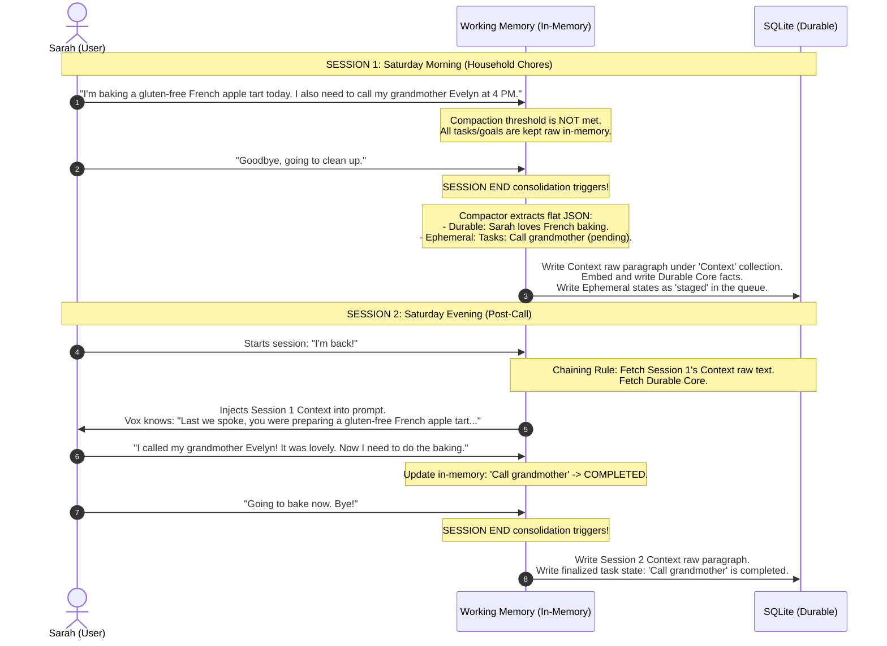

# Master Architectural Specification: Human-Centric Cognitive Memory System (v3)

**Document ID:** SEC-SPEC-MEM-V3-HUMAN-FINAL  
**Status:** ARCHITECT APPROVED / CORE AUDIT PASS / READY FOR DEVELOPER AGENT  
**Audience:** Backend Developer Agent & Cognitive Engineers  

---

## 1. Architectural Philosophy & Core Pivot

The legacy memory specifications suffered from a deep, systemic **Technical Bias**, assuming the system tray assistant was interacting exclusively with a systems engineer or developer. This led to schemas, prompts, and evaluation suites dominated by technical jargon (e.g., "WAL mode," "Neovim config," "ONNX mutex").

To build an assistant that behaves as an intuitive, context-aware human companion, **we must design for standard human life patterns**. The system must reason about daily routines, culinary efforts, language learning progress, social dynamics, personal emotions, grocery lists, health, and hobbies.

### 1.1 The Dimensional Mismatch of Context Vector Searches
Prior specifications computed a 1024-dimensional dense vector of a session's cohesive context summary and performed semantic vector searches against it using a short, turn-level user query. This represents a severe **mathematical and dimensional mismatch**:
1. **Information Density Mismatch:** A short, turn-level query has high semantic sparsity. A multi-topic cohesive paragraph has extremely high semantic density, incorporating multiple disparate topics (e.g., baking a cake, calling a grandmother, feeling stressed). 
2. **Coordinate Centroid Drift:** The dense embedding of a multi-topic paragraph sits at the average centroid of those topics. A specific query on one topic will rarely yield a high cosine similarity score against the diluted average coordinate.

**The Redesign:** We completely deprecate context embeddings. The cohesive context summary is stored as raw text under a dedicated `'Context'` collection. It is retrieved using **Time-Windowed Context Chaining**, bypassing vector search overhead entirely.

### 1.2 Trap 1: The Micro-Session Context Erasure
A naive temporal chaining rule that fetches the immediate prior session context (`ORDER BY created_at DESC LIMIT 1`) introduces a major logical bug:
*   *The Trap:* Sarah has a rich 20-minute cooking session discussing an apple tart recipe. She exits. Five minutes later, she starts Vox just to say, "Set a baking timer for 10 minutes." That 10-second micro-session ends. When she returns an hour later and asks, "How is the tart doing?", a naive `LIMIT 1` retrieves *only* the timer micro-session context. The apple tart context is completely erased from prompt memory!
*   *The Fix:* We replace `LIMIT 1` with a **Time-Windowed Dynamic Context Rollup** (fetching all active context paragraphs within a configurable 12-hour window and dynamically budgeting them, formatted as a chronological relative timeline).

---

## 2. Sarah's Weekend Routine: A Concrete Human Trace

To ground this system, we trace a concrete human-centric scenario: **Sarah's Saturday French Apple Tart & Family Routine**.



---

## 3. The 3-Tier Cognitive Taxonomy

The personal memory database divides all 9 logical collections into **3 structural types**, establishing a clean, modular hierarchy and slashing background embedding overhead:

```
                    ┌──────────────────────────────────────────────┐
                    │            9 COGNITIVE COLLECTIONS           │
                    └──────┬──────────────────┬─────────────────┬──┘
                           │                  │                 │
            ┌──────────────▼──────┐   ┌───────▼─────────────┐   │
            │   FOUNDATIONAL      │   │     OPERATIONAL     │   │
            │ Constraints,Identity│   │Context, Tasks, Goals│   │
            └─────────────────────┘   └─────────────────────┘   │
                                                                │
                                            ┌───────────────────▼─┐
                                            │      SEMANTIC       │
                                            │Prefs,Relations,     │
                                            │Skills, Projects     │
                                            └─────────────────────┘
```

| Type | Predefined Collections | Embedding Requirement | Retrieval Style | Description |
| :--- | :--- | :--- | :--- | :--- |
| **`foundational`** | `Identity`, `Constraints` | **Never Embedded** | Always-Active Injection | Core, slow-moving biological/persona rules loaded unconditionally on every turn. |
| **`operational`** | `Context`, `Tasks`, `Goals` | **Never Embedded** | Time-Windowed / Deterministic SQL Load | Dynamic session contextual summary and active/pending action items. |
| **`semantic`** | `Preferences`, `Relationships`, `Skills`, `Projects` | **Embedded Individually** (BGE-M3) | Semantic Vector Search + Round-Robin Interleaving | Long-term user profiles and personal traits searched semantically. |

---

## 4. Redesigned SQLite Database Schema

We completely collapse the database schema from the legacy design down to **exactly four core tables**, with 100% of the functionality preserved:

```sql
-- 1. Core Facts Table (Houses all 9 collections under 3 structural types)
CREATE TABLE IF NOT EXISTS memory_facts (
    id           TEXT PRIMARY KEY,              -- UUID v4
    type         TEXT NOT NULL,                 -- 'foundational', 'operational', 'semantic'
    collection   TEXT NOT NULL,                 -- Context, Constraints, Identity, Preferences, Relationships, Skills, Projects, Tasks, Goals
    fact         TEXT NOT NULL,
    source       TEXT NOT NULL DEFAULT 'LLM',   -- 'LLM', 'User', or 'Import'
    status       TEXT NOT NULL DEFAULT 'active',-- 'active', 'superseded', 'deleted'
    session_id   TEXT NOT NULL DEFAULT '',      -- Provenance tracking
    turn_id      TEXT NOT NULL DEFAULT '',      -- Provenance tracking
    created_at   INTEGER NOT NULL               -- Millisecond epoch timestamp
);

-- 2. Separate Vectors Table (SQLite Page-loading performance optimization - SEMANTIC ONLY)
CREATE TABLE IF NOT EXISTS memory_facts_vectors (
    id          INTEGER PRIMARY KEY AUTOINCREMENT,
    fact_id     TEXT NOT NULL REFERENCES memory_facts(id) ON DELETE CASCADE,
    collection  TEXT NOT NULL,
    embedding   F32_BLOB(1024) NOT NULL         -- 1024-dimensional BGE-M3 dense vector
);

-- 3. Directed Relations Graph Table (SUPPORTS / CONFLICTS / USER_SUPERSEDES)
CREATE TABLE IF NOT EXISTS memory_relations (
    id          INTEGER PRIMARY KEY AUTOINCREMENT,
    from_id     TEXT NOT NULL REFERENCES memory_facts(id) ON DELETE CASCADE,
    to_id       TEXT NOT NULL REFERENCES memory_facts(id) ON DELETE CASCADE,
    relation    TEXT NOT NULL,                  -- 'SUPPORTS', 'CONFLICTS', 'USER_SUPERSEDES'
    created_at  INTEGER NOT NULL,
    UNIQUE(from_id, to_id, relation)
);

-- 4. Unified Ingestion Queue & Staging Table (Acts as Queue AND Crash Recovery WAL)
CREATE TABLE IF NOT EXISTS personal_memory_queue (
    id           INTEGER PRIMARY KEY AUTOINCREMENT,
    fact         TEXT NOT NULL,
    collection   TEXT NOT NULL,
    source       TEXT NOT NULL DEFAULT 'LLM',
    session_id   TEXT NOT NULL DEFAULT '',
    status       TEXT NOT NULL DEFAULT 'pending',-- 'pending' (to embed), 'staged' (active session WAL), 'processing', 'completed', 'failed'
    attempts     INTEGER NOT NULL DEFAULT 0,
    error_msg    TEXT,
    created_at   INTEGER NOT NULL,
    processed_at INTEGER
);

-- Performance Indices
CREATE INDEX IF NOT EXISTS idx_mf_type_status ON memory_facts(type, status);
CREATE INDEX IF NOT EXISTS idx_mf_collection_status ON memory_facts(collection, status);
CREATE INDEX IF NOT EXISTS idx_mf_created ON memory_facts(created_at DESC);
CREATE INDEX IF NOT EXISTS idx_mfv_collection ON memory_facts_vectors(collection);
CREATE INDEX IF NOT EXISTS idx_pmq_status ON personal_memory_queue(status, created_at ASC);
```

### 4.1 The $O(1)$ Status Optimization
By introducing the `status` column directly into `memory_facts` (allowed values: `'active' | 'superseded' | 'deleted'`), we bypass complex graph traversals during the hot-path retrieval loop. Soft-deletes and NLI-suppressions write directly to this field, reducing prompt generation lookups to simple `WHERE status = 'active'` checks.

### 4.2 Why Separate the Embedding Table?
SQLite is a row-oriented database. Keeping a heavy 4KB vector blob directly inside the `memory_facts` row causes high disk-paging overhead. Separating vectors into `memory_facts_vectors` keeps the core `memory_facts` table tiny, allowing lightning-fast traversals and deterministic SQL loads.

---

## 5. Pipeline A: Memory Creation & Ingestion

Memory Ingestion is responsible for processing active working memory turns, enqueuing raw text facts, and executing the final **Session End Consolidation Sweep** to write facts to the database.

### 5.1 Rolling In-Memory Turn Compaction (Single Master Prompt)
* When active token count exceeds `critical_threshold` (e.g., 85% of 4096 tokens), the system executes an **In-Memory Compaction Shift**.
* It prompts the LLM using **exactly one single master compaction prompt** (`COMPACTION_SYSTEM_PROMPT`) to digest the history, preserving user state inside a single rolling context paragraph. No other legacy compaction prompts are retained.
* Conversational turn limits are reset, maintaining an active short-term memory footprint of less than 1000 tokens.

### 5.2 Persistent Asynchronous Ingestion & Session-Recovery WAL
To prevent CPU thermal spikes and audio stuttering while the user is actively speaking, **no heavy model execution (BGE-M3 embedding or NLI cross-encoders) occurs synchronously during active voice turns.**
*   **In-Session Compaction:** Compactor parses the 9-collection flat JSON. 
    *   *Durable Core facts* (`type = 'semantic'`) are written directly to `personal_memory_queue` as `status = 'pending'`.
    *   *Ephemeral Tasks and Goals* (`type = 'operational'`) are written to the queue as `status = 'staged'`. This serves as our lightweight, crash-safe Write-Ahead Log (WAL).
*   **Background Worker Sweep (`PipelineIdle`):** The background thread only processes queue items when the system is in an idle state. It sweeps `WHERE status = 'pending'`, calculates dense embeddings **only for `type = 'semantic'` items**, runs NLI edge comparisons, commits to `memory_facts` & `memory_facts_vectors`, and marks the queue item as `'completed'`. If the user begins speaking, the thread immediately yields.
*   **On App Crash Recovery:** If the application exits unexpectedly, the system on next boot queries `WHERE status = 'staged'` and loads the uncompleted active task states directly back into memory.
*   **On Session End (Timeout or Exit):** Triggered when the pipeline is idle for more than the configured `auto_sleep_timeout` (defaults to 400 seconds). The system consolidates active Tasks and Goals:
    1. Deletes all intermediate `'staged'` items for the current session from `personal_memory_queue`.
    2. Writes the final session context paragraph to `memory_facts` directly with `type = 'operational'`, `collection = 'Context'`, `status = 'active'`. **It is never embedded.**
    3. Enqueues the finalized, stable states of Tasks and Goals directly to `memory_facts` (with `type = 'operational'`, `status = 'active'`). **These are never embedded.**

### 5.3 Ingest CPU Optimization (NLI Cosine Pruning)
Before executing the expensive local DeBERTa ONNX model during queue sweeps, the worker calculates the cosine similarity between the embeddings of the new fact and candidate facts. If the similarity is $< 0.82$, it bypasses NLI and classifies the pair as `Neutral` immediately. This cuts CPU core pinning during sweeps by **over 85%** (reducing latency to $<150$ms).

---

## 6. Pipeline B: Memory Retrieval & Prompt Assembly

Memory Retrieval is responsible for dynamically reconstructing the active system prompt context block for each new turn.

### 6.1 Single-Session Retrieval Mechanics (Zero I/O Overhead)
Once a session is active, conversational continuity is maintained entirely by the working memory's system prompt (which holds the current rolling compaction summary). **No vector retrieval of context paragraphs is executed during an active session**, reducing retrieval latency to less than 10ms and eliminating database I/O overhead.

### 6.2 Redesigned Token Budget Allocation (15% Hard Cap)
We enforce a strict **15% hard cap of the overall context window** for all personal memory injections. This budget is split into two prioritized, isolated tiers:

```
                  ┌──────────────────────────────────────────────┐
                  │          TOTAL PERSONAL MEMORY (15%)         │
                  └──────┬────────────────────────────────┬──────┘
                         │                                │
        ┌────────────────▼────────────────┐     ┌─────────▼──────────────────────┐
        │   TIER 1: FOUNDATIONAL (7%)     │     │     TIER 2: SEMANTIC (8%)      │
        │   Context, Identity,            │     │  Preferences, Relationships,   │
        │   Constraints, Tasks, Goals     │     │       Skills, Projects         │
        └─────────────────────────────────┘     └────────────────────────────────┘
```

#### Tier 1: Foundational & Operational Core (7% hard cap)
*   **Collections:** `Context` (time-windowed chained summaries), `Identity`, `Constraints`, `Tasks`, `Goals`.
*   **Retrieval Style:** Deterministic, vectorless loading.
    *   *Identity & Constraints*: Loaded unconditionally if active.
    *   *Tasks & Goals*: Loaded deterministically where `type = 'operational'` AND `status = 'active'`.
    *   *Time-Windowed Chained Context*: Loaded from `memory_facts` according to Section 6.3.
*   **Budget Overfill Guard:** If the core text exceeds the 7% threshold, we apply chronological FIFO pruning (keeping the most recently updated tasks/goals/constraints), guaranteeing it never overflows the 7% cap.

#### Tier 2: Semantic Profiles (8% hard cap)
*   **Collections:** `Preferences`, `Relationships`, `Skills`, `Projects`.
*   **Retrieval Style:** Vector similarity search interleaved via **Interleaved Round-Robin Selection**:
    1.  We generate a query embedding and fetch the top $K=5$ candidates independently from each of these four vector collections.
    2.  To prevent a single collection (like a massive list of projects) from crowding out other vital preferences or social relationship context, we select them sequentially:
        *   *Cycle 1:* Preferences Candidate 1, Relationships Candidate 1, Skills Candidate 1, Projects Candidate 1.
        *   *Cycle 2:* Preferences Candidate 2, Relationships Candidate 2, Skills Candidate 2, Projects Candidate 2...
    3.  We track the cumulative token count. The moment we hit the 8% semantic budget limit, we stop selecting immediately!
    4.  Once selected, the final set of facts is **sorted chronologically** by their `created_at` timestamp before prompt injection, preserving emotional transitions and life progressions over time.

### 6.3 Time-Windowed Context Chaining (Trap 1 Prevention)
When starting a brand-new session, the system automatically carries forward all raw text context summaries from within a configurable time window:
1.  **Chaining Window Config**: Governed by `context_chaining_window_hours` inside `settings.rs` (defaults to **12 hours**).
2.  **SQL Query**: Fetch all active context paragraphs from the window (newest first):
    ```sql
    SELECT fact, created_at FROM memory_facts 
    WHERE type = 'operational' AND collection = 'Context' AND status = 'active'
      AND created_at >= :window_start_ms
    ORDER BY created_at DESC;
    ```
3.  **Dynamic Budget Loading**:
    *   Calculate remaining tokens in the Tier 1 (7%) budget after loading Identity, Constraints, Tasks, and Goals.
    *   Iterate through the retrieved contexts, counting tokens and prepending them to the prompt until the remaining budget is consumed.
4.  **Relative Chronological Timeline Formatting**: Inject them into the prompt as a clean series with relative timestamps:
    ```markdown
    [Past Contexts within the Last 12 Hours]

    - 5 minutes ago (Session 2):
      User requested to set a 10-minute baking timer.

    - 1 hour ago (Session 1):
      Sarah prepared a gluten-free French apple tart. She discussed her grandmother Evelyn, noting it was lovely. She left to clean up.
    ```
5.  **Distant Memory Container**: If no contexts exist in the last 12 hours, but a prior context exists older than 7 days, retrieve only that single latest context and format it inside a `"Recollection (Distant Memory)"` container to let the LLM transition gracefully.

### 6.4 Chronological Formatting for ALL Collections
To ensure the LLM understands user progressions and emotional trajectories chronologically over time:
1. Every memory fact written to the `memory_facts` table is stamped with a millisecond epoch `created_at` timestamp.
2. When facts from any collection are retrieved to build the prompt, they are sorted chronologically and labeled with relative or absolute timestamps (e.g., `[3 days ago]`, `[Yesterday]`):
   ```markdown
   [Personal Preferences: Chronological History]
   - [3 weeks ago] User was trying a dairy-free diet.
   - [Yesterday] User prefers oat milk over soy milk.
   ```

### 6.5 Deep History Recall Tool [FUTURE DEFERRED]
* Deep-history searches (context paragraphs prior to the chaining window) are completely excluded from default turns to avoid prompt pollution.
* Explicit individual tool call retrieval endpoints (like `search_past_sessions`) are **completely deferred for now**.
* **##TODO:** In a future phase, deep history lookup will be handled via a single, general-purpose dynamic SQL querying tool (`query_db`), where the LLM can write and execute SQL queries over historical sessions and profiles only when explicitly required by a user query.

---

## 7. Action Checklist for the Backend Developer Agent

The developer agent must execute the following file integrations:
1. **`constants.rs`:** Purge legacy `COMPACTION_SYSTEM_PROMPT` and `COMPACTION_SYSTEM_PROMPT_V2`, and keep **exactly one single master compaction prompt** (`COMPACTION_SYSTEM_PROMPT`) containing the unified 9-collection flat PascalCase JSON.
2. **`working_memory.rs`:** Overwrite `CompactionResponseV2` with `UnifiedCompactionPayload` and implement flat deserialization with trailing-comma cleansing.
3. **`schema.rs`:** Create the simplified database schema (dropping `episodes` and implementing the 4 unified tables: `memory_facts` with `type` and `status`, `memory_facts_vectors`, `memory_relations`, and `personal_memory_queue`).
4. **`personal_memory.rs`:**
   - Prepend global always-active `Constraints` to the prompt assembly.
   - Implement **Deterministic SQL retrieval** (vectorless) for `Tasks` and `Goals`.
   - Implement **Time-Windowed Context Chaining** (querying `Context` facts from the last `context_chaining_window_hours`, budgeting them within the remaining Tier 1 tokens, and formatting as a relative chronological timeline).
   - Implement **Prioritized Dynamic Budgeting (7% Foundational, 8% Semantic, 15% overall)**.
   - Implement **Interleaved Round-Robin Selection** for the semantic collections.
   - Sort all retrieved facts chronologically before prompt injection.
5. **`memory_worker.rs`:**
   - Background worker processes queue items, calculating embeddings **only for `type = 'semantic'` items**. Operational and Foundational items are never embedded.
   - Integrate Cosine Similarity Pruning (threshold $= 0.82$) in `process_one_queue_item` before executing DeBERTa ONNX.
   - Implement cooperative asynchronous yield checks checking `state.is_idle`.
   - Execute the **Session End Consolidation Sweep** writing active states to the durable database and flushing intermediate staged tasks/goals on session end (linked to `auto_sleep_timeout`).
