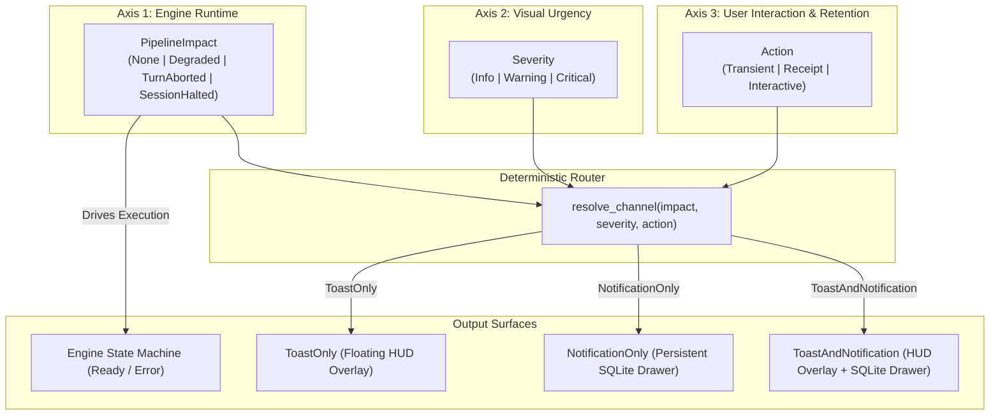

# Notification & Toast Unified Architectural Specification (Vox v2)

- **Status**: Target Specification (SSOT for Notifications, Toasts & Pipeline Errors)
- **Policy**: Zero Backward Compatibility (ZBC) — Clean architectural break; no legacy wrappers.
- **Scope**: Replaces legacy `ToastLevel`, `Actionability`, ad-hoc `show_toast` calls, and loose notification writes across the entire Vox application.

---

## 1. The Three Orthogonal Dimensions

The system separates concerns into three distinct, independent axes. No axis is overloaded to imply another:



### 1.1 `PipelineImpact` (Engine Control Flow)
- **Question Answered**: *What does the runtime audio engine and state machine do?*
- **Scope**: Controls Tokio tasks, CPAL audio streams, turn cancellation tokens, and `InteractionState` transitions.
- **Values**:
  - `None`: The event does not originate from or affect the voice interaction loop (e.g. Dictation, Memory Compaction, Scheduler, Settings).
  - `Degraded`: The voice turn continues without stopping. State transition: None. Playback continues with reduced fidelity (e.g. dropped TTS, skipped RAG).
  - `TurnAborted`: The active voice turn fails cleanly. Turn token is cancelled, pending synthesis is drained, and state machine resets directly to `Ready`.
  - `SessionHalted`: Unrecoverable breakdown. Playback is cancelled, token tripped, and state machine transitions to `Error`.

### 1.2 `Severity` (Visual Urgency & Styling)
- **Question Answered**: *What visual weight, badge token, and priority does the user see?*
- **Scope**: Universal across all UI surfaces (HUD toast, Drawer cards, Logs).
- **Values**:
  - `Info`: Routine success, normal telemetry, informational audit receipts (Violet / Neutral styling).
  - `Warning`: Recoverable issues, degraded audio/transcription quality, high system load, missed schedules (Amber styling).
  - `Critical`: Unrecoverable breakdowns, missing credentials, hardware disconnects, broken invariants (Rose / Red styling).

### 1.3 `Action` (Retention & Remediation Contract)
- **Question Answered**: *Where does this event live, and what must the user do?*
- **Scope**: Determines database persistence and UI interactive controls.
- **Values**:
  - `Transient`: Ephemeral real-time feedback for active outside-app interaction. Never written to SQLite; zero persistent drawer clutter. Auto-dismisses after 3s.
  - `Receipt`: Passive historical record. Written to SQLite drawer; contains no actionable user button. Never triggers a floating HUD popup over external apps.
  - `Interactive(ActionPayload)`: Actionable task or remediation requiring an action icon button or deep link (e.g. `"Compact"`, `"Consolidate"`, `"Open Settings"`).

---

## 2. Decommission Ledger

The following legacy constructs are permanently removed from Vox:

| Legacy Construct | Location | Replacement | Architectural Rationale |
| :--- | :--- | :--- | :--- |
| `ToastLevel` | `core/events.rs` | `Severity` | Eliminated redundant 4-level styling enum; unified with system severity. |
| `Actionability` | `core/error.rs` | `Action` | Replaced binary `None/Actionable` trap with 3-way `Transient / Receipt / Interactive`. |
| `show_toast()` direct calls | Across 8 files | `notify()` front door | Upstream code must not bypass the notification router to spawn windows. |
| Loose category strings | Across 8 files | `NotificationCategory` | Closed compiler-checked enum prevents typo drift and unhandled categories. |
| `notifications.is_read` | `schema.rs` | `status = 'read'` | Redundant boolean column dropped in Schema v4. |
| DB `UNIQUE(group_key)` | Draft plan | Append + Index | Overwriting rows destroys historical event auditability; DB stays append-only. |
| `trigger_session_compaction` | `ipc/notifications.rs` | `execute_notification_action` | 1-off IPC commands replaced with a polymorphic action execution contract. |

---

---

## 3. System Boundary & Service Structure

To keep domain boundaries pristine, responsibilities are partitioned strictly between three locations:

1. **`core/error.rs` (Data Shapes Only)**:
   - Contains strictly the data definition of `PipelineError` and domain error enums (`AudioError`, `SttError`, `TtsError`, etc.).
   - Contains **zero** notification logic, **zero** toast emission, and **zero** persistence queries.
2. **`services/notifications/` (The Notification Service)**:
   - Owns the universal `notify()` front door function:
     ```rust
     pub async fn notify<R: tauri::Runtime>(
         app: &AppHandle<R>,
         db: &turso::Connection,
         params: NotificationParams,
     ) -> Result<Option<String>>
     ```
   - Owns the 3D routing logic (`resolve_channel`).
   - Owns task idempotency and entity-scoping checks before writing to SQLite.
   - Owns the polymorphic backend action execution dispatcher (`execute_notification_action`).
   - Manages communication with `WINDOW_TOAST` (HUD overlay) and `persistence/notifications.rs` (SQLite).
3. **`pipeline/assistant/error.rs` (The Voice Turn Error Boundary)**:
   - Receives `PipelineError` on turn failures.
   - Drives audio engine state machine transitions based on `PipelineImpact`.
   - Delegates user alerting to the Notification Service via `notify()`.
4. **Thread Placement Invariant**:
   - Audio hot path workers (CPAL callback, VAD inference loop, dedicated OS threads) must **NEVER** call `notify()` or acquire database locks directly.
   - OS workers emit internal pipeline events (`VoxEvent::Error(PipelineError)`). Alerting is delegated to `notify()` strictly within the pipeline router or async handlers where `AppHandle` and Tokio runtimes are available.

---

## 4. Canonical Data Contracts

### 4.1 Universal Severity
Represents visual urgency, badge weight, and priority across all surfaces:
- **`Info`**: Normal operations, successful dictation output, non-blocking receipts. Visual language: neutral border, violet accent tile.
- **`Warning`**: Recoverable degradation, dropped audio buffer, high system load, missed schedules. Visual language: amber border and amber warning pill.
- **`Critical`**: Unrecoverable breakdowns, authentication failures, hardware disconnects, missing model assets. Visual language: pulsing red/rose border and high-contrast alert badge.

### 4.2 Universal Action Taxonomy
Represents retention in storage and expected user interaction:
- **`Transient`**: Ephemeral feedback for live interaction (e.g. Dictation Pasted, empty speech). Delivered only to the HUD overlay; never written to SQLite; auto-dismisses after 3 seconds.
- **`Receipt`**: Passive historical audit record (e.g. Compaction Finished, Consolidation Succeeded). Persisted to the SQLite drawer as a read/unread log. Never triggers a floating HUD popup over external apps.
- **`Interactive`**: Actionable task or remediation card. Persisted to the SQLite drawer with a primary action button. Dual-emits to the HUD overlay when severity is Critical or turn-aborting.

### 4.3 Action Payload Contract (`action_payload`)
The `action_payload` field contains strictly the executable parameters required when the user clicks the card's primary action:
- **Backend Dispatched Actions** (Executed via IPC command `execute_notification_action(id)`):
  - **`CompactSession`**: Carries `session_id` (numeric identifier) to run compaction.
  - **`ConsolidateMemory`**: Carries no parameters; invokes the consolidation engine.
  - **`Retry`**: Carries `operation` name and target resource identifier.
- **Frontend Handled Actions** (Executed client-side; zero backend IPC invocation):
  - **`Navigate`**: Carries `target` route (e.g. `"settings/audio"`, `"settings/ai"`, `"history?session=12"`). Handled directly by the React client via router navigation (`navigate(payload.target)`).

### 4.4 Card Display Metadata & Task Resolution Contract (`metadata`)
The `metadata` field is a JSON object containing read-only display context and the orthogonal task resolution lifecycle state:
- **Lifecycle Attributes**:
  - `resolution`: Task outcome state (`"pending" | "resolved" | "failed"`). Defaults to `"pending"` on interactive cards; `"resolved"` on receipts.
- **Display Attributes**:
  - Session cards: `{"uncompacted_turns": 14, "resolution": "pending"}` (renders turn count pill; drives compaction icon).
  - Hardware cards: `{"device_name": "USB Audio Interface", "resolution": "pending"}` (renders affected device).
  - Model cards: `{"model_id": "qwen2.5-0.5b", "resolution": "pending"}` (renders missing model name).
- **Execution Invariant**: High-frequency execution progress (spinners, percentages) is transient and managed in frontend state. Upon task completion or failure, the backend updates `metadata.resolution` in-place (`"resolved"` or `"failed"`).

### 4.5 Closed Categories
Categories are strictly constrained to seven domain scopes:
`SessionCompaction`, `MemoryConsolidation`, `Pipeline`, `Dictation`, `Hardware`, `Models`, `Storage`.

### 4.6 Persisted Notification Entity
Every notification written to SQLite contains the following attributes:
- `id`: Globally unique text identifier.
- `group_key`: Correlation key used for task idempotency and drawer rollup.
- `category`: Closed domain category.
- `severity`: Universal severity (`info`, `warning`, `critical`).
- `action_type`: Interaction classification (`receipt` or `interactive`).
- `action_payload`: Serialized executable action parameters.
- `title`: Plain-language card title.
- `message`: Plain-language description or instructions.
- `status`: Attention state (`unread`, `read`, or `dismissed`).
- `session_id`: Optional associated conversation session identifier.
- `metadata`: Serialized read-only display context.
- `created_at`: Creation timestamp in millisecond epoch.
- `updated_at`: Last update timestamp in millisecond epoch.


---

## 5. The 3D Deterministic Routing Engine

### 5.1 Channel Resolution Rules
Upstream callers never specify the delivery channel. The Notification Service resolves the channel via the following deterministic rules:

1. **Transient Rule**: If `Action` is `Transient`, the delivery channel is strictly **`ToastOnly`**. Zero database records are written.
2. **Receipt Rule**: If `Action` is `Receipt`, the delivery channel is strictly **`NotificationOnly`**. A silent record is added to the drawer; no floating HUD popup is shown.
3. **Interactive Branching Rule**: If `Action` is `Interactive`:
   - If `PipelineImpact` is `SessionHalted` OR `Severity` is `Critical`: The channel is **`ToastAndNotification`**. The incident halted the session or broke operation, so the user receives an immediate HUD alert outside the app and an actionable card in the drawer.
   - If `PipelineImpact` is `TurnAborted` AND `Severity` is `Warning`: The channel is **`ToastAndNotification`**. The turn failed due to an actionable reason (e.g. context limit), so the user sees immediate feedback plus a drawer link to fix it.
   - For all other combinations (e.g. routine background tasks like session compaction): The channel is **`NotificationOnly`**. The card appears in the drawer without interrupting external applications.

### 5.2 The 3D Truth Table

| `PipelineImpact` | `Severity` | `Action` | Resolved Channel | System Behavior & UX Contract | Real Codebase Examples |
| :--- | :--- | :--- | :--- | :--- | :--- |
| `None` | `Info` | `Transient` | **`ToastOnly`** | HUD overlay for 3s. Zero DB write. | `dictation_pasted` snippet; empty STT notice. |
| `None` | `Info` | `Receipt` | **`NotificationOnly`** | Silent drawer card. Zero HUD popup. | Session #12 compaction done; consolidation finished. |
| `None` | `Info` | `Interactive` | **`NotificationOnly`** | In-app task card with action icon button. | Session #12 uncompacted with action icon. |
| `None` | `Warning` | `Receipt` | **`NotificationOnly`** | Silent warning card in drawer. | Consolidation deferred (system busy). |
| `None` | `Warning` | `Interactive` | **`NotificationOnly`** | In-app remediation card. | Daily consolidation missed with `[Consolidate]`. |
| `Degraded` | `Warning` | `Transient` | **`ToastOnly`** | Ephemeral HUD warning. Turn continues. | Dropped audio buffer frame; degraded TTS fallback. |
| `Degraded` | `Warning` | `Interactive` | **`NotificationOnly`** | In-app drawer card. Turn continues. | Identity memory approaching limit with `[Settings]`. |
| `TurnAborted` | `Warning` | `Transient` | **`ToastOnly`** | HUD alert. Turn resets to Ready. | Intermittent STT decoding glitch (clean abort). |
| `TurnAborted` | `Warning` | `Interactive` | **`ToastAndNotification`** | HUD alert + Drawer card. Turn resets to Ready. | Prompt exceeds context window with `[Settings]`. |
| `SessionHalted` | `Critical` | `Transient` | **`ToastOnly`** | HUD alert. Session halts to Error. | Engine panic / thread crash (no user fix available). |
| `SessionHalted` | `Critical` | `Interactive` | **`ToastAndNotification`** | HUD alert + Drawer card. Session halts. | Provider 401 Auth fail, Mic unplugged, Model missing. |

---

## 6. Pipeline Error Translation & State Machine Invariants

### 6.1 State Machine Execution Contract
When an error occurs during a voice turn, the runtime error boundary must execute two independent steps:

1. **State Machine Execution (Driven strictly by `PipelineImpact`)**:
   - `None` or `Degraded`: The voice turn continues uninterrupted. No state transition occurs and no turn tokens are cancelled.
   - `TurnAborted`: The active turn fails cleanly. The runtime cancels the active turn token, clears pending speech synthesis jobs, and resets the state machine directly to `Ready`.
   - `SessionHalted`: An unrecoverable breakdown occurred. The runtime stops playback, trips the cancellation token, drains pending jobs, and transitions the state machine to `Error`.
2. **Notification Delegation**:
   - The error boundary generates a correlation group key (`pipeline_error:<source>`) and delegates alerting directly to the Notification Service's `notify()` entry point, passing the error's `impact`, `severity`, and `action`.
   - The error boundary contains no toast window creation or SQLite insertion logic.

---

## 7. Persistence Schema & Storage Invariants (Schema v4)

### 7.1 Entity Attributes Table

| Field | Type | Constraints | Description |
| :--- | :--- | :--- | :--- |
| `id` | Text | Primary Key | Globally unique notification identifier |
| `group_key` | Text | Not Null | Correlation key for task idempotency and feed rollup |
| `category` | Text | Not Null | Closed category (`session_compaction`, `pipeline`, etc.) |
| `severity` | Text | Not Null | Visual severity (`info`, `warning`, `critical`) |
| `action_type` | Text | Not Null | Interaction kind (`receipt` or `interactive`) |
| `action_payload` | Text | Not Null, Default `'{}'` | JSON parameters for polymorphic action execution |
| `title` | Text | Not Null | Plain-language user-facing title |
| `message` | Text | Not Null | Plain-language user-facing description |
| `status` | Text | Not Null, Default `'unread'` | Attention state (`unread`, `read`, `dismissed`) |
| `session_id` | Integer | Nullable, Foreign Key | Optional associated conversation session |
| `metadata` | Text | Not Null, Default `'{}'` | Read-only domain display context (e.g. turn counts) |
| `created_at` | Integer | Not Null | Millisecond epoch timestamp of creation |
| `updated_at` | Integer | Not Null | Millisecond epoch timestamp of last update |

*Indexes:*
- Status and creation recency: `(status, created_at DESC)`
- Group correlation lookup: `(group_key, status)`
- Session association lookup: `(session_id)`

### 7.2 Storage Invariants
1. **Receipt Auditing (Append-Only)**: Notifications with `Action::Receipt` (e.g. `Memory Consolidated`) are strictly append-oriented. Every event inserts a new database record under a stream-level `group_key` (e.g. `"memory_consolidation:daily"`). The frontend drawer visualizes these as a single rolled-up card with an occurrence counter `(×N)` and latest timestamp, preserving complete audit history without drawer spam.
2. **Transient Exclusion**: Events with `Action::Transient` are never committed to SQLite.
3. **Card Attention Isolation**: Card status is strictly user-governed (`unread`, `read`, `dismissed`). Background job execution progress is transient and must never overwrite card status with job states (e.g. `'completed'`, `'failed'`).
4. **Interactive Task Idempotency (Entity-Scoped In-Place Update)**: Notifications with `Action::Interactive` must use an entity-scoped `group_key` (e.g. `"session_compaction:12"`, `"hardware_disconnect:mic"`). This isolates separate sessions into distinct actionable cards in the UI. If an active (non-dismissed) card already exists for that entity, the service executes an in-place `UPDATE` (refreshing `metadata`, `message`, and `updated_at`) rather than creating duplicate actionable buttons for the same entity.
5. **In-Place Task Resolution (Zero Ghost Receipts)**: When a background remediation action (`CompactSession`, `ConsolidateMemory`, `Retry`) completes or fails, the backend updates the existing interactive notification row in-place (`metadata.resolution = 'resolved' | 'failed'`, updated `message`) and emits `NotificationUpdated`. It must **NOT** create a separate receipt notification or delete the card.
6. **User Dismissal Sovereignty on Boot**: During startup sweeps (such as `reconcile_uncompacted_sessions_on_boot`), if an interactive notification for `group_key` already exists in SQLite (even if `status = 'dismissed'`), the system must **never** resurrect it or insert a duplicate row. The user's dismissal decision is permanent and sovereign.

---

## 8. Runtime Delivery Channel Mechanics

### 8.1 Floating HUD Overlay Channel (`ToastOnly`)
- **Target**: Dispatched to the floating transparent HUD overlay window.
- **Payload Attributes**: Title, message, severity, and auto-dismiss duration (default 3000ms).
- **Foreground Focus Suppression**: When the main application window is currently focused and in the foreground, floating OS overlay windows are suppressed to prevent visual jitter.
- **Text Formatting Contracts**:
  - Transcribed text paste displays a preview snippet: `“<start_words> ... <end_words>”` (up to 40 characters).
  - Empty recognition displays: *"Speech detected, but no words recognized."*
  - Manual text copying produces no toast overlay.

### 8.2 Drawer Channel (`NotificationOnly`)
- **Target**: Committed to SQLite and emitted to active desktop views via event bus.
- **Zero Overlay**: Never opens or flashes the HUD overlay window.

### 8.3 Dual Channel (`ToastAndNotification`)
- **Atomic Dispatch**: Emits simultaneously to the HUD overlay window and commits a persistent record to SQLite.

### 8.4 HUD Overlay Exclusivity & In-App Delivery Routing
- **Sole Overlay Surface**: Floating HUD alerts are exclusively delivered via Vox's internal transparent webview window (`AppWindow::Toast` in `toast.rs`). External third-party OS notification crates (`notify-rust`, `tauri-plugin-notification`, libnotify) are strictly excluded to avoid platform daemon hang risks and UI format breakage.
- **Delivery Outcome Semantics**: `show_toast` returns an explicit delivery outcome (`Shown`, `SuppressedFocused`, `Failed`):
  - `Shown`: HUD overlay webview displayed the toast to the user outside the app.
  - `SuppressedFocused`: Floating overlay was suppressed because the main window is focused. The Notification Service emits `IpcEvent::ShowToast` directly to `AppWindow::Main` so in-app users receive visual transient feedback without overlay window jitter.
  - `Failed`: Webview construction failed or was blocked by the display server compositor. The Notification Service logs the error and gracefully falls back to persistent drawer storage (`NotificationOnly`) so alerts are never swallowed.

---

## 9. IPC & Frontend Service Contracts

### 9.1 Application Interface Endpoints
- **Fetch Active Notifications**: Returns all records whose status is not dismissed, ordered newest first.
- **Mark Notifications Read**: Accepts an optional filter targeting specific IDs, an entire correlation group key, a category, an `action_type`, or all unread notifications. Updates matching records to read status.
- **Dismiss Notifications**: Accepts an optional filter targeting specific IDs, an entire correlation group key, a category, an `action_type`, or all active notifications. Updates matching records to dismissed status.
- **Execute Notification Action**: Polymorphic action executor accepting a notification ID (`execute_notification_action(id)`). Resolves the action payload and dispatches backend-executable tasks (`CompactSession`, `ConsolidateMemory`, `Retry`). Does not handle `Navigate` (which is executed client-side by the React router). Does not mutate the card's attention status. Updates `metadata.resolution` in-place on completion.

### 9.2 Drawer Presentation, Rollup & Badge Contracts
- **Two-Tab Drawer (`Tasks` vs `Updates`)**:
  - **`Tasks` Tab**: Shows actionable interactive cards requiring user remediation (`action_type == 'interactive'` and `metadata.resolution != 'resolved'`).
  - **`Updates` Tab**: Shows passive historical receipts and resolved tasks (`action_type == 'receipt'` or `metadata.resolution == 'resolved'`), rolled up with `(×N)` counters.
- **Bell Badge Counter Contract**: The UI notification bell badge counter in the top-right cluster reflects all unread attention items according to the deterministic rule:
  $$\text{countsTowardBadge} = (\text{status} == \text{'unread'}) \land ((\text{action\_type} == \text{'interactive'} \land \text{metadata.resolution} \neq \text{'resolved'}) \lor \text{severity} \in \{\text{'warning'}, \text{'critical'}\})$$
  This guarantees that unresolved tasks always alert the user, system warnings and critical receipts are not hidden, and resolved interactive tasks do not artificially inflate the badge.
- **Auto-Mark as Read**: Opening/mounting the drawer automatically marks unread notifications as read and clears the unread badge counter.
- **Scoped Dismiss All**: A single `[Dismiss All]` header action is strictly scoped to the active tab (`filter: { action_type: activeTab }`).
- **Icon Action Buttons**: Action buttons are minimal, sleek icon buttons (e.g. `Sparkles` for compaction, `Database` for consolidation, `RotateCcw` for retry) with hover tooltips indicating the action. No loud text buttons (e.g. no `[Tidy Now]`).
- **Action Execution State**: When a user clicks an action button, the icon displays an inline loading spinner (`Loader2`). Upon backend resolution, the button resolves into a checkmark (`Check`).
- **Uncompacted Session Visual Cues**: Sessions with uncompacted turns show an accent highlight dot/glow in the session rail and detail drawer with a compact icon action.

---

## 10. Exhaustive Domain Call-Site Inventory

| Subsystem | Call Site File | Category | Impact | Severity | Action | Copy Contract |
| :--- | :--- | :--- | :--- | :--- | :--- | :--- |
| **Dictation** | `output_router.rs` | `Dictation` | `None` | `Info` | `Transient` | Title: `"Dictation Pasted"`<br/>Msg: `“<snippet>”` |
| **Dictation** | `transcript.rs` | `Dictation` | `None` | `Info` | `Transient` | Title: `"Dictation"`<br/>Msg: `"Speech detected, but no words recognized."` |
| **Dictation PTT** | `ptt.rs` | `Dictation` | `None` | `Warning` | `Interactive(Navigate("settings"))` | Title: `"Dictation Disabled"`<br/>Msg: `"Enable dictation in Settings to use Push-To-Talk."` |
| **Pipeline STT** | `on_error` | `Pipeline` | `TurnAborted` | `Warning` | `Transient` | Title: `"Voice Notice: STT"`<br/>Msg: Error description |
| **Pipeline TTS** | `on_error` | `Pipeline` | `Degraded` | `Warning` | `Transient` | Title: `"Voice Notice: TTS"`<br/>Msg: Degraded synthesis notice |
| **Pipeline RAG** | `on_error` | `Pipeline` | `Degraded` | `Warning` | `Transient` | Title: `"Voice Notice: Memory"`<br/>Msg: `"Semantic retrieval skipped for this turn."` |
| **Pipeline Context**| `on_error` | `Pipeline` | `TurnAborted` | `Warning` | `Interactive(Navigate("settings/ai"))` | Title: `"Voice Notice: Context"`<br/>Msg: `"System prompt exceeds context window."` |
| **Pipeline Rate Limit**| `on_error` | `Pipeline` | `TurnAborted` | `Warning` | `Interactive(Navigate("settings/ai"))` | Title: `"Voice Notice: Rate Limit"`<br/>Msg: `"Provider rate limit reached."` |
| **Pipeline Network**| `on_error` | `Pipeline` | `TurnAborted` | `Warning` | `Interactive(Navigate("settings/ai"))` | Title: `"Voice Notice: Network"`<br/>Msg: `"Connection to provider failed or timed out."` |
| **Pipeline Auth** | `on_error` | `Pipeline` | `SessionHalted` | `Critical` | `Interactive(Navigate("settings/ai"))` | Title: `"Voice Notice: Auth"`<br/>Msg: `"API key invalid, missing, or unauthorized."` |
| **Hardware** | `on_error` | `Hardware` | `SessionHalted` | `Critical` | `Interactive(Navigate("settings/audio"))` | Title: `"Voice Notice: Audio"`<br/>Msg: `"Microphone device disconnected."` |
| **Models 404/Missing** | `on_error` | `Models` | `SessionHalted` | `Critical` | `Interactive(Navigate("settings/models"))` | Title: `"Voice Notice: Models"`<br/>Msg: `"Model weights or endpoint not found on server."` |
| **Models Warmup** | `warm_up_llm` | `Models` | `SessionHalted` | `Critical` | `Interactive(Navigate("settings/models"))` | Title: `"Voice Notice: Models"`<br/>Msg: `"LLM provider initialization failed."` |
| **Compaction** | `coordinator.rs` | `SessionCompaction` | `None` | `Info` | `Interactive(CompactSession(id))` | Title: `"Session #X Ready to Compact"`<br/>Msg: `"X uncompacted turns."` |
| **Compaction** | `coordinator.rs` | `SessionCompaction` | `None` | `Info` | `Receipt` | Title: `"Session #X Compacted"`<br/>Msg: `"Extracted X memory facts."` |
| **Compaction** | `coordinator.rs` | `SessionCompaction` | `None` | `Warning` | `Receipt` | Title: `"Session #X Compaction Failed"`<br/>Msg: Error description |
| **Scheduler** | `scheduler.rs` | `MemoryConsolidation`| `None` | `Warning` | `Interactive(ConsolidateMemory)` | Title: `"Memory Consolidation Missed"`<br/>Msg: `"Scheduled daily run missed."` |
| **Scheduler** | `scheduler.rs` | `MemoryConsolidation`| `None` | `Info` | `Receipt` | Title: `"Memory Consolidated"`<br/>Msg: `"Daily profile updated."` |

---

## 11. Strict Invariants & Negative Constraints

1. **No Ad-Hoc Toast Spawning**: Upstream code must never call `show_toast` or create webviews directly; all HUD overlay and drawer card creation routes strictly through `notify()`.
2. **No DB Storage for Transient Events**: Events with `Action::Transient` must never execute SQLite inserts.
3. **No HUD Popups for Silent Receipts**: Events with `Action::Receipt` must never open or flash `WINDOW_TOAST`.
4. **No DB Uniqueness on `group_key`**: SQLite must never enforce `UNIQUE(group_key)`; event logs must remain append-only.
5. **No Card Status Mutation by Jobs**: Background tasks must never overwrite notification card `status` with job progress (e.g. `'completed'`, `'in_progress'`). Card status is strictly user-attention (`unread`, `read`, `dismissed`).
6. **No Raw Enums in User Copy**: Category identifiers and raw enum debug strings must never be rendered as text in user-facing UI.
